# Многооболочечный конвейер LLM — публичная редакция для критического обсуждения

> **Работа не завершена и продолжается.** Это не выпуск готового продукта,
> не подтверждение работоспособности R1 и не руководство для промышленного
> применения. Документ подготовлен прежде всего для поиска ошибок, слабых
> допущений, избыточной сложности и непроверенных выводов.

**Публичная редакция:** 0.1

**Дата среза:** 24 июля 2026 года

**Состояние:** проект для критических замечаний

**Язык обсуждения:** русский; содержательные замечания на других языках также
могут быть рассмотрены после перевода

**Целостность комплекта:** [контрольные суммы SHA-256](SHA256SUMS.txt)

**Состав репозитория обновлён:** 25 июля 2026 года; 14 Markdown-файлов,
включая настоящий README

**Доступ:** репозиторий пока приватный; открытая публикация и лицензия не
утверждены

## Карта репозитория

README является самостоятельной публичной редакцией проекта. Остальные
документы позволяют проверить её основания и не требуют доступа к закрытым
RUN, внутренней памяти или исходному коду.

### Рекомендуемые маршруты чтения

| Цель | Последовательность |
|---|---|
| Быстро понять замысел и спорные решения | настоящий README → [гипотеза качества](docs/160-multi-harness-multi-model-quality-hypothesis.md) → [фактическое состояние](docs/153-current-implementation-and-r1-gap-description.md) |
| Проверить исследовательские основания | [реестр литературы](docs/159-research-foundations-and-external-sources-register.md) → [Orca](docs/59-orca-comparison.md) → [oh-my-pi/OMP](docs/68-oh-my-pi-comparison.md) → [гипотеза качества](docs/160-multi-harness-multi-model-quality-hypothesis.md) |
| Провести архитектурную рецензию | [PRD](docs/149-product-requirements-document.md) → [целевая архитектура](docs/150-current-target-architecture-and-prd-traceability.md) → [паспорта частей](docs/151-component-passports.md) → [спецификация R1](docs/152-r1-product-specification.md) |
| Оценить фактическую готовность | [описание реализации](docs/153-current-implementation-and-r1-gap-description.md) → [план проверки](docs/156-product-validation-and-acceptance-plan.md) |
| Изучить установку и эксплуатацию R0 | [установка](docs/154-r0-installation-and-initial-configuration-guide.md) → [руководство оператора](docs/155-r0-operator-guide.md) |
| Подготовить формальное замечание | [обезличенный комплект обсуждения](docs/157-anonymized-professional-and-user-review-package.md) → разделы 17–19 настоящего README |

### Полный состав

| Документ | Назначение |
|---|---|
| [README](README.md) | самостоятельное описание незавершённого проекта и запрос критических замечаний |
| [59 — сравнение с Orca](docs/59-orca-comparison.md) | внешнее архитектурное сопоставление и извлекаемые уроки |
| [68 — сравнение с oh-my-pi/OMP](docs/68-oh-my-pi-comparison.md) | второе внешнее сопоставление, включая сравнительную таблицу |
| [149 — PRD](docs/149-product-requirements-document.md) | требования ко всему продукту и границы версий |
| [150 — целевая архитектура](docs/150-current-target-architecture-and-prd-traceability.md) | компоненты, договоры, состояния, проверки и трассировка PRD |
| [151 — паспорта частей](docs/151-component-passports.md) | ядро, Codex, Hermes, Claude Code и подсистема выбора моделей |
| [152 — спецификация R1](docs/152-r1-product-specification.md) | нормативное описание первой рабочей версии |
| [153 — реализация и пробелы](docs/153-current-implementation-and-r1-gap-description.md) | что существует фактически и чего не хватает до R1 |
| [154 — установка R0](docs/154-r0-installation-and-initial-configuration-guide.md) | установка и первоначальная настройка прототипа |
| [155 — работа оператора R0](docs/155-r0-operator-guide.md) | восстановление, проведение ролей, приёмка, остановка и закрытие RUN |
| [156 — план проверки](docs/156-product-validation-and-acceptance-plan.md) | единая проверка и приёмка от местных испытаний до D-150 |
| [157 — комплект обсуждения](docs/157-anonymized-professional-and-user-review-package.md) | маршруты рецензирования, вопросы и форма замечания |
| [159 — реестр источников](docs/159-research-foundations-and-external-sources-register.md) | оценки Orca и OMP, правила доказательного веса и 202 внешних источника |
| [160 — гипотеза качества](docs/160-multi-harness-multi-model-quality-hypothesis.md) | проверяемая гипотеза о разных оболочках и моделях, контраргументы и D-150 |

Все перечисленные файлы входят в [перечень контрольных сумм](SHA256SUMS.txt).
Наличие документа в репозитории не означает, что описанная в нём возможность
реализована или принята.

## 1. Зачем опубликован этот документ

Проект вырос из практической попытки соединить несколько LLM через разные
агентные оболочки и при этом не передать моделям управление состоянием,
разрешениями и остановкой процесса. За время разработки были созданы
детерминированное ядро, договоры, переходники, архивы результатов и серия
пилотных RUN. Полный полезный цикл целевой версии ещё не завершён.

Публичное обсуждение нужно до того, как проект станет слишком большим и
закрепит ошибочные решения. Особенно ценны замечания, которые:

- показывают логическую ошибку или неподтверждённое обобщение;
- предлагают более простой способ достичь той же цели;
- выявляют угрозу безопасности или воспроизводимости;
- ставят под сомнение границы ролей;
- показывают, что проверка не измеряет заявленное свойство;
- объясняют, почему продукт будет неудобен реальному пользователю.

Похвала полезна, но приоритет этой редакции — критика.

## 2. Как читать состояние проекта

В документе используются четыре обозначения зрелости:

| Обозначение | Смысл |
|---|---|
| **реализовано** | существует в программе и имеет местную проверку |
| **частично** | основа существует, но путь не соединён или не проверен полезным циклом |
| **спроектировано** | закреплено документом, но ещё не реализовано |
| **гипотеза** | требует будущего измерения и не считается свойством продукта |

Ни одно слово «спроектировано» в этой редакции не следует читать как
«работает». Исторический технический успех не равен содержательной приёмке.

## 3. Проблема, которую пытается решить проект

Обычная работа с одной моделью часто смешивает несколько разных действий:

1. понимание пользовательской цели;
2. разбиение задачи;
3. сбор и анализ доказательств;
4. написание итогового документа;
5. критику результата;
6. решение о повторе;
7. управление файлами, процессами, расходом и состоянием.

Если всё принадлежит одной модели и одному сеансу, трудно отличить
содержательное решение от технического перехода, а ошибочный ответ может сам
себя принять и запустить следующий шаг.

Проект проверяет другой подход: смысловые роли выполняют модели внутри
подходящих оболочек, а официальный жизненный цикл обеспечивает обычная
детерминированная программа.

## 4. Исходная гипотеза

Использование нескольких специализированных связок может дать более полный и
проверяемый результат, чем один модельный путь, если:

- роли действительно различаются, а не дублируют друг друга;
- каждая следующая роль получает полный принятый вход;
- исполнитель не принимает собственный результат;
- технический отказ не маскируется повтором;
- ядро предотвращает скрытое изменение задания и конфигурации;
- итоговое качество сравнивается до стоимости.

Эта гипотеза **не доказана**. Проект пока не завершил даже один целевой
полезный цикл R1, а сравнение с одной сильной связкой D-150 не проводилось.

## 5. Предлагаемая архитектура

**Схема № 1. Разделение смысловых ролей и управления состоянием**

```mermaid
flowchart LR
    U["**Пользователь**<br/>цель и окончательное решение"] --> C1["**Codex App**<br/>спецификация"]
    C1 --> K1["**Детерминированное ядро**<br/>план, договоры, состояния"]
    K1 --> H["**Hermes Agent**<br/>ограниченные доказательные модули"]
    H --> C2["**Codex App**<br/>содержательная критика"]
    C2 -->|"принято"| B["**Принятая основа**<br/>неизменяемый архив"]
    C2 -->|"отказ"| S["**Остановка**<br/>без автоматического повтора"]
    B --> CL["**Claude Code**<br/>полный итоговый документ"]
    CL --> C3["**Codex App**<br/>критика итога"]
    C3 --> U2["**Пользователь**<br/>принять / доработать / остановить"]
    U2 --> K2["**Ядро**<br/>отчёт и закрытие RUN"]

    classDef user fill:#fff0b3,stroke:#b7791f,stroke-width:3px,color:#3d2b00;
    classDef codex fill:#dbeafe,stroke:#2563eb,stroke-width:3px,color:#102a56;
    classDef core fill:#fee2e2,stroke:#dc2626,stroke-width:3px,color:#4c1010;
    classDef hermes fill:#dcfce7,stroke:#16a34a,stroke-width:3px,color:#103b1e;
    classDef claude fill:#ede9fe,stroke:#7c3aed,stroke-width:3px,color:#2e1065;
    classDef archive fill:#ecfeff,stroke:#0891b2,stroke-width:3px,color:#164e63;
    classDef stop fill:#ffe4e6,stroke:#e11d48,stroke-width:4px,color:#4c0519;
    class U,U2 user;
    class C1,C2,C3 codex;
    class K1,K2 core;
    class H hermes;
    class CL claude;
    class B archive;
    class S stop;
    linkStyle 0,1,2,3,5,6,7,8 stroke:#334155,stroke-width:4px;
    linkStyle 4 stroke:#e11d48,stroke-width:4px;
```



### 5.1. Codex App

Предлагаемая роль: единая входная точка пользователя, постановка задачи,
критика промежуточной основы и итогового документа. Codex не должен владеть
официальными состояниями и единолично доказывать преимущество собственного
результата.

### 5.2. Hermes Agent

Предлагаемая роль: низовой исполнитель ограниченных доказательных модулей.
Основным кандидатом остаётся DeepSeek V4 Flash, но пригодность точной связки
для полезных модулей ещё не доказана. Модель не должна выполнять работу
полного оркестратора.

### 5.3. Claude Code

Предлагаемая роль: получить всю принятую основу и сформировать связный полный
итог. В текущем проекте использовалась связка с GLM-5.2, но модель и поставщик
могут быть заменены новой зафиксированной конфигурацией. Полная роль ещё не
проверена на требуемом объёме входа и выхода.

### 5.4. Детерминированное ядро

Роль: состояния, версии, зависимости, аренды, попытки, архивы, контрольные
суммы, расход, остановка, восстановление и отчёт. Ядро не оценивает смысл
текста и не сочиняет модельный результат.

### 5.5. Подсистема выбора моделей

Роль: рекомендовать точную связку «модель + поставщик + оболочка + версия +
настройки + договор» или честно вернуть «недостаточно данных». Она не меняет
модель автоматически, не создаёт RUN и не разрешает расход.

## 6. Почему используются разные агентные оболочки

Смысл проекта не сводится к последовательному вызову трёх API. Каждая
оболочка даёт собственный способ работы с файлами, контекстом, инструментами,
профилями, памятью и моделью. Именно сочетание модели и оболочки считается
единицей выбора.

Одновременно это одно из самых спорных решений проекта:

- различие оболочек может не дать измеримого преимущества;
- интеграционные отказы могут перекрыть пользу специализации;
- контекст может теряться при передаче;
- обновление одной оболочки меняет свойства всей связки;
- три роли могут оказаться дороже и медленнее без роста качества.

До D-150 это решение остаётся архитектурной гипотезой.

## 7. Что уже создано

На текущем снимке существуют:

- ядро на SQLite с журналом событий;
- состояния проекта, RUN, задания и попытки;
- идемпотентные операции и защита от второй активной попытки;
- договоры заданий, результатов, критик, процессов, сети и расхода;
- неизменяемые архивы результатов и контроль SHA-256;
- карантин поздних результатов;
- аренды, наблюдение процессов и восстановление;
- техническая публикация результата;
- отдельная содержательная приёмка;
- передача только принятого архива;
- переходники Hermes и Claude Code;
- учёт токенов и расчётной стоимости;
- отчёт и пользовательское решение по RUN;
- документация от истории проекта до плана приёмки.

Подробное описание содержится в
[документе 153](docs/153-current-implementation-and-r1-gap-description.md). Наличие
этих частей не означает, что они уже соединены в целевой R1.

## 8. Что требуется до R1

Текущий критический путь ограничен шестью пакетами:

1. **Д24:** один неизменяемый план RUN и одно пользовательское решение по его
   точной редакции;
2. **путь Codex:** проверяемый вход, спецификация, паспорт сеанса и критика;
3. **полезный модуль Hermes:** формальный договор доказательств, полноты и
   честного отказа;
4. **принятая совокупная основа:** манифест всех принятых модулей и матрица
   покрытия;
5. **полная роль Claude Code:** измеренный полный вход и достаточный выход без
   скрытого дополнительного обращения;
6. **единый координатор:** один точный граф и один набор местных проверок.

После местной реализации выполняется один искусственный цикл без моделей и
только затем — один полезный RUN по отдельному разрешению пользователя.

## 9. Что показали неуспешные испытания

Неуспешные RUN сохранены как источник ограничений, а не как доказательство
непригодности всех моделей.

| Наблюдение | Вывод, который допустим | Недопустимое обобщение |
|---|---|---|
| DeepSeek исчерпывал выходной бюджет либо возвращал пустой итог | конкретный путь и договор не обеспечили завершение | все модели с развёрнутым рассуждением непригодны |
| RUN-022 завершился усечением большого задания | задание было слишком крупным для выбранного выхода | V4 Flash всегда даёт плохой ответ |
| RUN-023 технически прошёл, но был отклонён по содержанию | `verified` нельзя считать приёмкой | технический успех доказывает качество |
| RUN-024 остановился внутри Hermes до результата | нужен честный договор отказа оболочки | установлен дефект модели DeepSeek |
| часть путей Claude не получила полный вход | ссылка на файл не равна переданному содержимому | Claude Code не способен к роли вообще |

Серия отказов также показала риск самой разработки: проект может погрязнуть в
локальных технических проверках и потерять полезную цель. Поэтому дальнейший
план запрещает новые микропилоты без связи с конкретным блокирующим
требованием.

## 10. Основные проектные решения, которые предлагается критиковать

### 10.1. Детерминированное ядро

Предположение: состояния и остановка должны принадлежать обычной программе, а
не модели. Вопрос: не создаёт ли собственное ядро избыточную сложность по
сравнению с готовыми средствами существующих оболочек?

### 10.2. Три смысловые роли

Предположение: постановка и критика, доказательные модули и итоговая
оркестрация требуют разных связок. Вопрос: достаточно ли двух ролей либо одной
сильной модели с независимым оценщиком?

### 10.3. DeepSeek V4 Flash в низовом слое

Предположение: быстрая модель может качественно выполнить узкий модуль при
правильном договоре. Вопрос: где проходит граница сложности, после которой
дешёвая модель повышает цену ошибки?

### 10.4. Claude Code как полный оркестратор

Предположение: оболочка хорошо подходит для синтеза большого итогового
документа. Вопрос: какие свойства должны проверяться у любой альтернативной
модели внутри Claude Code?

### 10.5. Codex как постановщик и критик

Предположение: одна оболочка может удерживать пользовательскую цель и
независимо критиковать чужие результаты. Вопрос: достаточно ли этой
независимости и как избежать смещения при оценке собственного решения?

### 10.6. Д24 — одно решение на полный RUN

Предположение: пользователь должен подтверждать один запечатанный план, а не
каждый ожидаемый вызов отдельно. Вопрос: не слишком ли широки такие
полномочия, и какие изменения должны немедленно погашать допуск?

### 10.7. Качество прежде цены

Предположение: цену следует сравнивать после качества. Вопрос: как определить
«сопоставимое качество» и учитывать цену ошибки без субъективной подгонки?

### 10.8. Отложенные расширения

RAG, ретривер, обучаемая маршрутизация, память опыта и сложные проверяющие
подсистемы отложены до повторяющейся измеренной ошибки. Вопрос: не отсутствует
ли среди них компонент, необходимый уже для первого полезного R1?

## 11. Известные технические и архитектурные пробелы

1. Нет единого реализованного Д24.
2. Нет формального паспорта проверяемого сеанса Codex.
3. Полезный модуль Hermes ещё не прошёл содержательную приёмку в целевом виде.
4. Нет окончательного сборщика совокупной основы R1.
5. Путь Claude Code ограничен и не доказан на полном требуемом входе.
6. Нет одного координатора целевого графа R1.
7. Неуспешно остановленный RUN закрывается, но проект R0 остаётся `active`.
8. Нативный Hermes имеет прямую сеть и не является полной файловой
   песочницей.
9. Карточкам выбора моделей не хватает доказанного происхождения части
   показателей.
10. Нет переносимого профиля Д25.
11. Нет чистой установки на другом компьютере.
12. Нет публичной лицензии и выпускного процесса.
13. Нет принятого полезного R1.
14. Нет результата D-150.

Любое замечание, показывающее более короткий путь закрытия этих пробелов,
особенно ценно.

## 12. Риски продукта

| Риск | Возможное следствие | Текущая защита |
|---|---|---|
| разрастание архитектуры | годы разработки без полезного результата | путь C и запрет расширения без измеренной ошибки |
| потеря контекста между ролями | красивый, но неполный итог | передача только принятого архива и матрица покрытия |
| самооценка модели | пропуск собственной ошибки | отдельная критика и решение пользователя |
| усечение ответа | незавершённый документ принят как успех | конечные метки и содержательная проверка |
| скрытый повтор | расход и изменение условий без решения | Д24, идемпотентность и правило остановки |
| изменение глобальных профилей | поломка самостоятельных приложений пользователя | отдельные проектные профили |
| неизвестный расход или причина | ложная точность отчёта | состояния `unknown` и отдельная диагностика |
| утечка ключей | компрометация поставщика | ключи остаются в профилях, а не в договорах |
| зависимость от одной версии | невоспроизводимость | паспорт точной связки и SHA-256 |
| ложное заявление о преимуществе | неверный выбор архитектуры | D-150 после R1, слепая оценка до цены |

## 13. Безопасность: честные границы

Проект старается не записывать ключи в репозиторий, ограничивает каталоги
попыток и архивирует сетевые квитанции. Но текущий R0 не является завершённой
защищённой средой:

- нативный Hermes использует собственный прямой доступ поставщика;
- проектный профиль отделяет настройки, но не создаёт полную песочницу;
- безопасность отдельных путей Windows и Docker различается;
- публикационный пакет ещё не прошёл независимый аудит;
- профессиональное распространение внутренних RUN запрещено по умолчанию.

Особенно нужны замечания специалистов по границам процессов, сети,
пользовательским профилям и угрозам подмены результата.

## 14. Как будет проверяться готовность

[Единый план проверки](docs/156-product-validation-and-acceptance-plan.md) разделяет
шесть уровней:

1. В0 — документация и трассировка;
2. В1 — местные детерминированные проверки;
3. В2 — искусственный полный цикл без моделей;
4. В3 — один реальный полезный R1;
5. В4 — независимая установка R2;
6. В5 — D-150 для R3.

Нижний уровень не закрывает верхний. Сейчас проект не прошёл В3–В5.

## 15. Что проект не заявляет

Настоящая редакция не заявляет:

- готовность к промышленной эксплуатации;
- безопасность для конфиденциальных данных;
- преимущество многомодельного подхода;
- универсальную пригодность перечисленных моделей;
- переносимость на другой компьютер;
- полную автономность;
- отсутствие галлюцинаций;
- экономическую эффективность;
- окончательность архитектуры;
- завершённость работы.

## 16. План дальнейшей работы

### До R1

1. Пользовательская и профессиональная проверка документации.
2. Одна местная реализация шести пакетов без модельных вызовов.
3. Один целевой набор проверок и один искусственный цикл.
4. Один отдельно разрешённый полезный RUN.
5. Критика, отчёт и решение пользователя.

### После принятого R1

1. Подготовка переносимого выпуска R2.
2. Независимая установка и эксплуатация на другом компьютере.
3. Утверждение протокола D-150.
4. Слепое сравнение качества до раскрытия стоимости.
5. Точечные расширения только по повторяющейся измеренной ошибке.

Работа продолжается. Порядок может измениться по результатам обоснованной
критики.

## 17. Какие замечания нужны сейчас

### Архитектура

- Где проект избыточен?
- Какой компонент можно убрать без потери гарантий?
- Какие полномочия распределены неверно?
- Достаточен ли компактный автомат состояний?
- Нужна ли отдельная оболочка-оркестратор?

### Методика проверки

- Проверяют ли `R1-TEST` и `R1-AC` заявленные свойства?
- Достаточно ли одного полезного RUN для узкого утверждения R1?
- Как исключить смещение Codex при критике?
- Какой минимальный корректный протокол D-150?
- Как измерять полноту и фактическую точность большого документа?

### Выбор моделей

- Оправдана ли быстрая модель низового слоя?
- Какие признаки должны открывать более сильную модель?
- Какие параметры связки важнее показателей модели отдельно?
- Как учитывать подписочный тариф и расчётную стоимость?
- Какие модели и оболочки необходимо включить в D-150?

### Безопасность

- Где нарушена граница доверия?
- Достаточно ли проектных профилей?
- Как безопасно сохранить самостоятельный режим приложений?
- Какие данные нельзя включать в доказательный архив?
- Нужна ли обязательная системная песочница уже в R1?

### Пользовательский опыт

- Понятна ли ценность продукта?
- Не слишком ли тяжёл ручной цикл R0?
- Какие решения пользователь не должен подтверждать вручную?
- Как должен выглядеть основной экран будущего продукта?
- Какие отчёты нужны пользователю, а какие только разработчику?

## 18. Как оформить критическое замечание

Рекомендуемый формат:

```text
Идентификатор: REV-...
Раздел: номер и заголовок
Класс: блокирующее / существенное / малое / редакционное / вопрос
Наблюдение: что именно неверно или неполно
Доказательство: источник, команда, пример или логическая цепочка
Риск: к чему приведёт сохранение решения
Предложение: минимальное исправление или альтернативный путь
Область: единичный случай / системная проблема
```

Критика не обязана предлагать готовое решение, если дефект доказан. Чем точнее
ссылка на раздел, предпосылку или проверку, тем быстрее замечание можно
обработать.

## 19. Как будут обрабатываться замечания

Каждое содержательное замечание получает один исход:

- **принято** — ошибка или более сильное решение подтверждены;
- **принято частично** — проблема подтверждена, предложенный способ требует
  отдельной проверки;
- **отклонено** — приводится проверяемое основание;
- **отложено** — не входит в R1 и не блокирует текущий путь;
- **требует решения пользователя** — затрагивает цель, риск или полномочия.

Фактическая ошибка исправляется новой редакцией. Архитектурная идея сначала
становится гипотезой. Критика не запускает модельный RUN автоматически.

## 20. Состав расширенной документации

Исследовательские основания архитектуры и проверяемая гипотеза:

- [сравнение с Orca](docs/59-orca-comparison.md);
- [сравнение с oh-my-pi/OMP](docs/68-oh-my-pi-comparison.md);
- [реестр внешней литературы и источников](docs/159-research-foundations-and-external-sources-register.md);
- [гипотеза о качестве разных оболочек и моделей](docs/160-multi-harness-multi-model-quality-hypothesis.md).

Для углублённого разбора подготовлены:

- [PRD](docs/149-product-requirements-document.md);
- [архитектура и трассировка](docs/150-current-target-architecture-and-prd-traceability.md);
- [паспорта пяти частей](docs/151-component-passports.md);
- [спецификация R1](docs/152-r1-product-specification.md);
- [описание реализации](docs/153-current-implementation-and-r1-gap-description.md);
- [установка R0](docs/154-r0-installation-and-initial-configuration-guide.md);
- [руководство оператора](docs/155-r0-operator-guide.md);
- [план проверки](docs/156-product-validation-and-acceptance-plan.md);
- [обезличенный комплект](docs/157-anonymized-professional-and-user-review-package.md).

В этой редакции машинные пути и ссылки на закрытые материалы удалены. Связи
между перечисленными документами и внешние официальные либо научные источники
сохранены. Закрытые запуски, внутренняя память, код и первичные материалы в
репозиторий не включены. Настоящий файл можно читать отдельно.

## 21. Ограничения распространения

Лицензия проекта пока не выбрана. Настоящий документ подготовлен для чтения и
критических замечаний; условия повторного использования кода и полного
комплекта будут определены отдельной редакцией.

В публичный набор не входят ключи, профили, рабочие RUN, память проекта,
первичные сообщения и конфиденциальные материалы. Публикация исходного кода
или расширенного архива требует отдельного решения владельца.

## 22. Канал обратной связи

Редакция размещена в отдельном закрытом репозитории:
[multi-agent-pipeline-public-review](https://github.com/alexxpavloff6-ai/multi-agent-pipeline-public-review).
На подготовительном этапе доступ выдаётся приглашённым рецензентам, а
замечания принимаются через раздел задач (Issues) вместе с точной редакцией
документа:

`Публичная редакция 0.1 от 24 июля 2026 года`.

Перед открытием репозитория этот раздел и правила доступа должны быть проверены
повторно без изменения истории предыдущей редакции.

## 23. Критерий полезности публичного обсуждения

Публикация считается полезной, если она приводит хотя бы к одному из
следующих результатов:

- найден блокирующий дефект до нового модельного RUN;
- доказано, что компонент можно удалить или упростить;
- усилена проверка качества либо безопасности;
- уточнена граница доказанного вывода;
- предложен воспроизводимый вариант D-150;
- пользовательский сценарий стал понятнее;
- профессиональный рецензент смог восстановить логику без истории чата.

Количество просмотров, объём текста и число моделей не являются показателями
успеха этой редакции.

## 24. Итоговый статус

**Проект не завершён. Работа продолжается.**

Сейчас существует исследовательский R0 и подробный проект R1. Полезный полный
цикл R1, переносимый R2 и сравнительный R3 ещё не приняты. Настоящий документ
приглашает к критике до продолжения реализации и не должен использоваться как
доказательство готовности продукта.
