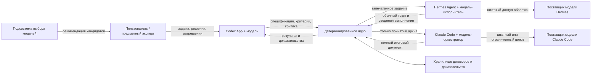
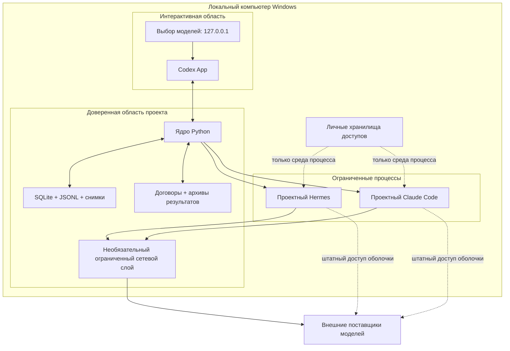
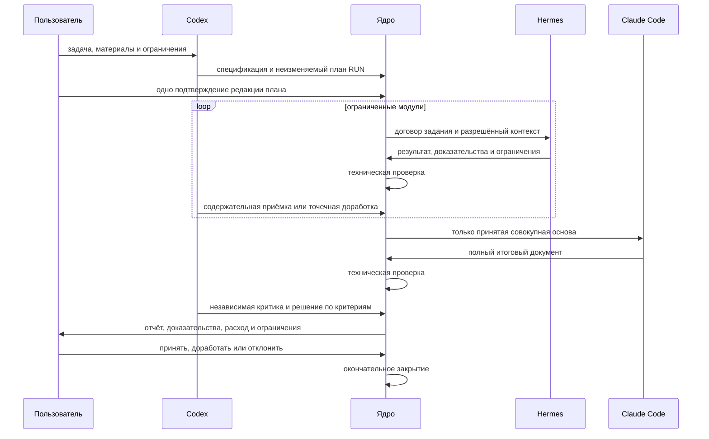

# Актуальная целевая архитектура и трассировка требований PRD

> **Обновление доказательной базы от 25 июля 2026 года.** RUN-025 подтвердил
> один закрытый полезный путь через низовой слой Hermes, Claude Code + GLM,
> независимую критику Codex и детерминированное закрытие ядром. Наблюдение
> подтверждает связность архитектуры в одной точной конфигурации, но не заменяет
> формальную приёмку R1, переносимость R2 и сравнение D-150. См.
> [документ 162](162-run025-first-useful-cycle-evidence-and-impact.md).

> **Примечание к публичной редакции.** Связи внутри комплекта 149–157 и внешние
> официальные либо научные источники сохранены. Ссылки на закрытые запуски,
> местные пути, внутреннюю память, код и материалы вне комплекта заменены
> текстовыми указателями; соответствующие закрытые файлы не опубликованы.

**Дата:** 21 июля 2026 года

**Редакция:** 1.0

**Состояние:** проект для пользовательской проверки; описывает целевую
архитектуру на основе фактической реализации, но не разрешает изменение кода,
договоров, RUN или настроек

**Основание:** [PRD редакции 1.0](149-product-requirements-document.md)

## 1. Назначение

Документ отвечает на четыре вопроса:

1. Из каких частей должен состоять продукт.
2. Какая часть владеет каждым решением и состоянием.
3. Через какой договор и переход проходит информация.
4. Как проверяется каждое из 57 требований PRD.

Архитектура строится не только по ранним документам 01–07, но и по фактически
реализованным программам, 40 JSON-схемам, 50 файлам местных проверок и
измеренным отказам RUN-014–RUN-024. Желаемое состояние отделено от текущего.

## 2. Источники архитектуры

- [PRD всего продукта](149-product-requirements-document.md);
- доказательная история;
- компоненты и границы 0.1;
- ранняя модель состояний;
- договоры данных 0.1;
- минимальное ядро и фактические переходы;
- критический аудит;
- содержательный контур;
- передача принятого результата;
- эксплуатационный профиль 1.2;
- штатная передача Hermes;
- стандарт доказательности;
- программы, схемы и проверки текущей ветки на исходном коммите `4dd70bb`;
- спецификация выбора моделей
  и программы `choose_model` на коммите `e89d3a2`.

Ранняя модель состояний в документе 03 шире фактически реализованного автомата.
Она является источником замысла, но не описанием текущего кода.

## 3. Архитектурные правила

### АРХ-001. Один владелец официального состояния

Только детерминированное ядро создаёт официальные сущности и выполняет
переходы. Пользователь и модели подают подписанные содержанием договоры или
решения, но не редактируют состояние напрямую. Основания: D-002, D-009 и
код ядра.

### АРХ-002. Модели не общаются напрямую

Передача выполняется через ядро и неизменяемые файлы. Следующая модель получает
не память предыдущего диалога, а проверенный архив и квитанцию передачи.

### АРХ-003. Договор сильнее запроса

Системный запрос объясняет задачу, но права, входы, выходы, пределы и критерии
закрепляются версионными договорами и проверяются программой.

### АРХ-004. Две независимые приёмки

Техническая проверка отвечает на вопрос «пакет цел и соответствует договору?».
Содержательная — «результат точен, полон и доказателен?». Состояние `verified`
не открывает зависимый путь без `accepted`.

### АРХ-005. Качество оценивается до цены

Цена и токены сохраняются, но скрыты от содержательного проверяющего там, где
могут повлиять на решение. Дешёвый результат не компенсирует критическую
ошибку.

### АРХ-006. Один допуск на неизменяемый план RUN

Пользователь утверждает общий план, точные связки, максимальное число вызовов и
общий предел один раз. Вызовы внутри неизменяемого плана не требуют
микроподтверждений. Любое расширение плана требует нового решения.

### АРХ-007. Проектные профили изолированы

Конвейер не меняет глобальные пользовательские настройки Codex App, Claude Code
и Hermes Agent. Связка для RUN определяется отдельным профилем или запечатанной
выдачей.

### АРХ-008. Неизвестное остаётся неизвестным

Потерянная причина, неполный расход или неопределённый сетевой исход не
заменяются нулём или правдоподобной догадкой.

### АРХ-009. Выбор модели — рекомендация

Подсистема выбора может допустить, ранжировать или отклонить кандидатов. Только
пользователь включает связку в план RUN; ядро проверяет точную конфигурацию.

### АРХ-010. Расширение следует за измеренной ошибкой

Новый компонент, состояние или постоянное правило добавляется после
воспроизводимого сбоя либо утверждённого требования выпуска, а не потому, что
механизм описан в публикации.

## 4. Контекст системы



Стрелки между моделями отсутствуют. Ядро не пересылает внутреннюю историю
рассуждения как официальный результат и не доверяет заявлению модели об успехе
без проверки файлов и состояния процесса.

## 5. Уровни архитектуры

| Уровень | Состав | Ответственность |
|---|---|---|
| Человек и взаимодействие | пользователь, предметный эксперт, Codex App, местный интерфейс выбора | постановка, решения, критика, объяснение |
| Смысловая работа | модель Codex, модель Hermes, модель Claude Code | спецификация, доказательные модули, синтез и критика |
| Детерминированное управление | ядро, координаторы, содержательные шлюзы | состояния, зависимости, приёмка, остановка и отчёт |
| Исполнение | диспетчер процессов, наблюдатель Windows, переходники оболочек | запуск, аренда, сигнал жизни, стандартный вывод и завершение |
| Внешняя граница | сетевой посредник, местный шлюз, транспорт поставщика | разрешённый запрос, квитанция, неопределённый исход |
| Данные и доказательства | SQLite, JSONL, снимки, архивы, договоры, журналы расхода | источник истины, целостность, воспроизведение и аудит |
| Рекомендация связки | программа выбора, карточки доказательств, местный веб-интерфейс | фильтры, неопределённость, ранжирование и честный отказ |
| Документация | история, PRD, архитектура, паспорта, инструкции | воспроизводимость человеком и профессиональная проверка |

## 6. Компоненты и границы полномочий

### 6.1. Пользователь

Владеет целью, допустимым риском, внешними расходами, существенными допущениями,
выбором связки и окончательной приёмкой. Пользователь не обязан вручную менять
SQLite, вычислять SHA-256 или повторять формальные проверки.

### 6.2. Codex App

Выполняет интерактивный вход, формирует спецификацию и критерии, принимает или
отклоняет доказательную основу, критикует итог и готовит человекочитаемое
объяснение. В сравнении D-150 не может быть единственным судьёй результата,
который сам подготовил.

Текущий пробел: роль описана процедурно, но не имеет отдельного проектного
профиля, входного переходника и воспроизводимого паспорта.

### 6.3. Hermes Agent

Получает одно ограниченное доказательное задание. Модель возвращает обычный
текст без обязательного файлового средства; детерминированный переходник
сохраняет результат. V4 Flash — текущая модель низового слоя, но не постоянная
часть архитектуры.

Текущий статус: текстовый и нативный пути реализованы и местно проверены;
полноценная пригодность для совокупной основы R1 не доказана.

### 6.4. Claude Code

Получает только принятую основу, проверяет покрытие и противоречия, затем
создаёт полный итоговый документ. Конкретная модель и поставщик заменяемы.

Текущий статус: переходники и ограниченные реальные вызовы существуют; полный
итог после принятой совокупной основы R1 ещё не получен.

### 6.5. Детерминированное ядро

Владеет состояниями, договорами, идемпотентностью, зависимостями, попытками,
архивами, приёмкой, расходом, событиями и завершением. Основная реализация —
pipeline_controller.py.

Текущий статус: сильная реализованная основа. Необходимы единая спецификация
фактических команд, политика миграций и трассировка всех требований.

### 6.6. Подсистема выбора моделей

Получает запрос пользователя и карточки доказательств; возвращает рекомендацию
или отказ. Не создаёт проектных сущностей и не запускает модели.

Текущий статус: программа и интерфейс реализованы в `choose_model`; 39 карточек
не имеют прямых первичных ссылок и поэтому не готовы для R2.

## 7. Размещение и границы доверия



Показаны два допустимых, но не равносильных сетевых пути. При посредническом
пути запрос и квитанция принадлежат проекту. При нативном пути оболочка сама
использует сохранённый у неё доступ к поставщику, а ядро получает только
наблюдаемый процесс, стандартный вывод и сведения расхода. Нативный путь нужен
для исходного замысла разных оболочек и не должен скрыто выдаваться за более
сильную сетевую изоляцию посредника.

Границы:

1. **Пользовательская:** ввод и решения не считаются машинно проверенными, пока
   не оформлены договором.
2. **Процессная:** оболочка не получает право менять официальное хранилище.
3. **Файловая:** запись ограничена каталогом попытки.
4. **Сетевая:** запрос проходит по заранее закреплённому нативному или
   посредническому пути, разрешённому поставщику, модели и пределу; тип пути
   сохраняется как часть конфигурации связки.
5. **Секретов:** значение ключа не входит в договор, журнал и архив.
6. **Содержательная:** технически целый файл остаётся недоверенным до отдельной
   приёмки.
7. **Межветочная:** `documentation` описывает, `main` реализует,
   `choose_model` развивает рекомендацию связок.

## 8. Фактическая модель состояний

Целевая архитектура R1 использует компактный автомат, уже реализованный в
`pipeline_controller.py`. Планирование и критика представлены договорами, а не
новыми официальными состояниями.

### 8.1. Проект

```text
active → awaiting_final_acceptance → completed
   └──────────────────────────────→ cancelled
```

Допустим также возврат `awaiting_final_acceptance → active`, если итог не принят.

### 8.2. RUN

```text
active → report_ready → content_accepted → closed
   │          └──────→ rework_required → closed
   └───────────────────────────────→ cancelled
```

Для неуспешного отчёта допускается `report_ready → closed` с решением `stop`.

### 8.3. Задание

```text
ready → active → result_submitted → verified → accepted
           │             │             ├→ needs_rework → ready
           │             │             ├→ superseded
           │             └→ failed     └→ cancelled
           └→ ready / failed / cancelled
```

Зависимое задание может стать исполнимым только после `accepted` всех
обязательных предшественников.

### 8.4. Попытка

```text
active → result_submitted → verified
  ├→ cancelled → quarantined
  ├→ failed ───→ quarantined
  └→ orphaned → active / result_submitted / cancelled / failed / quarantined
```

### 8.5. Почему не переносится весь автомат документа 03

Состояния `planning`, `assembling`, `critiquing` и другие ранние стадии полезны
как смысловые этапы, но не требуются для управления текущим R1. Их добавление
увеличило бы число переходов и миграций без измеренного дефекта. Соответствующие
артефакты — спецификация, план, критика и отчёт — уже имеют отдельные договоры.

## 9. Основной последовательный поток R1

| Шаг | Владелец смысла | Действие ядра | Договор или доказательство | Условие продолжения |
|---:|---|---|---|---|
| 1 | пользователь + Codex | создаёт проект | спецификация | пользователь утвердил цель и критерии |
| 2 | Codex | создаёт RUN и задания | план, граф заданий, общий план допуска | схема и пределы допустимы |
| 3 | пользователь | фиксирует решение | пользовательский допуск плана RUN | SHA-256 и срок совпадают |
| 4 | Hermes | выполняет доказательный модуль | задание, выдача, процесс, результат | технический пакет цел |
| 5 | Codex | фиксирует содержательную оценку | ведомость качества или критика | модуль `accepted` либо путь остановлен |
| 6 | ядро | собирает совокупную основу | принятые архивы и квитанции | все обязательные модули приняты |
| 7 | Claude Code | создаёт полный итог | передача, задание, попытка, результат | итог технически цел |
| 8 | Codex | критикует итог | критика и ведомость качества | нет критических нарушений |
| 9 | ядро | готовит отчёт | отчёт RUN | расходы закрыты, происхождение проверено |
| 10 | пользователь | принимает, останавливает или требует доработку | пользовательское решение | SHA-256 отчёта совпадает |
| 11 | ядро | закрывает RUN и проект | события и снимок | все переходы воспроизводимы |

Ни отказ Hermes, ни непринятая основа не разрешают запуск Claude Code.

## 10. Хранилище и владение данными

| Данные | Канонический владелец | Правило |
|---|---|---|
| Официальное состояние | SQLite ядра | меняется только в транзакции ядра |
| Журнал событий | экспорт из SQLite | цепочка SHA-256; восстанавливаемая проекция |
| Последний снимок | ядро | связан с головой событий |
| Исходный договор | автор + ядро | нормализуется и запечатывается до исполнения |
| Рабочий файл попытки | исполнитель | недоверенный до публикации |
| Архив результата | ядро | неизменяем после публикации |
| Критика и приёмка | Codex/эксперт + ядро | связаны с точным архивом |
| Расход | ядро из проверяемого отчёта | неполный расход хранится отдельно |
| Сетевой ответ | ограниченный транспорт | связывается с запросом и квитанцией |
| Карточка выбора | подсистема выбора | версионируется; не изменяется задним числом |
| Документация | ветка `documentation` | ссылается на код и результаты, но не меняет их |

## 11. Каталог договоров

Коды ниже используются в матрице требований.

| Код | Договор или группа | Схема |
|---|---|---|
| Д01 | спецификация | specification.schema.json |
| Д02 | задание | task.schema.json |
| Д03 | план и граф | plan, task_graph |
| Д04 | выдача и наблюдение процесса | process_dispatch, process_observation |
| Д05 | результат попытки | attempt_result |
| Д06 | доказательство | evidence |
| Д07 | критика и ведомость качества | critique, role_quality_sheet |
| Д08 | передача принятого архива | accepted_result_handoff |
| Д09 | последовательная координация | sequential_coordination |
| Д10 | маршрутизация | routing_decision |
| Д11 | отчёт и доработка | report, run_rework |
| Д12 | решение пользователя | user_decision |
| Д13 | событие и снимок | event, snapshot |
| Д14 | диагноз отказа | failure_diagnosis |
| Д15 | расход и цены | resource_usage, model_pricing |
| Д16 | доказательства расхода | usage_evidence_manifest, usage_reference_registry |
| Д17 | сетевой запрос и исход | request, receipt, uncertain |
| Д18 | ограниченный доступ DeepSeek | approval, consumption, binding |
| Д19 | переходники Hermes | harness_relay, native_job, native_preparation |
| Д20 | местный шлюз Claude | claude_local_gateway |
| Д21 | контрольный набор качества | quality_control_set |
| Д22 | сравнение D-150 | plan, assessment, result |
| Д23 | выбор модели | selection request, evidence, recommendation |
| Д24 | единый допуск плана RUN | **отсутствует**; требуется новая схема, объединяющая план, связки, общий предел и число вызовов |
| Д25 | паспорт связки и версии | **отсутствует**; требуется для R2 и связи с Д23 |

Д18 отражает исторический одноцелевой допуск DeepSeek. Целевая R1 не должна
размножать его на каждый вызов: Д24 становится единым пользовательским решением
для неизменяемого плана RUN.

## 12. Каталог проверок

| Код | Область | Существующие проверки |
|---|---|---|
| П01 | ядро, состояния, идемпотентность | test_pipeline_controller.py, test_run_finalization.py |
| П02 | результат и публикация | test_result_builder.py, test_result_publisher.py |
| П03 | передача принятого архива | test_accepted_handoff_builder.py |
| П04 | процессы и восстановление | test_process_dispatcher.py, test_windows_process_observer.py |
| П05 | содержательное качество | test_content_quality_gate.py, test_stage2_quality_assurance.py |
| П06 | координация и зависимости | test_sequential_coordinator.py, test_task_graph_coordinator.py |
| П07 | Claude Code | test_claude_dispatch_adapter.py, test_claude_local_gateway.py, test_claude_zai_transport.py |
| П08 | Hermes | test_hermes_text_output_system.py, test_hermes_native_dispatch.py, test_hermes_native_profile_adapter.py |
| П09 | сеть и изоляция | test_network_broker.py, test_network_provenance.py, test_windows_sandbox.py |
| П10 | расход и допуск | test_metered_dispatch.py, test_resource_usage_builder.py, test_usage_archive_compatibility.py |
| П11 | сравнение D-150 | test_comparison_evaluator.py |
| П12 | контрольный набор | test_quality_control_set.py |
| П13 | полный искусственный цикл | test_three_role_system_cycle.py, test_sequential_three_role_protected.py |
| П14 | выбор моделей | test_model_selector.py в `choose_model` |
| П15 | чистая установка и обновление | **отсутствует**; требуется проверка R2 на отдельном компьютере |
| П16 | полнота ссылок и трассировки | **отсутствует**; требуется проверка матрицы PRD и доступности источников |
| П17 | пользовательский сценарий Codex | **отсутствует**; требуется проверяемый паспорт и учебный сценарий |
| П18 | единый допуск плана RUN | **отсутствует**; требуется до реализации Д24 |

Существование файла проверки не означает полного покрытия требования. Статус
каждой строки указан в матрицах ниже.

## 13. Правила чтения матрицы

В следующих таблицах используются три состояния готовности:

- **И — реализовано:** механизм есть в программе и покрыт местной проверкой;
- **Ч — частично:** основа существует, но не сведена в единый пользовательский
  путь, не проверена полным полезным циклом либо требует усиления;
- **П — пробел:** необходимого договора, механизма или проверки ещё нет.

Столбец «состояние» показывает официальное состояние ядра или переход, на
котором требование должно проявляться. Знак `—` означает, что требование не
имеет права менять официальное состояние. Договоры и проверки обозначены
кодами из разделов 11 и 12. Каждое требование PRD встречается ровно один раз.

## 14. Функциональные требования

| Требование | Компонент-владелец | Договор | Состояние или переход | Проверка | Статус и недостающее |
|---|---|---|---|---|---|
| PRD-F-001 | Codex, пользователь, ядро | Д01 | проект `active` | П01; целевая П16 | **Ч:** сохранение проекта есть; единого проверяемого входного пакета с файлами, ссылками, доменом и удалением секретов нет |
| PRD-F-002 | Codex, ядро | Д01, Д07 | проект `active`, до создания RUN | П05; целевая П17 | **Ч:** критерии и решения поддерживаются, но паспорт Codex и обязательная редакция спецификации не сведены в один путь |
| PRD-F-003 | ядро | Д13 | все состояния проекта, RUN, задания и попытки | П01 | **И:** личности, версии, связи и журнал реализованы |
| PRD-F-004 | Codex, Claude, ядро | Д02, Д03, Д10 | задание `ready` | П06 | **Ч:** граф и ограничения поддержаны; правило нераздутой роли исполнителя пока закреплено документами, а не отдельной проверкой договора |
| PRD-F-005 | Hermes, ядро | Д02, Д04, Д19 | попытка `active` | П08 | **Ч:** проектный профиль и штатный экспорт реализованы; полезный большой модуль V4 Flash ещё не принят |
| PRD-F-006 | Hermes, Codex, ядро | Д05, Д06 | `result_submitted` | П02, П05; целевая П16 | **Ч:** файлы и честный технический исход проверяются; единая машиночитаемая проверка доказательств и границ вывода неполна |
| PRD-F-007 | ядро | Д05 | `result_submitted → verified` | П01, П02 | **И:** договор, путь, SHA-256, состав и состояние проверяются до содержательной оценки |
| PRD-F-008 | Codex, ядро | Д07 | `verified → accepted/needs_rework` | П05 | **Ч:** разделение реализовано и применялось; нужен полный успешный R1 |
| PRD-F-009 | ядро, следующая роль | Д08 | исходное задание `accepted`, целевое `ready` | П03 | **И:** передаётся принятый архив с квитанцией и контрольными суммами |
| PRD-F-010 | Claude Code, ядро | Д02, Д04, Д05, Д08, Д20 | полный цикл попытки | П07 | **Ч:** переходник и местный шлюз есть; законченный полезный итог из всей принятой основы не доказан |
| PRD-F-011 | Codex, ядро | Д07 | `verified → accepted/needs_rework` | П05; целевая П17 | **Ч:** ведомость качества есть; паспорт и воспроизводимый пользовательский сценарий Codex отсутствуют |
| PRD-F-012 | Codex, ядро | Д02, Д07, Д11 | `verified → needs_rework`; прежнее задание `superseded`, новое `ready` | П01, П11 | **И:** архив не меняется, преемник и решение фиксируются; содержательное применение ещё зависит от Codex |
| PRD-F-013 | пользователь, ядро | Д11, Д12 | RUN `report_ready → content_accepted/rework_required → closed`; проект `awaiting_final_acceptance → completed` | П01 | **И:** отчёт, решение и закрытие разделены и идемпотентны |
| PRD-F-014 | ядро | Д04, Д13, Д14 | `orphaned` и восстановление без нового вызова | П01, П04 | **И:** основное состояние, события и процессы сверяются; поздний пакет изолируется |
| PRD-F-015 | пользователь, Codex, ядро | Д15, Д16; целевой Д24 | RUN `active`, до первой попытки | П10; целевая П18 | **П:** одноцелевые допуски существуют, но единого неизменяемого утверждения всего плана RUN ещё нет |
| PRD-F-016 | ядро, транспортный слой | Д15, Д16 | отдельный жизненный цикл резерва и учёта; состояние качества не меняется | П10 | **И:** расход отделён от качества, неполнота и подписочный эквивалент различаются |
| PRD-F-017 | подсистема выбора, пользователь | Д23 | — | П14; целевая П16 | **Ч:** рекомендация отделена от управления; карточкам доказательств не хватает прямых источников и SHA-256 |
| PRD-F-018 | администратор, три оболочки | целевой Д25, проектные профили | — | П07, П08; целевые П15, П17 | **П:** изоляция Hermes и Claude частично проверена; общего паспорта профилей и Codex-сценария нет |
| PRD-F-019 | ядро, документация | Д06, Д13 | все значимые решения и публикации | П05; целевая П16 | **Ч:** события и локальные ссылки есть; сквозная автоматическая проверка «утверждение → источник → решение → исполнение → проверка» отсутствует |
| PRD-F-020 | администратор, ядро | Д13 | любое состояние, без модельного вызова | П01, П04 | **И:** имеются самопроверка, проверка схем, SQLite, журнала и процессов; профили оболочек требуют объединённой команды |
| PRD-F-021 | подсистема выбора, администратор, ядро | Д23; целевой Д25 | новая конфигурация до нового RUN | П14; целевая П15 | **Ч:** связка отделена от модели и зрелость не переносится; установка новой связки ещё не оформлена как переносимый профиль |
| PRD-F-022 | оценщик, пользователь, ядро | Д22 | отдельный проект сравнения до `report_ready` | П11 и будущий настоящий D-150 | **Ч:** договоры и вычислитель есть; независимое сравнение на заранее утверждённых реальных задачах не проведено |

## 15. Требования к качеству

| Требование | Компонент-владелец | Договор | Состояние или переход | Проверка | Статус и недостающее |
|---|---|---|---|---|---|
| PRD-Q-001 | Codex, Hermes, Claude, ядро | Д06, Д07 | `verified → accepted/needs_rework` | П05; целевая П16 | **Ч:** критическая ошибка блокирует приёмку; автоматическая проверка прямого основания каждого утверждения неполна |
| PRD-Q-002 | Codex, ядро | Д01, Д03, Д07, Д11 | задание `verified`, RUN `report_ready` | П01, П05 | **Ч:** ведомость критериев поддержана; единая обязательная мера покрытия всей спецификации ещё не встроена в путь R1 |
| PRD-Q-003 | Codex, ядро | Д06, Д07, Д14 | `verified → needs_rework` либо попытка `failed` | П05 | **Ч:** запрет закреплён и применялся; проверка новых чисел и ссылок пока преимущественно содержательная |
| PRD-Q-004 | документация, исполнители, ядро | Д06, Д23 | до `accepted` | целевая П16 | **П:** стандарт есть, но автоматической проверки прямой ссылки, точного места и SHA-256 для всех существенных утверждений нет |
| PRD-Q-005 | переходники, ядро | Д05, Д14, Д17, Д19, Д20 | `active/result_submitted → failed` либо запрет приёмки | П07, П08, П09 | **Ч:** технические признаки усечения ловятся в нескольких путях; единое правило для всех оболочек и обычного текста не доказано |
| PRD-Q-006 | Claude, Codex | Д07, Д11 | `verified → accepted/needs_rework`; RUN `report_ready` | П05; целевая П17 | **Ч:** причины и замечания сохраняются; полнота выявления противоречий зависит от качества модельных ролей |
| PRD-Q-007 | Codex, независимый оценщик | Д07, Д22 | содержательная приёмка и отдельный проект D-150 | П11; целевая П17 | **Ч:** исполнитель не меняет состояние и не принимает себя; независимый судья настоящего D-150 ещё не утверждён и не испытан |
| PRD-Q-008 | Codex, документация, пользовательский слой | целевой Д25 | — | целевые П15, П17 | **П:** русскоязычные правила действуют в репозитории, но единый пользовательский слой и проверка понятности результата отсутствуют |
| PRD-Q-009 | пользователь, ядро, оценщик | Д07, Д15, целевой Д24 | RUN `active`; качество оценивается до учёта цены | П05, П10; целевая П18 | **Ч:** качество и расход разделены; единый план RUN должен запретить скрытое сокращение результата при приближении к пределу |
| PRD-Q-010 | подсистема выбора, документация | Д23 | — | П14; целевая П16 | **Ч:** область вывода и зрелость предусмотрены; карточки без первичных источников пока не дают честной доказательной зрелости |

## 16. Надёжность и восстановление

| Требование | Компонент-владелец | Договор | Состояние или переход | Проверка | Статус и недостающее |
|---|---|---|---|---|---|
| PRD-R-001 | ядро | Д02, Д04 | задание `ready/active`, попытка `active` | П01, П04 | **И:** единственная активная попытка обеспечена ограничениями хранилища; общий предел задаётся договором |
| PRD-R-002 | ядро | Д13 | любая изменяющая команда | П01 | **И:** одинаковый ключ возвращает прежний ответ, несовместимый запрос даёт конфликт |
| PRD-R-003 | диспетчер, ядро | Д04 | `active → orphaned/terminal` | П04 | **И:** личность процесса, аренда, сигналы жизни и наблюдение реализованы |
| PRD-R-004 | ядро | Д05, Д13, Д14 | `cancelled/failed/orphaned → quarantined` | П01, П02 | **И:** поздний пакет не меняет состояние задания и сохраняется отдельно |
| PRD-R-005 | ядро | Д05, Д08, Д13 | `verified/accepted`, затем передача | П01, П02, П03 | **И:** принятый архив неизменяем и проверяется по контрольным суммам |
| PRD-R-006 | ядро, переходники | Д14, Д17 | `active → failed/cancelled` | П07, П08, П09 | **Ч:** `unknown` поддержан и причина отделена от расхода; все внешние оболочки ещё не сведены к одному договору отказа |
| PRD-R-007 | пользователь, ядро | Д12, Д18; целевой Д24 | восстановление RUN и попытки без повторного `active` | П01, П10; целевая П18 | **Ч:** повтор прежней попытки и повторное потребление допуска блокируются частично; единый допуск RUN отсутствует |
| PRD-R-008 | ядро | Д13 | любое состояние | П01 | **И:** SQLite, снимки, JSONL и цепочка событий сверяются и восстанавливаются |

## 17. Безопасность и конфиденциальность

| Требование | Компонент-владелец | Договор | Состояние или переход | Проверка | Статус и недостающее |
|---|---|---|---|---|---|
| PRD-S-001 | администратор, переходники, ядро | Д04, Д17, Д19, Д20; целевой Д25 | попытка `active` | П07, П08, П09; целевая проверка секретов в П15 | **Ч:** ключи остаются в профилях поставщиков; общей проверяемой процедуры поиска секретов в истории, журналах и выпускном пакете нет |
| PRD-S-002 | ядро, изоляция процесса | Д02, Д04, Д05 | `active → result_submitted` | П01, П02, П09 | **И:** пути, выход за корень и альтернативные потоки блокируются; это дополняется изоляцией процесса |
| PRD-S-003 | администратор, проектные профили оболочек | Д19, Д20; целевой Д25 | — | П07, П08; целевая П15 | **Ч:** отдельные пути проверены; общий контроль контрольных сумм глобальных настроек трёх оболочек отсутствует |
| PRD-S-004 | сетевой посредник, ядро | Д17, Д18, Д19, Д20 | попытка `active` | П09 | **Ч:** управляемый сетевой путь и квитанции реализованы для отдельных режимов; нативный доступ оболочки по определению остаётся за её границей доверия |
| PRD-S-005 | администратор, выпускной пакет | целевой Д25 | — | целевая П15 | **П:** правило есть, но отдельной административной процедуры установки, проверки поставщика и отката ещё нет |
| PRD-S-006 | пользователь, ядро | Д12; целевой Д24 | проект и RUN до `closed/completed` | П01; целевая П18 | **Ч:** ядро не публикует наружу; формальный перечень необратимых действий и единый запрет выпуска отсутствуют |
| PRD-S-007 | документация, администратор выпуска | целевой Д25 | — | целевые П15, П16 | **П:** требуется выпускная проверка удаления ключей, личных путей и конфиденциального содержания |

## 18. Нефункциональные требования

| Требование | Компонент-владелец | Договор | Состояние или переход | Проверка | Статус и недостающее |
|---|---|---|---|---|---|
| PRD-N-001 | ядро | Д13 | все изменяющие команды | П01 | **И:** идемпотентность и конфликт ключей реализованы |
| PRD-N-002 | ядро | Д05, Д08, Д13 | публикация, приёмка, отчёт и восстановление | П01, П02, П03 | **И:** целостность SQLite, цепочки событий и архивов проверяется |
| PRD-N-003 | администратор, выпускной пакет | целевой Д25 | — | целевая П15 | **П:** установка R2 на чистом компьютере не подготовлена и не проверена |
| PRD-N-004 | ядро, администратор | версии схем, Д13; целевой Д25 | миграция состояния | П01; целевая П15 | **Ч:** схемы и миграции ядра версионированы; полный договор обновления и отката продукта отсутствует |
| PRD-N-005 | архитектура, подсистема выбора, ядро | Д02, Д23; целевой Д25 | новая конфигурация до нового RUN | П14; целевая П15 | **Ч:** модель состояний не зависит от модели; подключение новой связки ещё не оформлено единым расширением |
| PRD-N-006 | все роли, ядро, документация | Д07, Д11, Д12, Д14, Д23 | соответствующее решение или отказ | П05, П14; целевые П16, П17 | **Ч:** причины сохраняются, но сквозная ссылка на основание и понятное пользовательское объяснение не унифицированы |
| PRD-N-007 | пользователь, ядро | Д02, Д03, Д04, Д15; целевой Д24 | RUN и попытка до `active` | П04, П10; целевая П18 | **Ч:** большинство отдельных пределов есть; единого неизменяемого плана ресурсов RUN нет |
| PRD-N-008 | ядро, переходники | Д05, Д14, Д17; целевой Д24 | `active → failed/cancelled`, без скрытой смены | П07–П10; целевая П18 | **Ч:** отказ сохраняется; единое доказательство запрета скрытой смены модели и сокращения критериев отсутствует |
| PRD-N-009 | администратор, три оболочки | Д19, Д20; целевой Д25 | — | П07, П08; целевые П15, П17 | **Ч:** Hermes и Claude имеют проектные пути; Codex и общий сценарий совместимости ещё не описаны и не проверены |
| PRD-N-010 | ветка документации, владельцы компонентов | комплект документов; целевой Д25 | — | целевые П15–П17 | **Ч:** PRD, история, стандарт и эта архитектура созданы; паспорта, установка, эксплуатация, диагностика и обновление ещё впереди |

## 19. Сводное покрытие PRD

Матрица содержит все **57 из 57** требований PRD без повторов:

- 22 функциональных;
- 10 требований к качеству;
- 8 требований надёжности;
- 7 требований безопасности;
- 10 нефункциональных.

Текущая оценка по строгому правилу раздела 13:

| Состояние | Число требований | Значение |
|---|---:|---|
| реализовано | 17 | механизм существует и имеет местную проверку |
| частично | 33 | есть основа, но нет полного пользовательского доказательства либо единого договора |
| пробел | 7 | требуемого механизма или проверки ещё нет |

Эти числа не являются процентом готовности продукта: требования различаются по
масштабу и риску. Например, один пробел Д24 затрагивает сразу порядок допуска
всех внешних вызовов, а одна реализованная гарантия идемпотентности обслуживает
много сценариев.

## 20. Состояние компонентов

| Компонент | Что уже является опорой | Что нужно для цели |
|---|---|---|
| детерминированное ядро | сильная модель состояний, идемпотентность, архивы, карантин, процессы, расход, отчёт и восстановление | Д24, связь общего плана с фактическими вызовами и выпускная проверка |
| Codex App | фактически выполняет вход, спецификацию, критику и решения через данный проект | паспорт роли, проектный профиль, воспроизводимый сценарий П17 и явный договор входа/критики |
| Hermes Agent | текстовый экспорт, нативный проектный профиль, ограниченные задания и сохранение диагностики | успешные полезные модули V4 Flash, принятая совокупная основа и правило подъёма сложности на измеренном отказе |
| Claude Code | настроенная связка, переходник, местный шлюз, доступ к принятому архиву | полный законченный документ из принятой основы и подтверждение отсутствия усечения на полезной задаче |
| подсистема выбора моделей | методика, спецификация, схемы, программа и местные проверки в отдельной ветке | первичные источники в карточках, Д25, переносимый выпуск и сохранение рекомендательного характера |
| хранилище и наблюдаемость | SQLite, цепочка событий, снимки, архивы, журналы, ведомости расхода | единая проверка доказательной трассировки и выпускное обезличивание |
| документация | история, PRD, стандарт источников, реестр и настоящая архитектура | паспорта всех частей, описание реализации, установка, эксплуатация, диагностика и обновление |

## 21. Архитектурные разрывы, которые блокируют выпуски

### 21.1. До R1

1. **Д24 — единый неизменяемый план RUN.** Он должен связать цель, редакцию
   спецификации, граф заданий, точные связки, пределы времени и размера,
   общий денежный предел, максимальное число вызовов, правила остановки и одно
   решение пользователя. Изменение любого значимого поля создаёт новую
   редакцию и требует нового решения.
2. **Паспорт Codex и пользовательский путь П17.** Входной компонент сейчас
   существует как фактическая практика, а не как переносимая часть продукта.
3. **Один полезный полный цикл.** Ограниченные модули Hermes должны дать
   принятую совокупную основу; Claude — полный итог; Codex — независимую
   критику; пользователь — окончательное решение. Искусственная проверка П13
   этого не доказывает.
4. **Сквозная проверка качества.** Утверждения, критерии, источники и границы
   вывода должны быть видны от входа до итогового отчёта.

### 21.2. До R2

1. **Д25 — паспорт выпуска и связок:** версии ядра, оболочек, моделей,
   поставщиков, настроек, схем и проектных профилей с контрольными суммами.
2. **П15 — чистая установка:** отдельный компьютер, отсутствие прежнего
   каталога, безопасный ввод ключей, самопроверка, обновление и откат.
3. **П16 — автоматическая проверка ссылок и происхождения:** в том числе
   прямые адреса и SHA-256 карточек подсистемы выбора.
4. Паспорта всех компонентов, руководство пользователя, администратора и
   разработчика, диагностика и выпускное обезличивание.

### 21.3. До R3

1. заранее утверждённый точный протокол D-150;
2. одинаковые реальные задачи и равные общие ресурсные пределы;
3. запечатанные результаты и независимый оценщик, не совпадающий с автором;
4. оценка качества до раскрытия цены;
5. вывод только для проверенных связок, настроек, домена и выборки.

## 22. Целевые последовательности

### 22.1. Нормальный полезный цикл



### 22.2. Технический отказ

1. Переходник сохраняет наблюдаемую причину, неполные сведения расхода и
   личность процесса раздельно.
2. Ядро переводит попытку в допустимое терминальное состояние.
3. Задание не принимается и зависимый путь не открывается.
4. Восстановление не выполняет новый вызов и не повторяет допуск.
5. Повтор или новая связка возможны только как новая попытка либо задание в
   пределах заранее разрешённого плана; иначе нужен новый план.

### 22.3. Содержательный отказ

1. Технически исправный пакет получает `verified`, но не `accepted`.
2. Codex фиксирует критерии, которые не выполнены, и точные ссылки на редакцию.
3. Ядро создаёт точечное задание-преемник либо останавливает зависимую ветвь.
4. Принятый ранее архив не редактируется.
5. Более сильная модель внутри Hermes допускается лишь по правилу сложности,
   закреплённому до нового исполнения, а не как скрытая замена.

### 22.4. Выбор связки

1. Пользователь или Codex формирует запрос Д23 с ролью, доменом, языком,
   риском, качеством и ресурсными ограничениями.
2. Подсистема применяет жёсткие фильтры и сравнивает только действующие
   доказательства применимой области.
3. Выход — кандидат, запасной вариант или честное «недостаточно данных».
4. Пользователь принимает решение; только после этого конфигурация попадает в
   новую редакцию Д24.
5. Подсистема выбора не вызывает модель и не меняет состояние ядра.

## 23. Почему целевая архитектура не расширяет автомат состояний

Ранняя схема в документе 03 содержала смысловые состояния вроде планирования,
сборки и критики. Фактическое ядро использует более компактные технические
состояния. Целевая архитектура сохраняет этот вариант по трём причинам:

1. смысловая стадия задаётся типом задания и договором, а не скрытым внутренним
   состоянием модели;
2. добавление состояний увеличивает число переходов, восстановительных ветвей
   и случаев гонки;
3. измеренной ошибки, требующей новых официальных состояний, пока нет.

Если будущий успешный цикл обнаружит повторяющуюся неоднозначность, новое
состояние добавляется только вместе с владельцем, переходами, миграцией,
событием и проверкой. Это сохраняет D-002 и D-009.

## 24. Последовательность доведения архитектуры

| Этап | Результат | Что сознательно не делается |
|---|---|---|
| А. Утвердить архитектуру | эта матрица становится исходной точкой спецификаций | код и договоры не меняются |
| Б. Паспорта частей | ядро, Codex, Hermes, Claude и выбор моделей получают одинаковую структуру паспорта | не переписывается уже качественная документация |
| В. Спецификация R1 | Д24, паспорт Codex, сквозной договор качества и точный полезный сценарий | не строятся RAG, самообучение и десятикомпонентный контур |
| Г. Реализация и местная проверка | закрываются П17, П18 и связанные частичные строки | модельные вызовы не используются для проверки программы |
| Д. Один полезный цикл | эмпирическое подтверждение R1 на настоящей задаче | не создаётся серия микропилотов |
| Е. Переносимый выпуск | Д25, П15, П16, установка, обновление и обезличивание | не объявляется превосходство нескольких моделей |
| Ж. D-150 | независимое сравнение после работающего R1/R2 | цена не раскрывается до оценки качества |

## 25. Критерии принятия этого документа

Документ можно считать принятой архитектурной основой, если пользователь
подтверждает одновременно следующее:

1. пять основных частей и детерминированное ядро распределяют полномочия верно;
2. компактная фактическая модель состояний сохраняется;
3. все 57 требований PRD связаны с владельцем, договором, состоянием и
   проверкой;
4. Д24 и Д25 признаны целевыми пробелами, а не существующими возможностями;
5. R1 требует одного полезного полного цикла, а не ещё одной местной или
   искусственной проверки;
6. следующие документы — паспорта частей и спецификация R1 — не могут
   незаметно расширить продукт за границы PRD.

Принятие документа не разрешает изменение кода, создание RUN, внешний вызов или
расход. Оно разрешает только перейти в ветке документации к паспортам пяти
частей и последующей спецификации R1.

