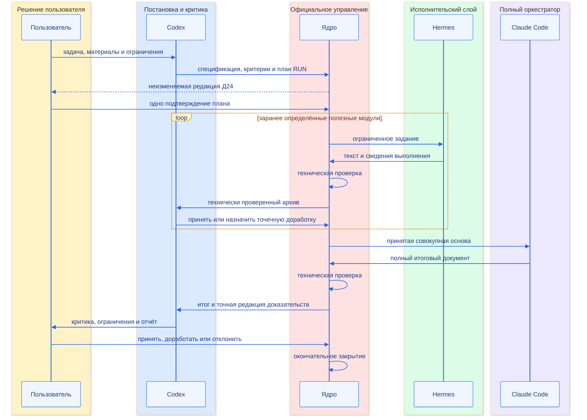
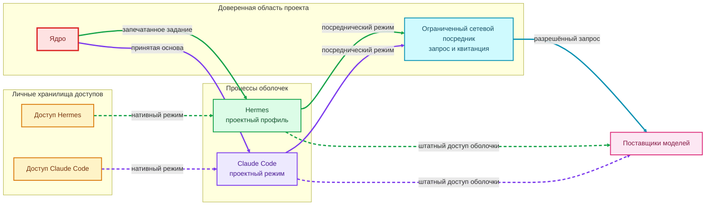
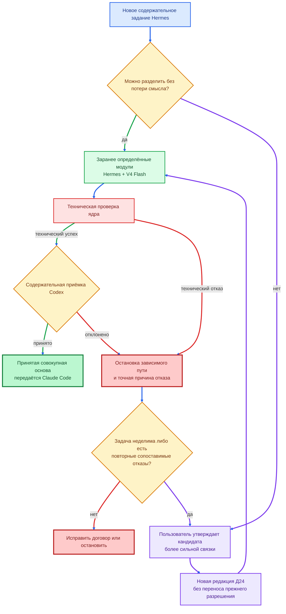

# Паспорта пяти основных частей продукта

> **Доказательное обновление от 25 июля 2026 года.** RUN-025 впервые связал все
> пять частей в закрытом полезном цикле: низовой слой создал принятую основу,
> Claude Code + GLM выполнил длинный синтез, Codex провёл независимую критику и
> финализацию, ядро сохранило происхождение и закрыло RUN, пользователь принял
> итог. Наблюдение относится только к точной проверенной конфигурации и не
> объявляет паспорта полностью реализованными для R1. Подробности:
> [документ 162](162-run025-first-useful-cycle-evidence-and-impact.md).

> **Примечание к публичной редакции.** Связи внутри комплекта 149–157 и внешние
> официальные либо научные источники сохранены. Ссылки на закрытые запуски,
> местные пути, внутреннюю память, код и материалы вне комплекта заменены
> текстовыми указателями; соответствующие закрытые файлы не опубликованы.

**Дата:** 22 июля 2026 года

**Редакция:** 1.2 — схемы приведены к единому акцентному цветовому стандарту

**Состояние:** сводный паспорт текущей реализации и целевых границ; не является
разрешением на изменение кода, запуск RUN, внешний вызов или расход

**Основания:** [PRD](149-product-requirements-document.md),
[целевая архитектура](150-current-target-architecture-and-prd-traceability.md),
реестр материалов и пробелов
и стандарт доказательности

## 1. Назначение

Документ даёт одинаковый минимально достаточный паспорт пяти частям продукта:

1. детерминированному управляющему ядру;
2. Codex App;
3. Hermes Agent;
4. Claude Code;
5. подсистеме выбора моделей.

### **Схема № 1. Пять частей продукта и владелец официального состояния**

```mermaid
flowchart LR
    U["Пользователь"]
    C["Codex App<br/>постановка и критика"]
    K["Детерминированное ядро<br/>единственный владелец состояния"]
    H["Hermes Agent<br/>доказательные модули"]
    L["Claude Code<br/>полный итоговый документ"]
    M["Выбор моделей<br/>только рекомендация"]

    U -->|"задача и решения"| C
    C -->|"спецификация и критерии"| K
    K -->|"ограниченное задание"| H
    H -->|"текст, доказательства, расход"| K
    K -->|"только принятая основа"| L
    L -->|"полный итог"| K
    K -->|"архив и состояние"| C
    C -->|"критика и отчёт"| U
    M -. "кандидаты и неопределённость" .-> U
    U -->|"утверждённая связка"| K

    classDef user fill:#fef3c7,stroke:#d97706,color:#78350f,stroke-width:2px
    classDef codex fill:#dbeafe,stroke:#2563eb,color:#1e3a8a,stroke-width:2px
    classDef core fill:#fee2e2,stroke:#dc2626,color:#7f1d1d,stroke-width:3px
    classDef hermes fill:#dcfce7,stroke:#16a34a,color:#14532d,stroke-width:2px
    classDef claude fill:#ede9fe,stroke:#7c3aed,color:#4c1d95,stroke-width:2px
    classDef selector fill:#fce7f3,stroke:#db2777,color:#831843,stroke-width:2px

    class U user
    class C codex
    class K core
    class H hermes
    class L claude
    class M selector

    linkStyle default stroke:#2563eb,stroke-width:3px
    linkStyle 8 stroke:#db2777,stroke-width:3px,stroke-dasharray:6 4
```



Сплошные стрелки показывают официальный путь данных и решений. Пунктирная
стрелка подчёркивает, что подсистема выбора рекомендует, но не управляет.
Цветовой код ролевых схем сохраняется далее: янтарный — пользовательское
решение, синий — Codex, красный — ядро, зелёный — Hermes, фиолетовый — Claude
Code, розовый — рекомендательная или итоговая контрольная точка.

Паспорт не переписывает ранние проекты, отчёты RUN, код и инструкции. Он
показывает, где находится каноническое описание, что подтверждено фактически,
что является целевым требованием и чего ещё нет.

## 2. Правила чтения

### 2.1. Три вида утверждений

| Метка | Значение |
|---|---|
| **Подтверждено** | свойство наблюдалось в коде, настройке, местной проверке или неизменяемом результате |
| **Цель** | свойство требуется PRD и архитектурой, но ещё может не быть реализовано |
| **Пробел** | необходимого договора, проверки, инструкции или доказательства нет |

Точная текущая модель не является постоянной частью продукта. Единицей
испытания и замены считается связка «модель + поставщик + оболочка + версия +
настройки + договор». Результат одной связки не переносится на другую без
отдельного основания.

### 2.2. Общая форма паспорта

Каждая часть описывается по одинаковым вопросам:

| Раздел | Обязательный вопрос |
|---|---|
| назначение | какую ценность создаёт часть |
| полномочия | чем владеет и чем не владеет |
| сценарии | как используется внутри продукта и самостоятельно |
| идентичность | какая реализация и конфигурация наблюдалась |
| вход | какие данные и договоры принимает |
| выход | какие данные, решения и ошибки возвращает |
| передача | как взаимодействует с соседней частью |
| настройка | где находятся проектные и личные параметры |
| безопасность | права, секреты, сеть и внешние действия |
| контекст и память | что загружается, сохраняется и сжимается |
| качество | как оцениваются точность, полнота и доказательность |
| наблюдаемость | какие события, журналы и сведения расхода доступны |
| отказы | как останавливается, восстанавливается и передаётся человеку |
| проверки | что проверено местно и в реальном пути |
| установка и обновление | что нужно для переноса и повторной проверки |
| ограничения | какие выводы запрещены |

### **Схема № 2. Один полный полезный цикл R1**



Схема показывает один последовательный RUN. Она не разрешает превращать каждый
модуль в отдельный опытный запуск или повторять модельный вызов автоматически.

## 3. Паспорт детерминированного управляющего ядра

### 3.1. Назначение и ценность

Ядро превращает решения пользователя и смысловых ролей в воспроизводимый
процесс. Оно владеет официальными состояниями, зависимостями, попытками,
пределами, архивами, событиями и остановкой, но не решает, истинно ли
содержательное утверждение.

Основная реализация — pipeline_controller.py.
Ранние основания находятся в компонентах и границах,
автомате состояний, договорах,
хранении и
минимальном ядре.

### 3.2. Исключительные полномочия

**Подтверждено:** только ядро может:

- создавать проект, RUN, задание и попытку;
- присваивать официальные идентификаторы и версии;
- выполнять допустимый переход состояния;
- регистрировать процесс, аренду и сигнал жизни;
- резервировать, учитывать и освобождать предел расхода;
- технически публиковать результат;
- фиксировать содержательное решение уполномоченной роли;
- создавать отчёт, решение пользователя и окончательное закрытие;
- восстанавливать экспорт и сверять цепочку событий.

Ядро не меняет цель, не исправляет текст модели, не выбирает гипотезу и не
подменяет содержательную приёмку.

### 3.3. Сценарии

Внутри конвейера ядро обслуживает полный путь от регистрации проекта до
закрытия. Самостоятельного пользовательского режима у него нет: это служба
проекта, вызываемая переходниками, координаторами или оператором через
проверяемые команды.

Для диагностики без модели доступны снимок состояния, самопроверка,
восстановление экспортов и сверка воспроизведения событий.

### 3.4. Идентичность реализации

**Подтверждено:** текущая основа — программа Python со стандартной библиотекой,
SQLite и файловыми архивами. В репозитории находятся 40 схем JSON и 50 файлов
местных проверок. Код и схемы относятся к исходной точке ветки документации
`4dd70bb`; паспорт не объявляет их переносимым выпуском.

Версия Python, версия SQLite, версия схем, редакция программы и набор миграций
должны войти в будущий паспорт выпуска Д25. Сейчас единого Д25 нет.

### 3.5. Входы и договоры

Основные входы:

- спецификация и план;
- договор задания и граф зависимостей;
- решение маршрутизации;
- описание попытки и запуска процесса;
- результат попытки и доказательства;
- содержательная критика и решение;
- отчёт расхода, сетевые квитанции и диагноз отказа;
- решение пользователя по отчёту.

Полный каталог договоров приведён в
[архитектуре, раздел 11](150-current-target-architecture-and-prd-traceability.md#11-каталог-договоров).
Ядро принимает только поддерживаемую редакцию схемы, нормализует договор и
связывает его с SHA-256.

### 3.6. Выходы и передача

Ядро создаёт:

- официальные записи SQLite;
- события JSONL с предыдущим SHA-256;
- снимки состояния;
- каталоги попыток;
- неизменяемые архивы технически проверенных результатов;
- квитанции передачи принятого результата;
- отчёты RUN, решения пользователя и итоговые состояния;
- архивы расхода и диагностики.

Следующая смысловая роль получает не изменяемый рабочий файл и не историю
диалога, а принятый архив через
accepted-result-handoff.

### 3.7. Состояния

Фактический автомат проекта, RUN, задания и попытки является каноническим для
R1 и приведён в
[архитектуре, раздел 8](150-current-target-architecture-and-prd-traceability.md#8-фактическая-модель-состояний).
Смысловые стадии не добавляются как официальные состояния без измеренной
ошибки, владельца, миграции, события и проверки.

### 3.8. Настройка и ресурсы

Рабочая область содержит SQLite, договоры, входящие выдачи, каталоги попыток,
архивы, события и снимки. Задание заранее закрепляет допустимый корень записи,
число попыток и зависимости. Запуск закрепляет денежный предел; попытка —
аренду, время и процесс.

**Пробел:** раздельные одноцелевые денежные допуски ещё не заменены целевым
договором Д24, который должен одним решением пользователя утверждать весь
неизменяемый план RUN.

### 3.9. Безопасность

**Подтверждено:** ядро проверяет границы путей, запрещает абсолютные и сетевые
пути, `..` и альтернативные потоки NTFS, не допускает вторую активную попытку,
не исполняет текст результата как команду и не хранит ключ в договоре.

Транзакции изменения выполняются с `BEGIN IMMEDIATE`; повтор команды защищён
ключом идемпотентности и хешем аргументов. Процессная и сетевая изоляция
являются отдельными уровнями и не подменяются файловой проверкой ядра.

### 3.10. Контекст, качество и наблюдаемость

Ядро не имеет модельного контекста. Его память — нормализованные данные,
состояния, события и архивы. Техническая проверка отвечает за договор,
целостность и происхождение; содержательная истинность остаётся за Codex,
Claude Code и пользователем.

Наблюдаемость включает личность процесса, аренду, сигнал жизни, код завершения,
время, причину отказа, сведения токенов и расхода. Неизвестная причина и
неполный расход сохраняются как неизвестные, а не заменяются догадкой или
нулём.

### 3.11. Отказы и восстановление

- поздний пакет сохраняется в карантине и не меняет состояние задания;
- осиротевший процесс обнаруживается по аренде и наблюдению Windows;
- восстановление не выполняет новый модельный вызов;
- принятый архив не исправляется задним числом;
- повреждение экспорта устраняется из основного хранилища либо сверяется через
  воспроизведение событий;
- содержательный отказ создаёт точечное задание-преемник или останавливает
  зависимый путь.

### 3.12. Проверки и область доказанности

Основные проверки: ядро,
завершение RUN,
диспетчер,
наблюдение Windows,
результаты,
передача и
искусственный трёхролевой цикл.

Они подтверждают программы и договоры на местных данных, но не доказывают
качество модельного результата, переносимость на чистый компьютер или
преимущество нескольких моделей.

### 3.13. Установка, обновление и ограничения

**Пробелы:** нет единой инструкции установки ядра на чистом компьютере,
матрицы версий, полного каталога команд и ошибок, договора обновления и отката,
проверки резервной копии и восстановления на другой машине.

Запрещено считать сильную местную основу готовым R2. До R2 нужны Д25, чистая
установка П15 и проверка архивной совместимости между выпусками.

## 4. Паспорт Codex App

### 4.1. Назначение и ценность

Codex — единый интерактивный вход пользователя в продукт, постановщик задачи и
критик результатов. Он превращает намерение пользователя в спецификацию и
проверяемые критерии, принимает либо отклоняет доказательную основу, критикует
итог оркестратора и объясняет пользователю результат.

Роль выведена из границ компонентов,
контура качества,
профиля 1.2 и
[PRD](149-product-requirements-document.md).

### 4.2. Полномочия

Codex может:

- уточнять цель и существенные ограничения вместе с пользователем;
- формировать спецификацию, критерии, риски и открытые вопросы;
- определять, какие утверждения требуют доказательств;
- проводить содержательную оценку результата Hermes и Claude Code;
- разделять замечания на критические, существенные и редакционные;
- предлагать точечную доработку или остановку;
- готовить человекочитаемый отчёт и рекомендацию пользователю.

Codex не утверждает собственную спецификацию за пользователя, не владеет
официальными состояниями и деньгами, не запускает модельные роли в обход ядра и
не может быть единственным судьёй собственного результата в D-150.

### 4.3. Сценарии

**Внутри конвейера:** постановка → проверка модулей Hermes → проверка полного
итога Claude Code → отчёт пользователю.

**Самостоятельно:** пользователь может применять Codex для обычной работы с
репозиторием, документами, кодом и критикой вне конвейера. Проект не должен
ломать личные настройки, установленные навыки и другие рабочие папки.

### 4.4. Идентичность и текущая конфигурация

В текущей сессии наблюдается Codex App с моделью GPT-5.6-sol. Это изменяемая
конфигурация, а не нормативная часть архитектуры. Паспорт точной связки должен
дополнительно закреплять версию приложения, модель, уровень рассуждения,
режим разрешений, песочницу, доступные средства, навыки, подключаемые службы,
рабочую папку и редакцию `AGENTS.md`.

**Пробел:** Д25 и отдельный машиночитаемый проектный профиль Codex отсутствуют.
Текущая сессия не является воспроизводимым паспортом связки.

### 4.5. Вход

Codex получает:

- задачу и уточнения пользователя;
- приложенные файлы, изображения и ссылки;
- `README.md`, краткую текущую память и относящиеся к задаче решения;
- PRD, архитектуру, договоры и правила проекта;
- технически проверенные и принятые архивы;
- ведомости качества, диагнозы отказа и отчёты RUN;
- фактические изменения Git.

Целевой вход постановки должен стать версионным договором: цель, язык, домен,
материалы, ожидаемый результат, критерии, риски, ограничения и открытые решения.
Сейчас эта форма существует в документах и практике, но не сведена в отдельный
переходник Codex.

### 4.6. Выход

На стадии постановки:

- спецификация и редакция критериев;
- политика источников и допущений;
- проект ограниченных заданий;
- проект единого неизменяемого плана RUN.

На стадии критики:

- critique;
- role-quality-sheet;
- решение `accepted`, `needs_rework` либо передача вопроса пользователю;
- точная ссылка на проверенную редакцию и доказательства замечаний.

На финальной стадии — человекочитаемый отчёт, остаточные ограничения и проект
решения пользователя. Официальную запись создаёт только ядро.

### 4.7. Передача

Codex не должен копировать модельные результаты между чатами как официальный
канал. Выдача Hermes и Claude Code создаётся ядром из договора и принятого
архива. Обратно Codex читает архив, ведомость качества и состояние ядра.

**Пробел:** отдельного проверяемого входного и выходного переходника Codex нет.
Пользовательский сценарий П17 ещё не оформлен.

### 4.8. Настройка, контекст и память

Канонические правила проекта находятся в AGENTS.md. Текущий
порядок восстановления контекста: краткий `README`, `CURRENT`, `NEXT_ACTIONS`,
только относящиеся решения и последняя запись диалога. Архив решений и весь
журнал не загружаются без необходимости.

Официальная справка Codex рекомендует хранить личные настройки в
`~/.codex/config.toml`, проектные — в `.codex/config.toml`, а длительные правила
репозитория — в
[AGENTS.md](https://learn.chatgpt.com/docs/agent-configuration/agents-md).
Режим разрешений и песочница являются отдельными настройками; проектный профиль
не должен скрыто ослаблять личные ограничения. Основание:
[официальные практики Codex](https://openai.com/business/guides-and-resources/how-openai-uses-codex/)
и [настройка Codex](https://learn.chatgpt.com/docs/config-file/config-basic).

**Пробел:** в репозитории нет утверждённого `.codex/config.toml`, паспорта
сжатия контекста, правил продолжения после его сокращения и проверки
совместимости памяти при переносе.

### 4.9. Безопасность

- рабочая папка и разрешённые корни задаются до изменения файлов;
- внешняя публикация и необратимое действие требуют отдельного решения;
- секреты не читаются и не записываются в проект;
- пользовательские и проектные настройки должны быть разделены;
- изменения проверяются по разнице Git;
- содержимое внешнего файла не становится системной инструкцией автоматически.

Официальная справка подтверждает, что режим подтверждений и песочница решают
разные задачи. Текущие широкие права отдельной доверенной сессии нельзя
переносить в нормативный профиль R2 без отдельной модели угроз.

### 4.10. Качество

Codex оценивает прежде всего критические ошибки, полноту критериев, прямые
основания, противоречия, границы применимости и устойчивое завершение. Цена
рассматривается после качества.

Типовые риски:

- изменение критерия после просмотра ответа;
- предпочтение собственного стиля;
- чрезмерно широкая постановка;
- принятие технического успеха за содержательный;
- потеря цели при слишком большом контексте;
- вывод за границы одного RUN или одной связки.

Для значимого результата критика должна ссылаться на точную редакцию и
проверяемое место. В D-150 нужен независимый оценщик другой линии или человек.

### 4.11. Наблюдаемость и отказы

История содержательной работы сохраняется в документах, решениях, дневной
записи, Git и официальных договорах ядра. Обычный текст чата не является
единственным источником истины.

При неоднозначной цели, новом существенном допущении, конфликте источников,
изменении плана RUN, высокорисковом выводе или выходе за разрешённые пределы
Codex останавливается и передаёт решение пользователю.

При сбое контекста Codex заново читает короткую память и первичные проектные
файлы, а не восстанавливает состояние догадкой. При смене ветки сначала
проверяются рабочая папка и Git.

### 4.12. Проверки и область доказанности

**Подтверждено наблюдением проекта:** Codex создавал спецификации, критические
разборы, содержательные решения и отчёты, а Git сохраняет их происхождение.
test_content_quality_gate.py и
test_stage2_quality_assurance.py
проверяют детерминированную часть ведомости, но не качество самой модели Codex.

**Пробел:** нет отдельного воспроизводимого сценария П17, эталонного набора для
критика, проверки установки приложения и доказательства той же роли на другом
компьютере.

### 4.13. Установка, обновление и ограничения

Требуется будущая инструкция: установка Codex App, вход в учётную запись,
выбор рабочей папки, настройка личного и проектного профилей, проверка версии,
песочницы, разрешений и средств, местный контрольный сценарий, обновление и
откат.

Нельзя объявлять текущую модель постоянной, переносить качество Codex на любую
GPT-модель, считать Codex независимым судьёй самого себя или выдавать текущую
долгую историю чата за переносимую память продукта.

## 5. Паспорт Hermes Agent

### 5.1. Назначение и ценность

Hermes — оболочка низового исполнительского слоя. Она получает ограниченный
доказательный модуль, обращается к закреплённой модели через собственный
профиль и возвращает полный текст основы вместе со сведениями выполнения.

Hermes извлекает, сопоставляет и анализирует заданную часть источников. Он не
заменяет оркестратора, не меняет цель и критерии и не принимает собственный
результат. Граница роли закреплена в
приложении 143.

### 5.2. Полномочия и сценарии

Внутри конвейера Hermes может:

- выполнить одну цель на ограниченной группе источников;
- вернуть доказательные утверждения, ссылки, противоречия и неопределённость;
- честно завершиться `cannot_complete`;
- использовать только заранее закреплённую модель и профиль;
- выдать окончательный ответ обычным текстом.

Hermes не создаёт официальные задания и попытки, не меняет состояния, не
увеличивает пределы, не запускает следующую роль и не выполняет полный итоговый
синтез большой задачи.

В самостоятельном режиме пользователь сохраняет обычный Hermes со своими
моделями, навыками и настройками. Проектный профиль не должен переключать или
перезаписывать глобальный профиль.

### 5.3. Идентичность и текущая связка

**Подтверждено местно:** Hermes Agent `0.18.2`, сборка `2026.7.7.2`;
проектный профиль `pipeline`; поставщик DeepSeek; модель
`deepseek-v4-flash`; рассуждение `none`; один ход; ноль повторов программного
интерфейса; ноль запасных поставщиков; средства и навыки отключены.

Канонический проектный образец —
hermes-pipeline-profile.yaml, а
нативный договор — hermes-native-job.
Точная модель является текущим кандидатом низового слоя, но не постоянной
частью продукта.

**Обнаруженная несогласованность:** комментарий образца профиля всё ещё
описывает ключ у сетевого посредника, тогда как более новая
нативная схема использует
собственный доступ Hermes. Перед R1 конфигурация и документ должны получить
одну согласованную редакцию; паспорт не исправляет исполняемый файл скрытно.

### 5.4. Вход

Нативный путь принимает один запечатанный `hermes_native_job`, который связывает:

- проект, RUN, задание, попытку, выдачу и резерв;
- путь, размер, кодировку и SHA-256 полного запроса;
- версию Hermes, профиль, поставщика, модель и хеш конфигурации;
- допустимые выходные файлы;
- время, размер, число ходов и число вызовов;
- отсутствие средств, навыков, повторов, продолжения и запасной модели;
- обязательную конечную метку, если она задана.

Запрос хранится в файле, а доверенный переходник читает его в память и вызывает
штатный одноразовый режим. Это обходится без ненадёжной передачи большого
текста аргументом командной строки Windows.

### 5.5. Выход и передача

Hermes штатно возвращает:

1. конечный текст ответа через стандартный вывод;
2. отдельный файл сведений токенов, стоимости, поставщика, модели и исхода.

hermes_native_profile_adapter.py
атомарно сохраняет оба файла в каталоге попытки. Затем детерминированный
сборщик создаёт attempt-result.
Модель не обязана вызывать `write_file` и не формирует служебный `result.json`.

Следующей роли передаётся только технически проверенный и отдельно принятый
архив. Рабочий стандартный вывод напрямую в Claude Code не передаётся.

### 5.6. Настройка и разделение профилей

Проектный запуск создаёт временный `HERMES_HOME`, выбирает профиль `pipeline`,
удаляет унаследованные переменные чужих поставщиков и отключает подключаемые
модули, правила, средства и память. Глобальная команда постоянного переключения
профиля не используется.

Переходник перед запуском обязан заново проверить пустой список средств и
навыков, один ход, ноль повторов и отсутствие запасного поставщика. Текстовый
запрет в запросе недостаточен, потому что одноразовый режим сам включает
автоматическое согласие на действия.

Секрет остаётся в личном хранилище Hermes и не входит в договор, командную
строку, журнал или родительский процесс.

### 5.7. Безопасность и сетевой путь

Существуют два исследованных пути:

- посреднический: Hermes изолирован от внешней сети, ключом владеет доверенный
  сетевой слой;
- нативный: установленный Hermes сам обращается к поставщику через свой профиль.

### **Схема № 3. Посреднический и нативный сетевые пути оболочек**



В посредническом режиме проект видит сетевой запрос и квитанцию. В нативном
режиме оболочка владеет доступом сама, а ядро наблюдает процесс, итоговый текст
и сведения выполнения. Эти режимы не равны по силе изоляции и должны входить в
идентичность связки.

Целевая нативная схема сохраняет исходный смысл самостоятельной оболочки, но
честно слабее AppContainer с полным запретом сети. Для неё требуются отдельный
процесс, ограничения дерева процессов и ресурсов, пустые средства, отдельный
профиль и запись только в каталог попытки. Тип сетевого пути должен входить в
идентичность связки Д25.

### 5.8. Контекст и память

Проектный профиль отключает память пользователя, профиль пользователя,
кодовый контекст, исследование среды и постоянное продолжение. Hermes получает
ровно запечатанный запрос текущего модуля.

Большой материал делится не на искусственные микропроверки, а на заранее
определённые полезные модули. Каждый модуль должен иметь один предмет,
ограниченную группу источников и проверяемую структуру доказательств. Полный
итог собирает Claude Code только из принятой совокупной основы.

### 5.9. Качество и маршрутизация сложности

### **Схема № 4. Маршрутизация задания и подъём сложности в Hermes**



Подъём к более сильной модели не является автоматическим повтором. Он требует
измеренного основания, решения пользователя и новой редакции плана.

Основные поля полезного модуля:

```text
source_id
locator
claim
evidence
scope_boundary
contradictions
uncertainty
completion_state
```

Детерминированная программа проверяет наличие, пути, размер, кодировку, хеш и
конечную метку, но не истинность утверждения. Codex проводит содержательную
приёмку.

V4 Flash остаётся основным кандидатом для ограниченных задач. Подъём более
сильной модели допускается только для неделимой сложной задачи либо после
повторных содержательных отказов на отдельно разрешённых сопоставимых
заданиях. Название модели само по себе не является основанием подъёма.

### 5.10. Наблюдаемость

Сохраняются код процесса, время, окончательный текст, файл расхода, точная
модель, поставщик, число вызовов и причина технического отказа. Причина и
неполный расход хранятся раздельно по
исправлению RUN-024.

**Пробел:** наблюдаемость внутреннего отказа нативного Hermes всё ещё зависит
от сведений, которые оболочка успела вернуть. RUN-024 остановился до
проверяемого содержательного результата и не доказал дефект модели.

### 5.11. Отказы и остановка

Без автоматического повтора путь останавливают:

- ненулевой код процесса;
- пустой или усечённый текст;
- отсутствие либо противоречие сведений расхода;
- расхождение модели, поставщика, версии или профиля;
- превышение времени, размера или числа вызовов;
- появление средства, навыка, повтора или запасной модели;
- отсутствие обязательной конечной метки;
- неопределённый сетевой или денежный исход.

Технически целый, но содержательно слабый пакет может стать `verified`, однако
не получает `accepted`. Повтор не создаётся автоматически. Неопределённый
прошлый расход разбирается без нового вызова.

### 5.12. Проверки и измеренные границы

Местные проверки:

- текстовый путь;
- нативный профиль;
- подготовка выдачи;
- нативная выдача;
- однократный файловый вход.

Реальные наблюдения:

- RUN-021 дал полный
  относящийся к задаче текст, но нарушил один предел размера;
- RUN-022 исчерпал 8192
  выходных токена на большой задаче;
- RUN-023
  завершился технически, но не выполнил сложный доказательный договор;
- RUN-024 подтвердил отказ внутри
  оболочки, но не качество DeepSeek.

Допустимый вывод узок: точная связка обоснована как кандидат для ограниченных
модулей, но не доказана как исполнитель одного неделимого анализа с входом
около 160 тысяч байт и выходом 16–32 тысячи токенов.

### 5.13. Установка, обновление и ограничения

**Пробелы:** нет инструкции чистой установки Hermes, безопасного создания двух
профилей, проверки версии, подключения доступа без чтения ключа, обновления и
отката, повторной проверки связки и сохранения самостоятельного режима.

Нельзя обобщать от V4 Flash на V4 Pro, от нативного пути на посреднический, от
местных проверок на реальное качество или от одного успешного текста на всю
роль исполнителя R1.

## 6. Паспорт Claude Code

### 6.1. Назначение и ценность

Claude Code — оболочка полной роли оркестратора. Она получает принятую
совокупную доказательную основу, проверяет покрытие и противоречия, разрешает
смысловые связи и создаёт законченный итоговый документ.

Оркестратор не сокращается до короткого проверяющего ради экономии. Цена ошибки
может превышать цену вызова, поэтому полнота, точность и устойчивое завершение
первичны. Роль закреплена в профиле 1.2.

### 6.2. Полномочия и сценарии

Claude Code может:

- оценивать полноту принятой основы;
- сопоставлять модули и источники;
- выявлять и явно сохранять противоречия;
- отмечать доказательные пробелы;
- создавать полный структурированный документ;
- предлагать точечные задания на доработку.

Он не меняет цель и критерии, не владеет состояниями и расходом, не запускает
Hermes напрямую, не принимает собственный итог и не получает непринятый рабочий
файл.

В самостоятельном режиме пользователь может запускать Claude Code со своими
обычными настройками. Проектный путь не должен необратимо менять личный
`settings.json` или выбранную пользователем модель.

### 6.3. Идентичность и текущая связка

**Наблюдавшаяся связка:** Claude Code `2.1.206`, Z.ai, GLM-5.2 или
`glm-5.2[1m]`, уровень усилий `high`; пользовательская авторизация хранится вне
репозитория. Это текущий кандидат, а не постоянная модель. Замена, включая
Fable или другого поставщика, создаёт новую конфигурацию и требует своих
доказательств.

Настройка GLM опирается на
[официальную инструкцию Z.ai](https://docs.z.ai/devpack/tool/claude), но её
заголовочный статус «ключ ещё не вводился» исторически устарел. Паспорт
фиксирует более позднее наблюдение, не переписывая исходную инструкцию.

### 6.4. Вход

Целевой вход включает:

- принятую спецификацию и критерии;
- только принятые модули Hermes;
- точные ссылки, SHA-256 и квитанции передачи;
- полные тексты источников, если средства чтения отключены;
- таблицу противоречий и открытых вопросов;
- требования к структуре и полноте результата;
- пределы контекста, выхода, времени и числа обращений.

accepted_handoff_builder.py передаёт
только принятый неизменяемый архив и экранирует его как недоверенные данные.

**Критический пробел R1:** действующий прямой переходник принимает запрос до
16 КБ, а историческая передача — источник до 12 КБ. Этого недостаточно, чтобы
объявить доказанной передачу полной совокупной основы большой задачи.

### 6.5. Выход и передача

Целевой выход — полный документ с:

- выполненными критериями;
- доказательными ссылками и границами применимости;
- разрешёнными и открытыми противоречиями;
- явными пробелами;
- остаточной неопределённостью;
- признаком устойчивого завершения.

claude_dispatch_adapter.py может
сохранить JSON-ответ и отдельный содержательный текст внутри каталога попытки.
После технической публикации Codex проводит независимую содержательную
критику. Claude Code не пишет в каталог Codex и не закрывает RUN.

### 6.6. Текущие пути запуска

Исследованы три варианта:

1. прямой установленный `claude.exe` с пользовательской авторизацией и
   ограниченными параметрами;
2. местный шлюз с проверяемыми запросами и ответами;
3. контейнерный путь с хостовым шлюзом.

Для первого R1 базовым кандидатом остаётся прямой процесс с безопасными
параметрами и собственным доступом оболочки. Местный шлюз и контейнерная схема
являются исследованными усилениями, но не объявлены обязательным
производственным путём. Тип пути входит в Д25.

### 6.7. Настройка и разделение профилей

Пользовательская настройка Z.ai находится в `%USERPROFILE%\.claude\settings.json`
и содержит конечную точку, соответствие имён моделей и доступ. Настоящий ключ
не копируется в проект и Git.

Ограниченный прямой процесс использует один ход, явную модель и денежный
предел, безопасный режим, пустой набор средств, пустую конфигурацию MCP,
отсутствие постоянного сеанса и предлагаемых следующих запросов. Запрос идёт
через стандартный ввод, а не аргумент командной строки.

**Пробел:** отдельного временного `CLAUDE_HOME` или полностью изолированного
проектного профиля, аналогичного Hermes, пока не закреплено. Пользовательские
настройки служат источником авторизации; их неизменность до и после RUN должна
проверяться.

### 6.8. Безопасность

Прямой переходник отключает средства, команды, MCP, дочерние агенты,
постоянный сеанс и работу Chrome. Диспетчер регистрирует непосредственный PID,
ограничивает время и сохраняет выход в каталоге попытки.

Местный шлюз дополнительно связывает запрос и ответ контрольными суммами,
ограничивает модель, число обращений, ответ и неопределённый сетевой исход.
Контейнерный путь усиливает процессную изоляцию, но сложнее и не выбран как
обязательный R1.

Текстовое отключение средств не заменяет проверку фактической команды. Ключ не
должен попадать в договор, журнал или дочерний запрос.

### 6.9. Контекст и память

Настройка Z.ai допускает большое контекстное окно и автоматическое сжатие, но
заявленный предел поставщика не доказывает эффективное сохранение всех
источников. В конвейере постоянный сеанс отключён; официальный контекст должен
полностью восстанавливаться из принятого архива и договора.

Если средства чтения запрещены, каждый обязательный `input_ref` должен быть
встроен в единственный запрос и проверен по SHA-256. Именно отсутствие полного
текста входа сделало RUN-020
содержательно неуспешным; это была ошибка подготовки выдачи, а не доказанный
дефект GLM.

### 6.10. Качество и пределы

Текущий переходник допускает до 4096 выходных токенов, до 600 секунд и
ограниченный размер ответа. Эти значения являются программными
предохранителями исследованного пути, а не доказанно достаточными пределами
полной роли R1.

Перед полезным циклом необходимо предварительно оценить требуемый объём и либо
поднять предел в новой проверяемой редакции, либо доказать, что законченный
документ помещается. Усечение, `max_tokens`, оборванный раздел и отсутствие
итога блокируют приёмку.

Один агентный ход не гарантирует один запрос поставщику: реальные RUN-007 и
RUN-008 наблюдали дополнительное служебное обращение к меньшей модели. Поэтому
Д24 должен закреплять максимальное общее число обращений, а не только число
ходов Claude Code.

### 6.11. Наблюдаемость

Сохраняются прямой ответ, содержательный текст, стандартная ошибка, код
процесса, время, модель, число обращений, токены и расчётный эквивалент
стоимости. Для подписки Coding Plan расчётный эквивалент отделяется от
фактического дополнительного списания.

Квота поставщика является отдельным внешним ограничением. Достижение
пятичасовой квоты наблюдалось в проекте и не должно ошибочно диагностироваться
как содержательный отказ модели.

### 6.12. Отказы и восстановление

Путь останавливается без скрытого повтора при:

- отсутствующем обязательном входе;
- несовпадении SHA-256;
- ошибке авторизации, конечной точки, модели или квоты;
- превышении времени, выхода или числа обращений;
- усечённом или пустом итоге;
- появлении запрещённого средства;
- противоречии сведений расхода;
- неопределённом сетевом исходе.

Восстановление читает сохранённый ответ и квитанции, но не делает новый вызов.
Содержательный отказ создаёт новое задание только по решению, а не продолжает
старое разрешение.

### 6.13. Проверки и область доказанности

Основные проверки:

- прямой переходник;
- местный шлюз;
- транспорт Z.ai;
- путь шлюза;
- контейнерный цикл.

Реальные короткие запросы подтвердили авторизацию, ограниченную команду и
техническую публикацию. Они не доказали полный итог R1 из большой принятой
основы. RUN-017–RUN-020 измерили ошибки выдачи, обработки и квоты, но не дают
общего вывода о качестве GLM-5.2.

### 6.14. Установка, обновление и ограничения

**Пробелы:** нет актуальной инструкции чистой установки, отдельного проектного
профиля, выбранного производственного пути, проверки большого принятого архива,
достаточного выходного предела, обновления Claude Code/поставщика/модели и
отката с повторной проверкой.

Нельзя считать один короткий реальный ответ доказательством роли оркестратора,
переносить вывод GLM на Fable или другую модель, считать `1M` гарантией полезного
контекста либо считать один ход одним обращением поставщика.

## 7. Паспорт подсистемы выбора моделей

### 7.1. Назначение и ценность

Подсистема помогает пользователю выбрать не известное название модели, а
точную связку для роли, домена и ситуации на основе действующих доказательств.
Она фильтрует несовместимых кандидатов, показывает неопределённость и может
честно вернуть «недостаточно данных».

Компонент создан в отдельной ветке `choose_model`. Его основания —
методика
и спецификация
на коммите `e89d3a2`.

### 7.2. Полномочия и сценарии

Подсистема может:

- проверить жёсткие ограничения связки;
- оценить применимость и зрелость доказательств;
- сравнить кандидатов по утверждённой рубрике или доминированию;
- показать основного кандидата, запасные варианты и причины отказа;
- вернуть состояние «не выбрано» или «нет кандидатов»;
- подготовить рекомендацию для решения пользователя.

Она не создаёт проект, RUN, задание, резерв или вызов; не переключает модель;
не изменяет состояние ядра; не утверждает расход и не превращает внешний
показатель модели в доказательство точной связки.

Сценарии:

- местный веб-интерфейс для пользователя;
- командный вызов детерминированной программы;
- самостоятельное обновление карточек доказательств;
- будущая рекомендация перед формированием Д24.

### 7.3. Идентичность реализации

**Подтверждено на коммите `e89d3a2`:**

- model_selector.py;
- model_selector_web.py;
- четыре схемы в `contracts/model-selection/`;
- 39 карточек показателей;
- 14 местных проверок;
- местный адрес `127.0.0.1:8765`.

Подсистема является отдельной частью продукта, но ещё не включена в
переносимый выпуск основной ветки. Коллизия номеров документов 77–78 запрещает
механическое слияние файлов.

### 7.4. Вход

Запрос выбора закрепляет:

- роль и вид задачи;
- домен и язык;
- требуемое качество и допустимый риск;
- поставщика, местоположение и правовые ограничения;
- контекст, выход, средства и формат;
- задержку, квоты и доступность;
- бюджет выбранной роли, занятый расход и предел всего пути;
- допустимый уровень неопределённости.

Единицей кандидата являются неизменяемая идентичность связки и отдельная
конфигурация. Промпт конкретной задачи не включается в идентичность связки, но
закрепляется в будущем сравнении D-150.

### 7.5. Доказательства

Карточка доказательства содержит точную область применения, источник,
измерение, дату, срок действия, независимость, воспроизводимость, конфигурацию
и жизненный цикл. Заменённая, отозванная или истёкшая карточка не участвует в
текущей рекомендации.

**Блокирующий пробел R2:** проверка ветки документации установила, что 39 из 39
карточек не содержат прямого `source_url` и `source_sha256`. Общая метка
`independent_benchmark` не позволяет пользователю проверить первичный источник.
До исправления рекомендации являются алгоритмическими кандидатами, но не
профессионально трассируемой доказательной базой.

### 7.6. Выход и передача

Выход — версионная рекомендация с:

- допущенными и отклонёнными кандидатами;
- исходами жёстких фильтров `допущена`, `не допущена` или `неизвестно`;
- зрелостью и многомерной неопределённостью;
- основным кандидатом и запасными вариантами;
- использованными доказательствами;
- причинами отказа или ничьей;
- SHA-256 договора.

Рекомендация передаётся пользователю или Codex. Только пользователь может
включить точную конфигурацию в новую редакцию Д24; автоматической связи с
состояниями ядра нет и не должно быть.

### 7.7. Настройка и безопасность

Программа работает местно, читает только переданные договоры и карточки и
записывает рекомендацию в разрешённый путь. Веб-интерфейс слушает только
`127.0.0.1`, а не внешний сетевой адрес.

Подсистема не нуждается в ключе модели и не должна выполнять внешний поиск во
время рекомендации. Обновление карточек является отдельной административной
процедурой с проверкой источника, лицензии и контрольной суммы.

**Пробел:** нет общего установщика, политики обновления набора доказательств,
подписи выпуска и проверки обезличивания.

### 7.8. Контекст, качество и неопределённость

Компонент не использует LLM в основном алгоритме. Его контекст — запрос,
карточки, события жизненного цикла, рубрика, веса и результаты D-150.

До D-150 веса и пороги являются версиями методики, а не доказанной оптимальной
формулой. При недостатке данных система должна отказаться от окончательного
выбора, а не заполнять неизвестное средним значением.

Качество рекомендации зависит от:

- применимости к точной связке;
- прямоты измерения нужного свойства;
- независимости;
- объёма и устойчивости выборки;
- воспроизводимости и актуальности;
- полноты жёстких фильтров.

### 7.9. Наблюдаемость и отказы

Рекомендация сохраняет использованные карточки, причины фильтрации, зрелость,
неопределённость и хеш. Ожидаемые честные исходы:

- нет действующих доказательств;
- кандидат не проходит жёсткий фильтр;
- существенное ограничение неизвестно;
- кандидаты неразличимы;
- область D-150 не совпадает с запросом;
- карточка истекла, отозвана или заменена.

Ни один из этих исходов не разрешает программе самостоятельно ослабить фильтр
или запустить более дешёвую модель.

### 7.10. Проверки и область доказанности

test_model_selector.py
проверяет допуск одного кандидата, отказ по завершению, недостаток данных,
доминирование, ничью, истёкшее доказательство, прямое пилотное наблюдение,
негативный RUN-014, целостность и режим до D-150.

Эти проверки подтверждают алгоритм на искусственных данных. Они не доказывают
правильность 39 внешних карточек, превосходство рекомендованной модели или
интеграцию с полным продуктом.

### 7.11. Установка, обновление и ограничения

До R2 нужны:

1. исправленные карточки с прямыми источниками и SHA-256;
2. безопасное разрешение коллизии документов;
3. паспорт версии схем, программы, интерфейса и набора доказательств;
4. чистая установка и местная самопроверка;
5. процедура добавления, замены, отзыва и истечения карточки;
6. явное подтверждение, что рекомендация не владеет ядром.

Нельзя выдавать предварительный кандидат за проверенную связку, переносить
RUN-014 на все DeepSeek/GLM, считать внешний рейтинг достаточным либо начинать
автоматическое переключение моделей до отдельного продуктового решения.

## 8. Межкомпонентные границы

| Откуда | Куда | Разрешённая передача | Запрещённая передача | Договор или пробел |
|---|---|---|---|---|
| пользователь | Codex | цель, материалы, ограничения, решения | секрет в чате как часть договора | целевой вход Codex; пока пробел |
| Codex | ядро | спецификация, критерии, критика, проект решения | прямое изменение SQLite и состояния | Д01, Д06, Д07, Д11, Д12 |
| подсистема выбора | пользователь/Codex | объяснимая рекомендация точной связки | автоматическое переключение и разрешение расхода | Д23 |
| пользователь | ядро | утверждение неизменяемого плана и итоговое решение | перенос разрешения на другой план | целевой Д24, Д12 |
| ядро | Hermes | запечатанный ограниченный модуль без секретов | вся история проекта и права оркестратора | Д02, Д04, Д19 |
| Hermes | ядро | окончательный текст и сведения выполнения | команда изменения состояния | Д05, Д14, Д19 |
| ядро | Codex | технически проверенный архив и ведомость | выдача `verified` как уже принятого результата | Д05–Д07 |
| ядро | Claude Code | только принятая совокупная основа с SHA-256 | изменяемый рабочий файл или неполный `input_ref` | Д08, Д20 |
| Claude Code | ядро | полный итог, доказательства, ограничения и сведения выполнения | самостоятельное закрытие RUN | Д05–Д07, Д14, Д20 |
| ядро | пользователь | отчёт, качество, расход и остаточные ограничения | скрытая трактовка отчёта как принятия | Д11, Д12 |

Модели не общаются напрямую. Данные между ними проходят через техническую
проверку ядра и отдельную содержательную приёмку. Д24 должен объединить план,
но не отменить эти два шлюза.

## 9. Сводная проверка полноты паспортов

Обозначения: **О** — описано с подтверждённой основой; **Ч** — описано, но
требуется реализация или полный полезный цикл; **П** — прямой пробел выпуска.

| Категория | Ядро | Codex | Hermes | Claude Code | Выбор моделей |
|---|:---:|:---:|:---:|:---:|:---:|
| назначение и граница | О | О | О | О | О |
| самостоятельный и проектный сценарий | не применяется | Ч | Ч | Ч | О |
| точная связка и версии | Ч | П | Ч | Ч | Ч |
| вход | О | Ч | О | Ч | О |
| выход | О | Ч | О | Ч | О |
| передача соседней части | О | Ч | О | О | О |
| проектная настройка | Ч | П | Ч | Ч | Ч |
| безопасность и секреты | О | Ч | Ч | Ч | Ч |
| контекст и память | О | Ч | О | Ч | О |
| качество | Ч | Ч | Ч | Ч | Ч |
| происхождение доказательств | Ч | Ч | Ч | Ч | П |
| наблюдаемость | О | Ч | Ч | О | О |
| отказы и восстановление | О | Ч | О | Ч | О |
| местные проверки | О | П | О | О | О |
| полный полезный путь R1 | Ч | Ч | Ч | Ч | не блокирует R1 |
| чистая установка R2 | П | П | П | П | П |
| обновление и откат | П | П | П | П | П |

Паспорт устраняет отсутствие объединяющего описания, но не превращает
частичный механизм в готовый. Наиболее слабые общие места — Д25, чистая
установка, обновление и откат. Наиболее слабая отдельная часть — воспроизводимый
путь Codex. Наиболее существенные содержательные неизвестные — полезная
совокупная основа Hermes и полный итог Claude Code.

### **Схема № 5. Переход от исследовательского прототипа R0 к выпускам R1–R3**

```mermaid
flowchart LR
    R0["R0<br/>исследовательский прототип"]
    S1["Спецификация R1<br/>Д24 и договоры ролей"]
    T1["Местные проверки<br/>без моделей"]
    C1["Один полный<br/>полезный цикл"]
    R1["R1<br/>рабочий точный контур"]
    S2["Д25, установка,<br/>обновление и откат"]
    T2["Чистый компьютер<br/>и перенос истории"]
    R2["R2<br/>переносимый выпуск"]
    D["D-150<br/>слепое сравнение качества"]
    R3["R3<br/>доказанный сравнительный выпуск"]

    R0 --> S1 --> T1 --> C1 --> R1
    R1 --> S2 --> T2 --> R2
    R2 --> D --> R3

    classDef prototype fill:#e2e8f0,stroke:#475569,color:#1e293b,stroke-width:2px
    classDef design fill:#dbeafe,stroke:#2563eb,color:#1e3a8a,stroke-width:2px
    classDef verify fill:#cffafe,stroke:#0891b2,color:#164e63,stroke-width:2px
    classDef useful fill:#dcfce7,stroke:#16a34a,color:#14532d,stroke-width:2px
    classDef release fill:#bbf7d0,stroke:#15803d,color:#14532d,stroke-width:3px
    classDef portable fill:#ede9fe,stroke:#7c3aed,color:#4c1d95,stroke-width:2px
    classDef compare fill:#fef3c7,stroke:#d97706,color:#78350f,stroke-width:2px
    classDef proven fill:#fce7f3,stroke:#db2777,color:#831843,stroke-width:3px

    class R0 prototype
    class S1 design
    class T1 verify
    class C1 useful
    class R1 release
    class S2,T2,R2 portable
    class D compare
    class R3 proven

    linkStyle 0,1,2,3 stroke:#2563eb,stroke-width:3px
    linkStyle 4,5,6 stroke:#7c3aed,stroke-width:3px
    linkStyle 7,8 stroke:#db2777,stroke-width:3px
```



R1 доказывает работоспособность точного контура, R2 — переносимость, а R3 —
только ограниченное областью D-150 сравнительное преимущество. Эти выводы не
подменяют друг друга.

## 10. Несогласованности, которые должна закрыть спецификация R1

### 10.1. Д24 вместо серии подтверждений

Нужен один машиночитаемый договор, связывающий цель, редакцию спецификации,
граф модулей Hermes, полную роль Claude Code, точные связки, пределы, число
вызовов, правила остановки и одно решение пользователя. Он не должен позволять
скрытую замену модели, уменьшение критериев или перенос остатка.

### 10.2. Вход и выход Codex

Нужно определить минимальный договор постановки и критики, не превращая Codex
в владельца состояния. Должны быть проверяемы редакция критериев, источник
решения, точный объект критики и причина принятия или доработки.

### 10.3. Полезный модуль Hermes

Нужно закрепить структуру доказательств, предел одного модуля, допустимую группу
источников, конечную метку, `cannot_complete` и условие подъёма сложности.
Конфигурация должна однозначно выбрать нативный либо посреднический путь и
устранить устаревший комментарий профиля.

### 10.4. Полная роль Claude Code

Нужно устранить разрыв между требуемой полной совокупной основой и текущим
пределом входа 16 КБ, а также доказать достаточный выход вместо исторических
4096 токенов. Спецификация должна учитывать служебные обращения и квоту
поставщика.

### 10.5. Сквозная доказательность

Нужно связать критерий → модуль → утверждение → источник → принятую редакцию →
итоговый раздел → замечание Codex. Автоматическая проверка подтверждает ссылку
и целостность, а не истинность.

### 10.6. Версия выпуска

Д25 должен закреплять программу ядра, схемы, оболочки, модели, поставщиков,
профили, сетевые пути, тарифные снимки и проверки. Без него результат нельзя
воспроизвести на другом компьютере и нельзя корректно сравнить в D-150.

## 11. Что паспорта не разрешают

Настоящий документ:

- не выбирает новую модель;
- не изменяет существующий профиль Hermes или Claude Code;
- не создаёт Д24 и Д25;
- не запускает местные программы и модели;
- не закрывает RUN-023 или RUN-024;
- не объявляет R1 достигнутым;
- не переносит подсистему выбора в основную ветку;
- не разрешает D-150.

## 12. Следующий документ

После пользовательской проверки паспортов следует подготовить **спецификацию
R1** как один согласованный документ, а не серию новых опытных отчётов. Она
должна определить:

1. договор Д24;
2. вход, критику и проектный профиль Codex;
3. договор полезного модуля Hermes;
4. договор полной роли Claude Code;
5. сквозную цепочку качества и доказательств;
6. точный один полезный сценарий R1;
7. местные проверки до любого модельного вызова;
8. границу между реализацией в `main` и будущей проверкой на моделях.

Только после реализации и местной проверки этой спецификации допустим один
полный полезный цикл. Новая серия микропилотов оболочек не является следующим
этапом.
