# Руководство оператора исследовательского прототипа R0

> **Примечание к публичной редакции.** Связи внутри комплекта 149–157 и внешние
> официальные либо научные источники сохранены. Ссылки на закрытые запуски,
> местные пути, внутреннюю память, код и материалы вне комплекта заменены
> текстовыми указателями; соответствующие закрытые файлы не опубликованы.

**Редакция:** 1.0

**Дата:** 24 июля 2026 года

**Состояние:** руководство по действующей ручной эксплуатации R0; не является
описанием автоматического цикла R1 или выпускной эксплуатации R2

**Предварительное условие:**
[установка и первоначальная настройка R0](154-r0-installation-and-initial-configuration-guide.md)

**Фактическая реализация:**
[описание существующих механизмов и разрывов](153-current-implementation-and-r1-gap-description.md)

## 1. Назначение и аудитория

Руководство предназначено для владельца и оператора текущего прототипа. Оно
описывает, как без скрытых знаний:

1. восстановить официальное состояние рабочей области;
2. подготовить проект, RUN и договоры заданий;
3. вручную провести роли Codex, Hermes и Claude Code;
4. отделить техническую проверку от содержательной приёмки;
5. остановить путь при техническом, содержательном или неопределённом исходе;
6. закрыть успешный либо неуспешный RUN;
7. проверить архивы, расход и журнал после завершения.

Это не разрешение запускать модель. Любое создание официальных сущностей,
внешнее действие и платный вызов требуют отдельного решения пользователя по
действующим правилам проекта.

## 2. Граница руководства

### 2.1. Что уже существует в R0

- SQLite как источник официального состояния;
- идемпотентные команды изменения состояния;
- проекты, RUN, задания, попытки, аренды и денежные резервы;
- техническая публикация и неизменяемый архив результата;
- отдельная содержательная критика;
- зависимости заданий и передача только принятого архива;
- отчёты успешного и неуспешного RUN;
- закрытие на принятие, доработку или остановку;
- восстановление проекций из проверенного журнала событий;
- отдельные переходники Hermes и Claude Code.

### 2.2. Что оператор пока делает вручную

- переводит пользовательскую цель в спецификацию и критерии;
- выбирает точную связку модели и оболочки;
- создаёт входные договоры и рассчитывает достаточные пределы;
- последовательно вызывает переходники;
- создаёт содержательные доказательства и критику Codex;
- предъявляет пользователю точный отчёт и SHA-256;
- выбирает способ восстановления после сбоя;
- следит, чтобы один отказ не превратился в серию микропроверок.

### 2.3. Что относится только к будущему R1 и R2

R1 должен заменить ручное согласование одним планом RUN Д24, формальным
полезным модулем Hermes, общей принятой основой, полной ролью Claude Code,
паспортом Codex и одним координатором точного графа. R2 дополнительно требует
Д25, чистой установки, переносимых профилей, закреплённых зависимостей,
обновления и отката.

## 3. Владельцы действий

| Действие | Владелец | Запрещённая подмена |
|---|---|---|
| Цель, критерии и границы | пользователь и Codex | модель-исполнитель сама расширяет задачу |
| Смысловой результат | Hermes либо Claude Code по роли | ядро сочиняет содержательный ответ |
| Критика результата | Codex, отдельно от исполнителя | исполнитель принимает собственный ответ |
| Окончательное решение | пользователь | показатель качества или цена принимают решение |
| Состояния, аренды, резервы, архивы | детерминированное ядро | оболочка редактирует SQLite или журнал |
| Запуск процесса | проверяемый диспетчер | модель запускает следующую роль |
| Повтор либо новая редакция | пользователь после диагноза | автоматический повтор или скрытая смена модели |

Качество, полнота, точность и доказательность оцениваются до сравнения цены.
Денежный предел является предохранителем, а не целевой функцией.

## 4. Основная схема R0

**Схема № 1. Ручной полезный цикл и владельцы переходов**

```mermaid
flowchart LR
    U["**Пользователь**<br/>цель и разрешения"] --> C1["**Codex**<br/>спецификация и критерии"]
    C1 --> K1["**Ядро**<br/>договор и ready"]
    K1 --> H["**Hermes**<br/>доказательный модуль"]
    H --> K2["**Ядро**<br/>verified"]
    K2 --> C2["**Codex**<br/>содержательная критика"]
    C2 -->|"принято"| K3["**Ядро**<br/>accepted и архив передачи"]
    C2 -->|"отказ"| S["**Остановка**<br/>без автоматического повтора"]
    K3 --> CL["**Claude Code**<br/>полный итог"]
    CL --> K4["**Ядро**<br/>verified"]
    K4 --> C3["**Codex**<br/>критика итога"]
    C3 --> U2["**Пользователь**<br/>accept / rework / stop"]
    U2 --> K5["**Ядро**<br/>отчёт и закрытие RUN"]

    classDef user fill:#fff0b3,stroke:#b7791f,stroke-width:3px,color:#3d2b00;
    classDef codex fill:#dbeafe,stroke:#2563eb,stroke-width:3px,color:#102a56;
    classDef core fill:#fee2e2,stroke:#dc2626,stroke-width:3px,color:#4c1010;
    classDef hermes fill:#dcfce7,stroke:#16a34a,stroke-width:3px,color:#103b1e;
    classDef claude fill:#ede9fe,stroke:#7c3aed,stroke-width:3px,color:#2e1065;
    classDef stop fill:#ffe4e6,stroke:#e11d48,stroke-width:4px,color:#4c0519;
    class U,U2 user;
    class C1,C2,C3 codex;
    class K1,K2,K3,K4,K5 core;
    class H hermes;
    class CL claude;
    class S stop;
    linkStyle default stroke:#334155,stroke-width:3px;
```



В R0 стрелки между ролями выполняет оператор. Ни одна стрелка не является
автоматическим разрешением следующего модельного вызова.

## 5. Обозначения и рабочая запись оператора

Перед работой завести запись без секретов:

| Поле | Пример формы |
|---|---|
| Проект | `PRJ-...` |
| RUN | `RUN-...` |
| Задания | `TASK-...` в порядке зависимостей |
| Попытки | `ATT-...` |
| Выдачи | `DSP-...` |
| Резервы | `RSV-...` |
| Отчёт | `RPT-...` |
| Рабочая область | абсолютный путь Windows |
| Коммит проекта | полный идентификатор Git |
| Связка каждой роли | модель, поставщик, оболочка, версия, настройки |
| Пользовательские разрешения | дословная фраза, сумма, SHA-256, срок |
| Текущее действие | подготовка / исполнение / приёмка / остановка / закрытие |

Каждая изменяющая команда получает уникальный `request-id`. Если команда
оборвалась после отправки, её разрешено повторить только с тем же
`request-id` и побайтово теми же аргументами. Для изменённых аргументов нужен
новый идентификатор. Один `request-id` нельзя использовать для другой операции.

## 6. Подготовка командной строки

В новом окне PowerShell задать только пути, не ключи:

```powershell
$Repo = "<КАТАЛОГ-РЕПОЗИТОРИЯ>"
$Workspace = "<КАТАЛОГ-РАБОЧЕЙ-ОБЛАСТИ>"
$Python = "C:\Python314\python.exe"
$Controller = Join-Path $Repo "tools\pipeline_controller.py"

Set-Location $Repo
git status --short
& $Python --version
```

До работы официальное дерево репозитория должно быть чистым либо каждое
существующее изменение должно быть известно и не относиться к рабочей области
RUN. Не подставлять в команды путь из непроверенного текста модели.

## 7. Восстановление существующей рабочей области

### 7.1. Первое правило восстановления

Официальное состояние нельзя восстанавливать по истории чата, последнему
видимому файлу результата или памяти оболочки. Используются:

1. `.pipeline/state.sqlite`;
2. проверяемая цепочка событий;
3. неизменяемые архивы результатов, критик и расхода;
4. сохранённые пользовательские решения.

Перед первым открытием старой рабочей области другой версией программы сделать
побайтовую резервную копию всего каталога в новый проверенный путь. Не
перемещать и не удалять исходник.

### 7.2. Обычное восстановление после штатной остановки

```powershell
& $Python $Controller status --workspace $Workspace
& $Python $Controller verify-event-replay --workspace $Workspace
```

Если проверка возвращает `status=ok`, проекции SQLite совпадают с событиями.
После этого разрешено пересоздать только производные экспорты:

```powershell
& $Python $Controller repair-exports --workspace $Workspace
```

`repair-exports` не является средством исправить несогласованную базу: перед
записью экспортов команда сама требует успешного воспроизведения событий.

### 7.3. Восстановление утраченной SQLite

`restore-event-replay` читает `logs/events.jsonl` и переписывает официальные
проекции. Поэтому его нельзя запускать как пробную команду в единственном
экземпляре рабочей области.

Порядок:

1. сохранить исходный каталог и его SHA-256-перечень;
2. создать отдельную копию для восстановления;
3. убедиться, что `logs/events.jsonl` и файловые архивы сохранились;
4. выполнить в копии:

```powershell
& $Python $Controller restore-event-replay --workspace "<КОПИЯ-ДЛЯ-ВОССТАНОВЛЕНИЯ>"
& $Python $Controller verify-event-replay --workspace "<КОПИЯ-ДЛЯ-ВОССТАНОВЛЕНИЯ>"
& $Python $Controller status --workspace "<КОПИЯ-ДЛЯ-ВОССТАНОВЛЕНИЯ>"
```

5. отдельно проверить архивы результатов и расхода;
6. только после сравнения принять восстановленную копию как новую рабочую
   область.

Повреждённая, неполная или разорванная цепочка событий не применяется.
Восстановление не разрешает автоматически повторить незавершённую попытку.

### 7.4. Потерянная попытка

Сначала ядро отмечает истёкшие аренды:

```powershell
& $Python $Controller detect-orphans `
  --workspace $Workspace `
  --request-id "REQ-DETECT-<МЕТКА>"
```

Затем оператор создаёт проверяемый `process_observation` и выбирает ровно одно
решение:

| Решение | Допустимое наблюдение | Результат |
|---|---|---|
| `resume` | тот же процесс доказанно жив | попытка снова `active`, аренда возобновлена |
| `result` | процесс завершён, полный пакет существует | пакет проходит обычную техническую проверку |
| `retry` | процесс не запустился либо завершён без результата | попытка `failed`, задание возвращается в `ready` |
| `final` | продолжение признано бессмысленным или небезопасным | попытка и задание завершаются неуспешно |

```powershell
& $Python $Controller recover-orphan `
  --workspace $Workspace `
  --attempt-id "<ATT-ID>" `
  --observation "<ПУТЬ-К-OBSERVATION.json>" `
  --resolution "<resume|result|retry|final>" `
  --request-id "REQ-RECOVER-<МЕТКА>"
```

Для `result` дополнительно задаётся `--result` с полным пакетом внутри каталога
попытки. `resume` запрещён без доказательства живого процесса. `retry` — это
техническое возвращение задания в `ready`, а не разрешение нового внешнего
вызова.

### 7.5. Незакрытый расход

Для каждого резерва проверить архив:

```powershell
& $Python $Controller verify-usage-archive `
  --workspace $Workspace `
  --reservation-id "<RSV-ID>"
```

Если нормализованный отчёт сохранён в SQLite, а файловая копия утрачена,
используется `restore-usage-evidence`. Если попытка завершилась неуспешно и
расход не определён, оператор выбирает только на основании доказательств:

- `zero` — подтверждённый нулевой расход;
- `known` — известная точная сумма;
- `estimated` — отдельный проверяемый расчёт по токенам или допустимой верхней
  оценке;
- `unknown` — доказательств недостаточно, учитывается весь резерв.

Неизвестный расход нельзя превращать в нулевой ради закрытия RUN.

Для `zero` и `unknown` сумма не задаётся:

```powershell
& $Python $Controller resolve-failed-cost `
  --workspace $Workspace `
  --reservation-id "<RSV-ID>" `
  --resolution "<zero|unknown>" `
  --request-id "REQ-RESOLVE-COST-<МЕТКА>"
```

При `known` сумма обязательна:

```powershell
& $Python $Controller resolve-failed-cost `
  --workspace $Workspace `
  --reservation-id "<RSV-ID>" `
  --resolution known `
  --amount-usd "<ИЗВЕСТНАЯ-СУММА>" `
  --request-id "REQ-RESOLVE-KNOWN-COST-<МЕТКА>"
```

`estimated` является другой операцией. Она допустима только при сохранённой
квитанции сети с HTTP 200 и версионном договоре цены:

```powershell
& $Python $Controller settle-failed-estimated-cost `
  --workspace $Workspace `
  --reservation-id "<RSV-ID>" `
  --network-receipt "<ПУТЬ-К-NETWORK-RECEIPT.json>" `
  --pricing "<ПУТЬ-К-PRICING.json>" `
  --request-id "REQ-ESTIMATE-COST-<МЕТКА>"
```

Если HTTP-исход неизвестен, расчёт `estimated` не применяется: выбирается
`unknown`, пока не появится новое проверяемое доказательство.

## 8. Допуск нового проекта и RUN

### 8.1. Обязательные условия

До `init` и `create-run` должны существовать:

- полезная цель, а не проверочная фраза подключения;
- перечень результатов и критериев приёмки;
- границы ролей;
- точные источники;
- условие остановки;
- решение пользователя создать официальные сущности;
- отдельное понимание, что разрешение на сущности не является разрешением
  модельного вызова.

### 8.2. Создание рабочей области

```powershell
& $Python $Controller init `
  --workspace $Workspace `
  --project-id "<PRJ-ID>" `
  --request-id "REQ-INIT-<МЕТКА>"

& $Python $Controller create-run `
  --workspace $Workspace `
  --project-id "<PRJ-ID>" `
  --run-id "<RUN-ID>" `
  --request-id "REQ-CREATE-RUN-<МЕТКА>"

& $Python $Controller set-run-budget `
  --workspace $Workspace `
  --project-id "<PRJ-ID>" `
  --run-id "<RUN-ID>" `
  --limit-usd "<ОБЩИЙ-ПРЕДЕЛ>" `
  --request-id "REQ-SET-BUDGET-<МЕТКА>"
```

В R0 общий предел учитывает резервы, но не заменяет раздельные одноразовые
подтверждения поставщиков по D-181. Остаток прежнего RUN не переносится.

Ошибочно созданный пустой RUN разрешено отменить только пока нет заданий,
попыток и резервов:

```powershell
& $Python $Controller cancel-empty-run `
  --workspace $Workspace `
  --run-id "<RUN-ID>" `
  --reason "<ПРИЧИНА>" `
  --request-id "REQ-CANCEL-EMPTY-<МЕТКА>"
```

## 9. Подготовка договора задания

### 9.1. Обязательные поля

Договор `task` должен содержать:

- тип, версию, `artifact_id`, проект, RUN, редакцию, время и производителя;
- название и одну проверяемую цель;
- идентификаторы требований;
- точные входные ссылки;
- зависимости;
- исполнителя, модель и предел технических попыток;
- разрешённые средства, корень записи и признак внешних действий;
- обязательные выходные файлы;
- содержательные критерии приёмки.

TASK-026 является
историческим примером формы, но его идентификаторы, источники и пределы нельзя
копировать в новое задание.

### 9.2. Проверки оператора до регистрации

1. `permissions.allowed_write_root` имеет вид
   `runs/<RUN-ID>/tasks/<TASK-ID>/attempts`.
2. Все зависимости принадлежат тому же RUN.
3. Каждая входная ссылка имеет путь, точное место и при необходимости SHA-256.
4. Критерий можно проверить по архиву, а не по самооценке модели.
5. Предельный размер оставляет содержательный запас и не заставляет модель
   выбирать между полнотой и формальным ограничением.
6. Неделимая задача не замаскирована под слишком большой низовой модуль.
7. В договоре нет ключей, пользовательских каталогов профилей и лишних прав.

### 9.3. Регистрация

```powershell
& $Python $Controller add-task `
  --workspace $Workspace `
  --project-id "<PRJ-ID>" `
  --run-id "<RUN-ID>" `
  --contract "<ПУТЬ-К-ВХОДНОМУ-TASK.json>" `
  --request-id "REQ-ADD-TASK-<МЕТКА>"
```

Ядро создаёт нормализованную неизменяемую копию в `contracts/tasks/`. После
этого входной договор нельзя редактировать как способ изменить официальное
задание. Существенное изменение требует нового задания либо преемника.

## 10. Подготовка попытки и денежного резерва

### 10.1. Порядок низкого уровня

В бюджетном RUN резерв создаётся **до** попытки и связывается с её будущим
идентификатором:

```powershell
& $Python $Controller reserve-cost `
  --workspace $Workspace `
  --project-id "<PRJ-ID>" `
  --run-id "<RUN-ID>" `
  --task-id "<TASK-ID>" `
  --attempt-id "<ATT-ID>" `
  --reservation-id "<RSV-ID>" `
  --provider "<deepseek|z_ai>" `
  --amount-usd "<ПРЕДЕЛ-ВЫЗОВА>" `
  --request-id "REQ-RESERVE-<МЕТКА>"

& $Python $Controller start-attempt `
  --workspace $Workspace `
  --task-id "<TASK-ID>" `
  --attempt-id "<ATT-ID>" `
  --dispatch-id "<DSP-ID>" `
  --executor-id "<EXECUTOR-ID>" `
  --lease-seconds "<СРОК>" `
  --request-id "REQ-START-ATTEMPT-<МЕТКА>"
```

Если резерв создан, но попытка ещё не существует и вызов отменён, его можно
освободить командой `release-cost`. После создания попытки резерв закрывается
только отчётом расхода, включая подтверждённый нулевой отчёт.

### 10.2. Нельзя смешивать уровни

Штатные высокоуровневые средства платного пилота сами создают резерв, попытку,
диспетчеризацию, учёт и публикацию. Если используется такой путь, оператор не
должен перед этим вручную выполнять те же низкоуровневые команды. Источник
истины — запечатанный план конкретной выдачи.

## 11. Роль Codex до исполнителя

Codex подготавливает:

1. спецификацию полезного результата;
2. план одного RUN;
3. карту требований и критериев;
4. пакет источников с прямыми ссылками и SHA-256;
5. ограниченное задание Hermes;
6. правило остановки и допустимый подъём сложности.

Codex не должен:

- заранее сочинять ожидаемый ответ и заставлять исполнителя только повторить
  его;
- выбирать источники по удобству без проверки происхождения;
- снижать полноту ради малого денежного предела;
- разрешать вызов от имени пользователя;
- напрямую менять SQLite, архивы и состояние задания.

## 12. Роль Hermes в R0

### 12.1. Подготовка нативной выдачи

Нативный путь использует отдельный профиль `pipeline` и собственный доступ
Hermes к поставщику. Из одного запечатанного плана создаются задание
одноразового входа, выдача и непогашенное подтверждение:

```powershell
& $Python (Join-Path $Repo "tools\hermes_native_dispatch_preparation.py") `
  --repository $Repo `
  --workspace $Workspace `
  --plan "<ПУТЬ-К-ЗАПЕЧАТАННОМУ-ПЛАНУ.json>"
```

Подготовка не вызывает модель и не погашает подтверждение.

### 12.2. Контрольная точка пользователя

До выполнения оператор предъявляет пользователю:

- точную модель, поставщика, версию Hermes и настройки рассуждения;
- назначение задания;
- число вызовов;
- достаточный, а не минимальный предел выхода;
- денежный предел как предохранитель;
- SHA-256 файла подтверждения;
- точную фразу подтверждения;
- остаточные риски нативной прямой сети.

Только после дословного подтверждения выполняется `native_hermes_paid_pilot.py`
с аргументами подготовленного договора. Ключ остаётся в профиле Hermes и не
передаётся ядру.

### 12.3. Исход Hermes

| Исход | Действие оператора |
|---|---|
| полный текст и строгий отчёт расхода | собрать и технически опубликовать результат |
| `cannot_complete` | сохранить честный отказ; зависимый путь не запускать |
| обрыв либо превышение размера | технический или содержательный отказ, без автоматического повтора |
| код процесса не ноль | сохранить `hermes_failure_diagnostic.json` и доступный неполный расход |
| HTTP-исход или расход неизвестен | остановиться, не повторять, разрешить расход отдельным доказательным решением |
| модель выдала текст без обязательных доказательств | технический пакет может быть `verified`, но задание не принимается |

DeepSeek V4 Flash остаётся основным кандидатом низового слоя. Он получает
ограниченные содержательные модули, но не роль полного оркестратора. Подъём к
более сильной модели допустим только для неделимой сложной задачи либо после
повторных содержательных отказов на отдельных сопоставимых заданиях и требует
нового решения пользователя.

## 13. Техническая публикация результата

Высокоуровневый путь обычно завершает публикацию сам. Для уже завершённой
проверяемой выдачи отдельный сборщик использует:

```powershell
& $Python (Join-Path $Repo "tools\result_publisher.py") `
  --workspace $Workspace `
  --dispatch-id "<DSP-ID>" `
  --request-id "REQ-PUBLISH-<МЕТКА>"
```

Либо ядро принимает заранее построенный `result.json` только из каталога
попытки:

```powershell
& $Python $Controller publish-result `
  --workspace $Workspace `
  --attempt-id "<ATT-ID>" `
  --result "<ПУТЬ-ВНУТРИ-КАТАЛОГА-ПОПЫТКИ\result.json>" `
  --request-id "REQ-PUBLISH-<МЕТКА>"
```

Успех означает `verified`, а не `accepted`. Ядро проверяет идентификаторы,
пути, SHA-256, границу записи, архив и отсутствие базовых признаков секрета,
но не истинность текста.

## 14. Содержательная приёмка задания

### 14.1. Вход приёмки

Codex оценивает только неизменяемую копию из `.pipeline/results`, а не рабочий
файл попытки и не пересказ чата. До приёмки должны существовать:

- спецификация и план;
- доказательства по существенным утверждениям;
- ссылка на нормализованный договор задания;
- ссылка на архивный результат;
- оценка каждого критерия и требования;
- открытые вопросы, запросы доработки и остаточные риски;
- ведомость качества;
- закрытый расход попытки.

CRT-TASK-026
показывает историческую форму полной критики. Он не является шаблоном
содержательного решения для нового задания.

### 14.2. Применение критики

```powershell
& $Python $Controller accept-task `
  --workspace $Workspace `
  --task-id "<TASK-ID>" `
  --critique "<ПУТЬ-К-CRITIQUE.json>" `
  --request-id "REQ-ACCEPT-TASK-<МЕТКА>"
```

Возможные решения критики:

| Решение | Официальный результат |
|---|---|
| `content_accepted` | задание переходит `verified → accepted` |
| `rework_required` | задание остаётся `verified`; сохраняется требование доработки |
| `user_decision_required` | задание остаётся `verified`; требуется явное решение пользователя |

Показатель `ready_for_glm` сам по себе не разрешает GLM. Передача следующей
роли допускается только после официального `accepted` и отдельного разрешения
вызова.

## 15. Передача принятой основы

Следующей роли передаётся только архив, связанный с принятым заданием.
Одноисточниковый R0 использует проверяемый запрос к сборщику:

```powershell
& $Python (Join-Path $Repo "tools\accepted_handoff_builder.py") `
  --workspace $Workspace `
  --request "<ПУТЬ-К-ЗАПРОСУ-ПЕРЕДАЧИ.json>"
```

Для графа нескольких заданий существует `task_graph_coordinator.py`, но
оператор обязан проверить ограничения текущей реализации: каждый источник до
12 КБ, общий запрос до 48 КБ. Наличие квитанции передачи не заменяет
содержательную приёмку.

Запрещено передавать:

- рабочий файл попытки;
- результат только в `verified`;
- сокращённый пересказ вместо архива;
- ссылку без фактического содержимого;
- изменённую копию принятого файла;
- архив из другого RUN без явного договора повторного использования.

## 16. Роль Claude Code в R0

### 16.1. Честная граница

R0 имеет переходники и опытные пути Claude Code, но ещё не имеет доказанного
полного договора роли R1. Действующий прямой путь ограничен примерно 16 КБ
входа и 4096 выходными токенами. Оператор не должен обрезать принятую основу,
чтобы искусственно уложиться в эти пределы.

До вызова нужно:

1. измерить полный вход вместе с инструкциями оболочки;
2. оценить достаточный выход для законченного документа;
3. убедиться, что все принятые архивы встроены полностью;
4. проверить отключение средств, MCP, памяти и продолжения сеанса;
5. закрепить модель, поставщика, версию Claude Code, усилие и SHA-256 запроса;
6. заблокировать вызов, если технический путь не вмещает задачу без потери
   качества.

### 16.2. Подготовка и разрешение

Переходник без вызова модели создаёт проверяемую выдачу:

```powershell
& $Python (Join-Path $Repo "tools\claude_dispatch_adapter.py") `
  --workspace $Workspace `
  --request "<ПУТЬ-К-CLAUDE-DISPATCH-REQUEST.json>"
```

Для действующего опытного пути GLM отдельная бесплатная подготовка имеет вид:

```powershell
& $Python (Join-Path $Repo "tools\real_glm_pilot.py") prepare `
  --workspace $Workspace `
  --config "<ПУТЬ-К-ВЫДАЧЕ.json>" `
  --proposed-max-usd "<ПРЕДЕЛ>"
```

Она выдаёт точный файл, SHA-256 и фразу подтверждения. Команда `execute`
допускается только после дословного нового подтверждения пользователя.
Подготовка не должна называться исполнением Claude Code, если выбранный путь
фактически обращается к GLM напрямую либо через иной транспорт.

### 16.3. Приёмка результата оркестратора

Полный итог должен:

- покрывать все требования;
- опираться только на принятую основу либо явно отмеченные новые источники;
- не присваивать моделям полномочия ядра;
- содержать проверяемые ссылки и границы применимости;
- не обрываться;
- не скрывать противоречия и остаточные риски;
- быть полезным документом, а не отчётом о ходе рассуждения.

Codex создаёт отдельную критику. Техническая публикация и содержательная
приёмка выполняются теми же командами, что для задания Hermes.

## 17. Условия немедленной остановки

Оператор останавливает зависимый путь, если обнаружено хотя бы одно:

- изменился запечатанный договор, запрос, профиль или исполняемый файл;
- сумма, число вызовов или срок не совпадают с подтверждением;
- зависимость не имеет состояния `accepted`;
- источник передан ссылкой без содержания;
- ответ пуст, усечён, не завершён либо не соответствует обязательному формату;
- процесс жив после предполагаемого завершения;
- исход сети или расход неопределён;
- найден секрет или выход за разрешённый каталог;
- технически проверенный результат содержательно отклонён;
- исчерпан предел контекста, выхода, времени, квоты или RUN;
- следующая роль потребовала бы автоматического повтора либо скрытой смены
  модели.

Остановка — нормальный исход управления риском, а не основание ослабить
проверки.

## 18. Обработка основных отказов

| Ситуация | Действие | Запрещено |
|---|---|---|
| резерв создан, попытки ещё нет | `release-cost` с причиной | оставлять резерв активным либо считать его расходом |
| попытка активна, процесс не запущен | отменить попытку, затем разрешить расход | создавать вторую активную попытку |
| зарегистрированный процесс жив | штатно остановить дерево, зафиксировать завершение, затем менять состояние | `cancel-attempt` до завершения живого процесса |
| аренда истекла | `detect-orphans`, наблюдение, одно из четырёх решений восстановления | угадывать по PID или чату |
| процесс завершён без результата | диагноз факта и гипотезы, `retry` либо `final` по решению | автоматически повторять вызов |
| поздний результат | позволить ядру поместить его в карантин | принимать задним числом |
| результат `verified`, но критика отрицательная | оставить непринятым, закрыть RUN либо создать отдельного преемника | передавать следующей роли |
| неизвестный расход | `unknown` на весь резерв либо отдельно доказанный `estimated` | ставить ноль без доказательства |
| квота поставщика исчерпана | зафиксировать внешний отказ и остановиться | повторять до восстановления квоты |
| локальный программный дефект | одно местное исправление и целевая проверка без модели | превращать исправление в новую серию пилотов |

Диагноз сбоя хранит отдельно наблюдаемый факт, гипотезу причины и выбранную
реакцию. Он не должен выдавать гипотезу за установленную причину.

## 19. Содержательная доработка

Если результат не принят, доступны два разных пути.

### 19.1. Остановка без преемника

Текущий RUN закрывается как неуспешный по разделу 21.2. Непринятый архив
сохраняется, но не используется следующей ролью.

### 19.2. Ограниченный преемник

После отдельного решения пользователя:

1. создать новое задание с новым `artifact_id` и `parent_task_id`;
2. включить только измеренные требования доработки;
3. зарегистрировать его через `add-task`;
4. выполнить `supersede-task` для исходного задания;
5. получить новый предел и новое подтверждение модельного вызова.

```powershell
& $Python $Controller supersede-task `
  --workspace $Workspace `
  --task-id "<ИСХОДНЫЙ-TASK-ID>" `
  --replacement-task-id "<НОВЫЙ-TASK-ID>" `
  --request-id "REQ-SUPERSEDE-<МЕТКА>"
```

Принятый архив не редактируется. Повтор с тем же контрактом не маскируется под
«доработку».

## 20. Подготовка итогового отчёта RUN

Перед отчётом проверить:

- нет активной попытки и живого зарегистрированного процесса;
- все денежные резервы закрыты;
- успешный RUN имеет все задания `accepted`;
- неуспешный RUN имеет честно перечисленные незавершённые задания;
- архивы результатов, критик, передач и расхода не изменены;
- `verify-event-replay` возвращает `ok`.

### 20.1. Успешный отчёт

```powershell
& $Python $Controller prepare-run-report `
  --workspace $Workspace `
  --run-id "<RUN-ID>" `
  --report-id "<RPT-ID>" `
  --outcome accepted `
  --request-id "REQ-PREPARE-REPORT-<МЕТКА>"
```

### 20.2. Неуспешный отчёт

```powershell
& $Python $Controller prepare-run-report `
  --workspace $Workspace `
  --run-id "<RUN-ID>" `
  --report-id "<RPT-ID>" `
  --outcome unsuccessful `
  --request-id "REQ-PREPARE-UNSUCCESSFUL-<МЕТКА>"
```

Команда возвращает `report_path` и **файловый** `report_sha256`. Именно этот
SHA-256 предъявляется пользователю. Внутренний договорный SHA-256 не заменяет
файловую контрольную сумму отчёта.

## 21. Решение пользователя и закрытие RUN

### 21.1. Успешное принятие

Оператор предъявляет пользователю:

- полный отчёт либо доступный для чтения итог;
- файловый SHA-256;
- учтённый расход и его тип: фактический, расчётный или неизвестный;
- остаточные ограничения;
- точное следствие решения `accept`.

После дословного решения создаётся договор `user_decision` с решением
`accept`. Историческая форма —
DEC-RUN-016-ACCEPT.

```powershell
& $Python $Controller decide-run-report `
  --workspace $Workspace `
  --run-id "<RUN-ID>" `
  --report-sha256 "sha256:<ФАЙЛОВЫЙ-SHA256>" `
  --user-decision "<ПУТЬ-К-USER-DECISION.json>" `
  --request-id "REQ-ACCEPT-REPORT-<МЕТКА>"
```

После этого RUN имеет `content_accepted`, а проект —
`awaiting_final_acceptance`. Окончательное закрытие является отдельной
операцией и выполняется только если пользователь разрешил завершить проект:

```powershell
& $Python $Controller finalize-project `
  --workspace $Workspace `
  --project-id "<PRJ-ID>" `
  --run-id "<RUN-ID>" `
  --report-sha256 "sha256:<ФАЙЛОВЫЙ-SHA256>" `
  --request-id "REQ-FINALIZE-<МЕТКА>"
```

Итог: `RUN=closed`, `PROJECT=completed`.

### 21.2. Неуспешная остановка без повтора

Для отчёта `outcome=unsuccessful` пользователь может выбрать `stop`. Договор
должен прямо признать непринятые задания, расход и отсутствие повтора.
Историческая форма —
DEC-RUN-021-STOP.

```powershell
& $Python $Controller decide-run-report `
  --workspace $Workspace `
  --run-id "<RUN-ID>" `
  --report-sha256 "sha256:<ФАЙЛОВЫЙ-SHA256>" `
  --user-decision "<ПУТЬ-К-STOP-DECISION.json>" `
  --request-id "REQ-STOP-RUN-<МЕТКА>"
```

Итог: `RUN=closed` с причиной `unsuccessful_stopped`. Проект R0 остаётся
`active`. В текущей командной строке нет отдельной операции окончательной
отмены такого проекта. Это честный пробел жизненного цикла, а не разрешение
пометить проект завершённым вручную.

### 21.3. Доработка всего RUN

Решение `rework` требует отдельного договора `run_rework` и закрывает старый
RUN. Затем новый RUN создаётся со ссылкой на предыдущий и SHA-256 сохранённого
договора:

```powershell
& $Python $Controller decide-run-report `
  --workspace $Workspace `
  --run-id "<СТАРЫЙ-RUN-ID>" `
  --report-sha256 "sha256:<ФАЙЛОВЫЙ-SHA256>" `
  --user-decision "<ПУТЬ-К-REWORK-DECISION.json>" `
  --rework-contract "<ПУТЬ-К-RUN-REWORK.json>" `
  --request-id "REQ-REWORK-RUN-<МЕТКА>"

& $Python $Controller create-run `
  --workspace $Workspace `
  --project-id "<PRJ-ID>" `
  --run-id "<НОВЫЙ-RUN-ID>" `
  --previous-run-id "<СТАРЫЙ-RUN-ID>" `
  --rework-contract-sha256 "sha256:<ДОГОВОРНЫЙ-SHA256-ДОРАБОТКИ>" `
  --request-id "REQ-CREATE-REWORK-RUN-<МЕТКА>"
```

Новый RUN получает новый общий предел и новые подтверждения. Повторное
использование принятых заданий допускается только по перечню договора
доработки.

## 22. Заключительная проверка

После любого закрытия:

```powershell
& $Python $Controller status --workspace $Workspace
& $Python $Controller verify-event-replay --workspace $Workspace
```

Оператор сверяет:

- состояние проекта, RUN, заданий и попыток;
- отсутствие активных аренд, процессов и резервов;
- файловый SHA-256 отчёта и пользовательского решения;
- архивы результатов и расхода;
- голову цепочки событий;
- отсутствие нового вызова после неопределённого исхода;
- отсутствие секретов в новых файлах;
- чистоту репозитория либо известный перечень документальных изменений.

Для каждого резерва повторяется `verify-usage-archive`. Расхождение не
исправляется ручным редактированием JSON или SQLite.

## 23. Контрольный лист оператора

### До RUN

- [ ] полезная цель и критерии проверяемы;
- [ ] пользователь разрешил создание сущностей;
- [ ] точный коммит и рабочая область зафиксированы;
- [ ] прежнее состояние воспроизводится без расхождений;
- [ ] источники имеют прямые ссылки и SHA-256;
- [ ] роли и условия остановки разделены;
- [ ] размер каждого задания соответствует роли модели;
- [ ] секреты отсутствуют.

### До каждого модельного вызова

- [ ] задание `ready`, зависимости `accepted`;
- [ ] связка и профиль совпадают с запечатанным планом;
- [ ] предел входа и выхода достаточен для качества;
- [ ] число вызовов равно разрешённому;
- [ ] денежный предел и срок действуют;
- [ ] SHA-256 предъявлен пользователю;
- [ ] получено дословное новое подтверждение;
- [ ] автоматический повтор выключен.

### После каждого результата

- [ ] процесс завершён и аренда закрыта;
- [ ] расход закрыт либо честно признан неизвестным;
- [ ] результат технически опубликован;
- [ ] содержательная оценка выполнена по архиву;
- [ ] цена не влияла на решение о качестве;
- [ ] следующая роль не запущена до `accepted`;
- [ ] отказ не породил микропроверку.

### Перед закрытием RUN

- [ ] активных попыток, процессов и резервов нет;
- [ ] отчёт соответствует успешному либо неуспешному исходу;
- [ ] файловый SHA-256 отчёта предъявлен пользователю;
- [ ] решение пользователя оформлено договором;
- [ ] остаточные риски признаны явно;
- [ ] события воспроизводятся без расхождений;
- [ ] дальнейшие действия не наследуют прежнее разрешение.

## 24. Известные ограничения руководства

1. Руководство описывает фактическую командную строку текущего снимка, но не
   заменяет автоматические договоры R1.
2. Старые документы 07 и 119 содержат исторические примеры и отдельные
   формулировки, позднее уточнённые реализацией; при расхождении приоритет имеют
   текущая справка команд, схемы и код.
3. Нет единой команды полного трёхролевого цикла.
4. Нет Д24: подтверждения внешних вызовов в R0 раздельные.
5. Полная роль Claude Code ещё не доказана на достаточном входе и выходе.
6. Нативный Hermes имеет прямую сеть и не является полной файловой
   песочницей.
7. Неуспешно остановленный RUN не завершает проект отдельным терминальным
   состоянием.
8. Руководство ещё не проверено независимым оператором на другом компьютере.

## 25. Основания и область применимости операций

Руководство собрано из нескольких типов доказательств. Они не равнозначны:
действующая справка и код определяют доступную команду, схема — форму договора,
а успешный или неуспешный опытный RUN показывает только наблюдавшийся путь и не
доказывает универсальную надёжность связки.

| Часть руководства | Основное основание | Что именно подтверждено |
|---|---|---|
| Состояния, переходы и команды | `pipeline_controller.py`, минимальное ядро | доступные операции текущего снимка и исходная модель ядра; при расхождении действует код |
| Формы договоров | документ 04, `pipeline_controller.py` | обязательные поля и допустимые значения текущих договоров; окончательную местную проверку выполняет код |
| Хранение и наблюдаемость | документ 06 | проектные требования к SQLite, событиям, архивам и показателям |
| Восстановление событий | документ 29 | границы воспроизведения и восстановления проекций |
| Содержательная приёмка | документ 85, профиль качества | отделение `verified` от смыслового `accepted`, первичность качества |
| Итоговое решение пользователя | документ 87 | успешный путь принятия отчёта и завершения проекта |
| Неуспешная остановка | документ 116 | путь `unsuccessful_stopped` без автоматического повтора |
| Нативная выдача Hermes | проект передачи, переходник, подключение к диспетчеру, подготовка выдачи, сохранение отказа | подготовка, подтверждение, платный вызов и сохранение неполного отказа |
| Передача принятой основы | документ 17, граф заданий | передача только неизменяемого принятого результата и пределы текущих сборщиков |
| Переходник Claude Code | документ 15, [описание разрыва R0→R1](153-current-implementation-and-r1-gap-description.md) | существующий файловый договор и недоказанная полнота будущей роли |
| Установка R0 | [руководство 154](154-r0-installation-and-initial-configuration-guide.md) | подготовка компьютера, профилей и местная проверка без модельного вызова |
| Исторические примеры закрытия | успешный RUN-016, неуспешный RUN-021 | конкретные наблюдавшиеся исходы, но не гарантия будущего RUN |

Ссылки на `runtime/` в разделах 9, 14 и 21 — примеры уже сохранённых
договоров. Они не являются шаблонами со значениями по умолчанию. Для нового
RUN оператор каждый раз строит новые идентификаторы, пути, критерии, пределы и
подтверждения.

## 26. Следующий документальный этап

После пользовательской проверки руководств 154 и 155 следует перейти к этапу
9 системы документации — подготовить **план проверки и приёмки продукта**. Он
должен связать требования PRD и спецификации с местными проверками, полезными
RUN, D-150, областью доказанности и критериями независимого профессионального
разбора. Новый модельный вызов или RUN этим документальным этапом не
разрешается.


