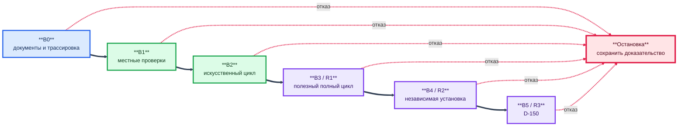

# Единый план проверки и приёмки многооболочечного конвейера

> **Примечание к публичной редакции.** Связи внутри комплекта 149–157 и внешние
> официальные либо научные источники сохранены. Ссылки на закрытые запуски,
> местные пути, внутреннюю память, код и материалы вне комплекта заменены
> текстовыми указателями; соответствующие закрытые файлы не опубликованы.

**Редакция:** 1.0

**Дата:** 24 июля 2026 года

**Состояние:** проект плана проверки и приёмки; сам по себе не подтверждает
готовность R1, R2 или R3

**Область:** весь продукт — детерминированное ядро, Codex App, Hermes Agent,
Claude Code, подсистема выбора моделей, документация и общие механизмы

## 1. Назначение

План определяет, какими доказательствами и в какой последовательности
проверяется продукт. Он связывает:

- 57 требований [PRD](149-product-requirements-document.md);
- 66 нумерованных требований и 8 критериев результата
  [спецификации R1](152-r1-product-specification.md);
- существующие программы и проверки из
  [описания реализации](153-current-implementation-and-r1-gap-description.md);
- один будущий полезный полный цикл R1;
- независимую установку и эксплуатацию R2;
- сравнение D-150 для R3.

Документ отвечает на четыре вопроса:

1. что именно считается объектом проверки;
2. какое свидетельство достаточно для конкретного требования;
3. кто вправе принять результат;
4. какое утверждение разрешено после успешной проверки.

План не создаёт RUN, не разрешает модельный или сетевой вызов и не заменяет
отдельное решение пользователя.

## 2. Главная граница доказательства

Ни один вид проверки не подменяет другой:

| Уровень | Что он доказывает | Чего не доказывает |
|---|---|---|
| В0 — документация | требования, ссылки и границы согласованы | код работает |
| В1 — местные проверки | детерминированный механизм выполняет заданное правило | модели дадут качественный результат |
| В2 — искусственный цикл | компоненты соединены без внешних моделей | полезность и качество реального ответа |
| В3 — полезный R1 | одна точная конфигурация завершила один принятый полезный цикл | переносимость, универсальность и преимущество схемы |
| В4 — независимый R2 | выпуск устанавливается и эксплуатируется на другом компьютере | превосходство над альтернативами |
| В5 — D-150 для R3 | в пределах утверждённой выборки измерено сравнение конфигураций | универсальное превосходство для иных задач и версий |

Технический успех попытки не является содержательной приёмкой. Наличие файла
проверки не означает, что он проверяет весь заявленный смысл требования.
Исторический RUN подтверждает только наблюдавшуюся конфигурацию и исход.

**Схема № 1. Последовательность доказательных шлюзов продукта**

Переход вправо допускается только после принятого отчёта предыдущего уровня.
Отказ не перескакивает на следующий уровень и не расходует прежнее
разрешение повторно.

## 3. Принципы проверки

### 3.1. Качество прежде цены

Сначала проверяются точность, полнота, источники, договор, отсутствие усечения,
противоречия и границы применимости. Время, токены и расчётная стоимость
раскрываются оценщику только после смысловой оценки, когда это требуется
D-150. Цена не может превратить неполный результат в принятый.

### 3.2. Один владелец официального состояния

Только детерминированное ядро меняет состояния проекта, RUN, задания и
попытки. Проверяющий не исправляет SQLite, журнал или архив вручную ради
успешного результата.

### 3.3. Независимость оценки

- исполнитель не принимает собственный результат;
- Codex критикует результат Hermes и Claude Code, но окончательное решение
  принадлежит пользователю;
- результат, созданный Codex, не оценивается в D-150 только самим GPT;
- R2 проверяет человек, не участвовавший в подготовке среды;
- заявленное преимущество R3 требует заранее назначенного независимого
  оценщика.

### 3.4. Неизменяемость доказательств

Вход, конфигурация, результаты, журналы, отчёт и решение связываются путём,
версией Git и SHA-256. Исправление после выполнения создаёт новую редакцию и
не переписывает прежнее свидетельство.

### 3.5. Отказ — допустимый результат

Проверка может иметь исход `пройдено`, `не пройдено`, `заблокировано`,
`не применимо` или `не выполнялось`. Неизвестное не превращается в успешное,
нулевое или доказанное.

### 3.6. Запрет бесконечной шлифовки

Один установленный дефект допускает одно местное исправление и одну целевую
повторную проверку. Новый тест добавляется только для конкретного требования,
дефекта или условия выпуска. Детерминированный дефект не требует модельного
вызова. Содержательный отказ останавливает зависимый путь и не создаёт серию
микро-RUN.

## 4. Владельцы и разделение обязанностей

| Обязанность | Владелец | Контроль |
|---|---|---|
| Утверждение границы выпуска | пользователь | версия PRD и спецификации |
| Подготовка проверочного пакета | разработчик и Codex | независимая сверка матрицы |
| Выполнение местных проверок | разработчик либо оператор | неизменяемый журнал выполнения |
| Выполнение модельной роли | соответствующая оболочка | ядро и переходник |
| Содержательная критика | Codex и при необходимости предметный специалист | точная редакция результата |
| Независимая установка R2 | сторонний оператор | наблюдатель и акт установки |
| Слепая оценка D-150 | заранее назначенный оценщик | скрытые названия связок и цены |
| Окончательное принятие | пользователь | отдельный подписанный решением договор |
| Изменение официального состояния | детерминированное ядро | события и воспроизведение |

Один человек может выполнять несколько административных действий R0, но в
отчёте обязательно указывается, где независимость отсутствовала.

## 5. Проверочный пакет

До начала проверки создаётся неизменяемый пакет со следующими сведениями:

1. идентификатор проверки и целевой выпуск;
2. точный коммит Git и состояние рабочего дерева;
3. версии программ, договоров, оболочек, моделей и поставщиков;
4. операционная система, Python и обязательные зависимости;
5. перечень требований и проверочных случаев;
6. входы, ожидаемые результаты и условия остановки;
7. разрешённые внешние действия и число модельных вызовов;
8. достаточные пределы контекста, выхода, времени и денег;
9. роли исполнителя, проверяющего и принимающего лица;
10. каталоги результатов, журналов и отчётов;
11. способ обезличивания;
12. SHA-256 всего пакета и отдельное решение пользователя.

Для В0–В2 модельные вызовы должны быть запрещены. Для В3–В5 пакет становится
частью Д24 либо отдельного заранее утверждённого сравнительного договора.

## 6. Запись результата одной проверки

Каждый проверочный случай сохраняет:

| Поле | Содержание |
|---|---|
| `check_id` | устойчивый идентификатор |
| `requirement_refs` | требования PRD и спецификации |
| `release_gate` | R1, R2 или R3 |
| `preconditions` | обязательное состояние до начала |
| `input_refs` | пути, версии и SHA-256 входов |
| `procedure_ref` | точная команда или инструкция |
| `expected` | наблюдаемый критерий успеха |
| `actual` | фактический результат без толкования |
| `outcome` | пройдено / не пройдено / заблокировано / не применимо |
| `evidence_refs` | журналы, архивы, снимки и отчёты |
| `environment_ref` | паспорт среды и конфигурации |
| `executor` | кто выполнял |
| `reviewer` | кто проверял |
| `started_at_utc`, `finished_at_utc` | время выполнения |
| `deviation_refs` | отклонения и ограничения |

Причина, наблюдаемый факт и реакция сохраняются раздельно. Если причина не
установлена, записывается `unknown`.

## 7. В0 — проверка документации и трассировки

### 7.1. Объекты

- история и границы продукта;
- PRD и архитектура;
- паспорта пяти частей;
- спецификация R1;
- описание реализации и разрывов;
- установка и руководство оператора;
- настоящий план;
- карточки доказательств подсистемы выбора моделей.

### 7.2. Случаи

| Код | Проверка | Критерий |
|---|---|---|
| `DOC-001` | каждый PRD-ID присутствует в матрице раздела 17 | ровно 57 уникальных идентификаторов, без пропусков и дублей |
| `DOC-002` | все 66 требований R1 покрыты разделом 16 | каждая группа имеет местную и/или полезную проверку |
| `DOC-003` | все местные ссылки открываются | отсутствующих файлов нет либо способ получения явно описан |
| `DOC-004` | внешние утверждения имеют прямые источники | ссылка, точное место, тип источника и область вывода указаны |
| `DOC-005` | состояния факта, решения и гипотезы разделены | косвенное основание не названо доказанным фактом |
| `DOC-006` | версии документов согласованы с кодом | команда и схема не противоречат действующей справке |
| `DOC-007` | секреты и личные сведения отсутствуют | автоматическая и ручная проверка не находят запрещённых данных |
| `DOC-008` | руководство выполнимо без истории чата | независимый читатель восстанавливает последовательность действий |

`DOC-008` окончательно закрывается только на В4. До этого результат является
редакторской проверкой, а не доказательством независимой воспроизводимости.

## 8. В1 — местные детерминированные проверки R1

До первого полезного модельного вызова должны пройти все десять случаев из
[раздела 15 спецификации R1](152-r1-product-specification.md#15-местная-проверка-до-первого-модельного-вызова):

| Код | Область | Блокирующий результат |
|---|---|---|
| `R1-TEST-001` | полная схема Д24 | отсутствующая обязательная группа принята |
| `R1-TEST-002` | канонический SHA-256 Д24 | значимое изменение не меняет SHA-256 |
| `R1-TEST-003` | связь допуска с RUN и редакцией | допуск переносится или расширяется повтором |
| `R1-TEST-004` | контроль каждого вызова | незапланированный или превышающий предел вызов разрешён |
| `R1-TEST-005` | постановка и критика Codex | неверная редакция или решение проходит проверку |
| `R1-TEST-006` | доказательный модуль Hermes | усечение, неполное доказательство или второй сетевой путь принят |
| `R1-TEST-007` | принятая совокупная основа | `verified` либо повреждённый архив передан дальше |
| `R1-TEST-008` | предварительная проверка Claude | ссылка без текста или недостаточный выход допускаются |
| `R1-TEST-009` | искусственный сквозной цикл | состояние меняется вне ядра либо восстановление расходует допуск |
| `R1-TEST-010` | секреты, пути и профили | ключ, чужой файл или глобальная настройка доступны процессу |

После целевых проверок выполняется один общий прогон существующего набора П01–П13
из [каталога архитектуры](150-current-target-architecture-and-prd-traceability.md#12-каталог-проверок).
П14 подсистемы выбора запускается в точном коммите `choose_model`; его
успешность не означает доказанную зрелость карточек источников. П15–П18 нельзя
помечать пройденными до создания отсутствующих проверок.

Результат В1 принимается только при нуле падений, нуле пропущенных обязательных
случаев и объяснённом перечне предупреждений. Исправление обнаруженного сбоя
не расширяет испытание за пределы связанного требования.

## 9. В2 — искусственный полный цикл без моделей

Один искусственный сценарий должен использовать настоящие договоры, состояния
и архивы будущего R1, но заранее подготовленные модельные результаты.

Обязательные ветви:

1. нормальный путь трёх модулей Hermes, принятой основы, Claude и итогового
   решения;
2. технический отказ до публикации;
3. содержательный отказ после `verified`;
4. поздний результат и карантин;
5. истёкшая аренда и каждое допустимое решение восстановления;
6. точечное задание-преемник;
7. неуспешное закрытие RUN без повтора;
8. успешное закрытие RUN и проекта;
9. восстановление проекций и проверка архивов;
10. блокировка лишнего вызова, изменённого плана и повторного допуска.

Критерий В2: все переходы соответствуют спецификации, зависимости открываются
только после `accepted`, никакой исполнитель не меняет состояние, а
воспроизведение событий даёт тот же итог. В2 не оценивает качество модели.

## 10. В3 — один реальный полезный цикл R1

### 10.1. Условия входа

Полезный RUN запрещён, пока одновременно не выполнены:

- пользователь принял PRD, спецификацию и границу R1;
- реализованы шесть пакетов раздела 17 документа 153;
- В0–В2 пройдены на том же коммите;
- подготовлен один полезный Д24 со всеми связками и пределами;
- полный вход и достаточный выход каждой роли измерены до вызова;
- назначены Codex-критик и окончательный пользователь;
- определены условия остановки без автоматического повтора.

### 10.2. Сценарий

1. Codex формирует точную спецификацию и три полезных модуля Hermes.
2. Hermes выполняет модули последовательно через проектный профиль.
3. Codex принимает каждый модуль по содержанию.
4. Ядро строит полную совокупную основу только из `accepted`.
5. Claude Code получает встроенное содержание всей основы и создаёт итог.
6. Codex критикует точную неизменяемую редакцию итога.
7. Ядро формирует отчёт; пользователь принимает, отправляет на доработку либо
   останавливает RUN.

### 10.3. Обязательные критерии

Восемь критериев `R1-AC-01`–`R1-AC-08` применяются без ослабления:

- три модуля завершены и содержательно приняты;
- все существенные выводы имеют источник, место и границу;
- доказанное, ручное и недоказанное разделены;
- Claude получил весь принятый архив;
- итог покрывает назначение, допуск, роли, шлюзы, остановку, архивы,
  ограничения и контрольный лист;
- критических ошибок и незакрытых противоречий нет;
- состояния меняло только ядро, события и расходы восстановимы;
- пользователь отдельно принял итоговый отчёт.

Дополнительно проверяются шлюз R1 PRD и отсутствие усечения. Один непринятый
модельный результат означает, что R1 не принята. Технический `verified`,
частично полезный текст или принятие только отчёта о неуспехе не заменяют
успешный R1.

### 10.4. Разрешённый вывод

После успеха допустимо утверждать только:

> Одна точно зафиксированная конфигурация на одном полезном задании завершила
> полный цикл R1 с принятым результатом и воспроизводимыми доказательствами.

Нельзя утверждать переносимость, превосходство нескольких моделей,
универсальность других доменов или пригодность иной версии связки.

## 11. В4 — независимая приёмка переносимого R2

R2 проверяется на чистом стороннем компьютере и в новой учётной записи
оператора, не имеющей доступа к прежней рабочей области.

| Код | Проверка | Критерий |
|---|---|---|
| `R2-001` | получение точного выпуска | версия, лицензия, SHA-256 и журнал изменений доступны |
| `R2-002` | установка по руководству 154 | нет скрытых устных шагов и доступа к машине разработчика |
| `R2-003` | первоначальная настройка трёх оболочек | самостоятельные профили до и после не изменены скрыто |
| `R2-004` | бесплатная самопроверка | ядро, договоры, профили и пути проверены без моделей |
| `R2-005` | основной цикл по руководству 155 | оператор выполняет путь без истории чата |
| `R2-006` | основные отказы | восстановление, остановка и закрытие выполнены по инструкции |
| `R2-007` | резервная копия и восстановление | состояние и архивы совпадают по SHA-256 |
| `R2-008` | обновление и откат | история сохраняется, несовместимость обнаруживается заранее |
| `R2-009` | безопасность выпуска | Git и контрольный пакет не содержат секретов и личных путей |
| `R2-010` | источники выбора моделей | карточки открываются, имеют происхождение, срок и SHA-256 |
| `R2-011` | понятность результата | оператор и предметный специалист понимают итог без журналов |
| `R2-012` | обезличенный пакет | его можно передать специалисту без конфиденциальных данных |

Проверяющий ведёт журнал затруднений. Любой обязательный устный совет
разработчика означает дефект документации. R2 принимается только при
одновременном выполнении шлюза R2 PRD и закрытии либо явном принятии всех
существенных отклонений пользователем.

## 12. В5 — сравнительная приёмка R3 по D-150

D-150 выполняется только после принятого R1 и отдельного утверждения протокола.
Минимальные условия:

1. не менее двух одинаковых полезных задач;
2. одинаковые общие ресурсные пределы путей, а не только одного вызова;
3. запечатанные входы, конфигурации и результаты;
4. случайный порядок и скрытые названия связок;
5. оценщик не является единолично автором одного сравниваемого результата;
6. одна рубрика качества, утверждённая до раскрытия результатов;
7. цена раскрывается после смысловой оценки;
8. сохраняются все отказы и незавершённые ответы;
9. вывод содержит размер выборки, угрозы достоверности и область применения;
10. пользователь отдельно принимает формулировку сравнительного вывода.

Успех D-150 не разрешает автоматически менять модель, оболочку, поставщика
или официальное состояние. Подсистема выбора моделей остаётся
рекомендательной.

## 13. Приёмка установки и руководства R0 до R2

Документы 154 и 155 можно редакторски принять до R2, но их независимая
воспроизводимость остаётся непроверенной. Предварительная проверка включает:

- выполнение всех бесплатных команд на текущем компьютере;
- сверку фактических аргументов со справкой программ;
- проверку отсутствия скрытых ключей и персональных значений;
- прохождение одного искусственного сценария новым оператором в копии рабочей
  области;
- фиксацию каждого места, где потребовалось устное пояснение.

Такой результат называется «проверено на исходной среде», а не «переносимо».

## 14. Правила остановки и повторной проверки

Проверка немедленно останавливается, если:

- изменён запечатанный вход, конфигурация или критерий;
- обнаружен секрет либо выход за разрешённый каталог;
- модельный вызов не предусмотрен планом;
- результат усечён или потеряна обязательная часть;
- расход, сеть или живой процесс остались в неопределённом состоянии;
- зависимое задание ещё не `accepted`;
- оценщику раскрыта запрещённая до оценки информация;
- версия программы не совпадает с паспортом среды.

После отказа:

1. сохранить фактическое свидетельство;
2. отделить наблюдение от гипотезы причины;
3. связать дефект с требованием;
4. определить, является ли исправление местным или меняет спецификацию;
5. при местном дефекте выполнить одну целевую повторную проверку;
6. при изменении спецификации создать новую редакцию пакета;
7. не наследовать прежний допуск модельного вызова.

Полный набор повторяется только при изменении общего договора, автомата,
хранилища, безопасности, Д24 или выпускной конфигурации. Редакционная правка
не должна автоматически запускать все модельные роли.

## 15. Отчёт и решение о выпуске

Итоговый отчёт содержит:

1. выпуск и точную конфигурацию;
2. перечень выполненных, пропущенных и заблокированных случаев;
3. матрицу 57 требований PRD;
4. матрицу 66 требований R1 и `R1-AC-01`–`08`;
5. критические и существенные отклонения;
6. область доказанного;
7. расход и его тип отдельно от качества;
8. угрозы достоверности;
9. ссылки на неизменяемые доказательства;
10. рекомендуемое решение: принять, принять с ограничениями, доработать или
    отклонить.

Окончательное решение пользователя оформляется отдельно от отчёта. Решение
указывает точный SHA-256 отчёта и не может распространяться на другой выпуск.

## 16. Матрица 66 требований спецификации R1

| Группа | Требования | Обязательная проверка | Окончательное свидетельство |
|---|---|---|---|
| граница | `R1-SCOPE-001`–`003` | `DOC-005`, проверка формулировки отчёта | принятый R1 без расширения вывода |
| полномочия | `R1-AUTH-001`–`002` | `R1-TEST-009` | события показывают единственного владельца состояния |
| Д24 | `R1-PLAN-001`–`008` | `R1-TEST-001`–`004` | запечатанный план и связанное решение пользователя |
| Codex | `R1-CODEX-001`–`006` | `R1-TEST-005` | постановка и две критики полезного RUN |
| Hermes | `R1-HERMES-001`–`008` | `R1-TEST-006` | три принятых доказательных модуля |
| совокупная основа | `R1-BASE-001`–`005` | `R1-TEST-007` | манифест, матрица покрытия и квитанция передачи |
| Claude Code | `R1-CLAUDE-001`–`008` | `R1-TEST-008` | полный принятый итог без усечения |
| качество | `R1-QUALITY-001`–`006` | `DOC-004`, содержательная критика | ведомости модулей и итога |
| эксплуатация | `R1-OPS-001`–`005` | `R1-TEST-009` | нормальный и отказные искусственные пути |
| безопасность | `R1-SEC-001`–`005` | `R1-TEST-010` | отчёт секретов, путей, профилей и сети |
| местная готовность | `R1-TEST-001`–`010` | фактическое выполнение | журнал одного целевого набора и общего прогона |

Критерии `R1-AC-01`–`08` проверяются только на В3. Местные искусственные
данные не могут закрыть их вместо полезного RUN.

## 17. Матрица 57 требований PRD

Обозначения исходного состояния взяты из документа 150 и не пересчитаны этим
планом: **И** — реализовано, **Ч** — частично, **П** — пробел. Перед выпуском
статус определяется заново по фактическому отчёту.

### 17.1. Функциональные требования

| Требование | Основная проверка | Шлюз | Исходная оценка |
|---|---|---|---|
| PRD-F-001 | `R1-TEST-005`, В3 | R1 | Ч |
| PRD-F-002 | `R1-TEST-005`, критика В3 | R1 | Ч |
| PRD-F-003 | `R1-TEST-001`, `009` | R1 | И |
| PRD-F-004 | `R1-TEST-005`, `006`, три модуля В3 | R1 | Ч |
| PRD-F-005 | `R1-TEST-006`, полезный Hermes В3 | R1 | Ч |
| PRD-F-006 | `DOC-004`, `R1-TEST-006`, приёмка В3 | R1 | Ч |
| PRD-F-007 | П01, П02, `R1-TEST-009` | R1 | И |
| PRD-F-008 | П05, `R1-TEST-007`, В3 | R1 | Ч |
| PRD-F-009 | П03, `R1-TEST-007` | R1 | И |
| PRD-F-010 | `R1-TEST-008`, полный итог В3 | R1 | Ч |
| PRD-F-011 | `R1-TEST-005`, две критики В3 | R1 | Ч |
| PRD-F-012 | П01, П11, отказная ветвь В2 | R1 | И |
| PRD-F-013 | П01, закрытие В2 и В3 | R1 | И |
| PRD-F-014 | П01, П04, восстановление В2 | R1 | И |
| PRD-F-015 | `R1-TEST-001`–`004`, Д24 В3 | R1 | П |
| PRD-F-016 | П10, отчёт расхода В3 | R1 | И |
| PRD-F-017 | П14 и ручное объяснение выбора в R1; `R2-010` | R1/R2 | Ч |
| PRD-F-018 | `R1-TEST-010`, самостоятельный режим В3; `R2-003` | R1/R2 | П |
| PRD-F-019 | `DOC-001`–`006`, доказательства В3 | R1 | Ч |
| PRD-F-020 | В1 и заключительная проверка В3 | R1 | И |
| PRD-F-021 | новая конфигурация Д24; `R2-003`, `010` | R1/R2 | Ч |
| PRD-F-022 | В5, утверждённый D-150 | R3 | Ч |

### 17.2. Качество результата

| Требование | Основная проверка | Шлюз | Исходная оценка |
|---|---|---|---|
| PRD-Q-001 | `DOC-004`, критика В3 | R1 | Ч |
| PRD-Q-002 | матрица покрытия, `R1-AC-01`, `05` | R1 | Ч |
| PRD-Q-003 | проверка новых чисел и ссылок в В3 | R1 | Ч |
| PRD-Q-004 | `DOC-003`, `004`, `R1-AC-02` | R1 | П |
| PRD-Q-005 | `R1-TEST-006`, `008`, отсутствие усечения В3 | R1 | Ч |
| PRD-Q-006 | критика Claude и `R1-AC-06` | R1 | Ч |
| PRD-Q-007 | разделение ролей В3; слепой оценщик В5 | R1/R3 | Ч |
| PRD-Q-008 | язык и читаемость В3; `DOC-008`, `R2-011` | R1/R2 | П |
| PRD-Q-009 | Д24, скрытие цены при В5 | R1/R3 | Ч |
| PRD-Q-010 | `DOC-005`, границы отчётов В3–В5 | R1 | Ч |

### 17.3. Надёжность и восстановление

| Требование | Основная проверка | Шлюз | Исходная оценка |
|---|---|---|---|
| PRD-R-001 | П01, `R1-TEST-009` | R1 | И |
| PRD-R-002 | П01, повтор и конфликт в В2 | R1 | И |
| PRD-R-003 | П04, потерянный процесс В2 | R1 | И |
| PRD-R-004 | П01, П02, поздний пакет В2 | R1 | И |
| PRD-R-005 | П01–П03, повреждение архива В2 | R1 | И |
| PRD-R-006 | П07–П09, неизвестная причина В2 | R1 | Ч |
| PRD-R-007 | `R1-TEST-003`, `004`, восстановление В2 | R1 | Ч |
| PRD-R-008 | П01, восстановление событий В2 | R1 | И |

### 17.4. Безопасность и конфиденциальность

| Требование | Основная проверка | Шлюз | Исходная оценка |
|---|---|---|---|
| PRD-S-001 | `DOC-007`, `R1-TEST-010`, `R2-009` | R1/R2 | Ч |
| PRD-S-002 | П01, П02, П09, `R1-TEST-010` | R1 | И |
| PRD-S-003 | `R1-TEST-010`, `R2-003` | R1/R2 | Ч |
| PRD-S-004 | П09, `R1-TEST-006`, `008` | R1 | Ч |
| PRD-S-005 | `R2-002`, проверка источника установки | R2 | П |
| PRD-S-006 | Д24, отказная ветвь В2 | R1 | Ч |
| PRD-S-007 | `R2-009`, `012` | R2 | П |

### 17.5. Нефункциональные требования

| Требование | Основная проверка | Шлюз | Исходная оценка |
|---|---|---|---|
| PRD-N-001 | П01, идемпотентность В2 | R1 | И |
| PRD-N-002 | П01–П03, проверка архивов В2 и В3 | R1 | И |
| PRD-N-003 | `R2-001`–`005` | R2 | П |
| PRD-N-004 | `R2-001`, `007`, `008` | R2 | Ч |
| PRD-N-005 | новая связка без изменения автомата; `R2-010` | R1/R2 | Ч |
| PRD-N-006 | `DOC-005`, причины решений В2–В3 | R1 | Ч |
| PRD-N-007 | Д24, `R1-TEST-001`–`004` | R1 | Ч |
| PRD-N-008 | `R1-TEST-004`, `006`, `008`, остановка В2 | R1 | Ч |
| PRD-N-009 | `R1-TEST-010`, `R2-003`, `005` | R2 | Ч |
| PRD-N-010 | `DOC-001`–`008`, `R2-002`, `005` | R2 | Ч |

Все 57 требований имеют строку. Несколько проверок на одно требование нужны,
если местная гарантия и пользовательский результат различны. Один случай не
копируется под разными названиями только ради формального процента покрытия.

## 18. Текущее положение относительно шлюзов

На момент подготовки плана:

- существуют проверенные части ядра, архивов, состояний, процессов и
  переходников;
- описание 153 оценило 66 требований R1 как 13 реализованных, 35 частичных,
  15 прямых пробелов и 3 проверяемых только полезным RUN;
- Д24, полный договор Codex, формальный полезный модуль Hermes, совокупная
  основа, полная роль Claude и единый координатор R1 ещё не соединены;
- на момент исходной редакции полезный полный цикл R1 не был завершён;

### 18.1. Обновление после RUN-025

25 июля 2026 года RUN-025 дал прямое доказательство уровня В3: один полезный
цикл точной конфигурации завершён, содержательно принят и закрыт ядром. Этап 4
плана 118 завершён. Это снимает прежний пробел «полезный цикл отсутствует», но
не является автоматическим решением о выпуске R1.

До такого решения необходимо без новых модельных вызовов сопоставить конечный
граф RUN-025 с каждым `R1-TEST-001`–`010`, `R1-AC-01`–`08` и обязательным
договором спецификации 152. Отдельно надо определить, является ли
детерминированная финализация Codex штатной частью R1 или признаком незакрытого
пробела роли Claude. R2 и D-150 остаются невыполненными. Основание:
[документ 162](162-run025-first-useful-cycle-evidence-and-impact.md).
- руководства 154 и 155 не проверены независимым оператором;
- чистая установка R2 и D-150 не выполнялись.

Следовательно, сейчас нельзя принять R1, R2 или R3. Можно принять только
настоящий план как нормативную основу дальнейшей проверки.

## 19. Порядок фактического применения

1. Пользователь принимает либо исправляет PRD, спецификацию и этот план.
2. В `main` одной местной серией реализуются шесть пакетов R1 без моделей.
3. Выполняются В0, В1 и В2; создаётся один отчёт местной готовности.
4. Пользователь отдельно утверждает один полезный Д24.
5. Выполняется один В3 без промежуточных микро-RUN.
6. При успехе R1 принимается в узкой доказанной области.
7. Отдельно собирается переносимый выпуск и выполняется В4.
8. После принятого R1 и утверждённого протокола выполняется В5.
9. Только повторяющаяся измеренная ошибка может открыть точечное расширение
   архитектуры.

## 20. Критерии принятия настоящего плана

План готов к использованию, если пользователь подтверждает, что:

1. уровни В0–В5 не смешиваются;
2. все 57 PRD-ID и группы 66 требований R1 покрыты;
3. R1 требует одного принятого полезного цикла, а не набора технических
   демонстраций;
4. R2 требует независимой установки и эксплуатации;
5. D-150 не запускается до принятого R1;
6. качество оценивается раньше цены;
7. исправление одного дефекта не превращается в бесконечную серию испытаний;
8. окончательное решение остаётся у пользователя;
9. документ не разрешает RUN, модельный вызов или изменение договоров.

## 21. Источники и область применимости

Основные нормативные источники:

- система документации — место
  этапа проверки в полном комплекте;
- стандарт доказательной базы
  — правила источников и неизменяемости;
- [PRD](149-product-requirements-document.md) — 57 требований и шлюзы
  выпусков;
- [архитектура и трассировка](150-current-target-architecture-and-prd-traceability.md)
  — исходные состояния покрытия и каталог П01–П18;
- [спецификация R1](152-r1-product-specification.md) — 66 требований,
  `R1-TEST-001`–`010` и `R1-AC-01`–`08`;
- [описание реализации](153-current-implementation-and-r1-gap-description.md)
  — фактические механизмы и шесть пакетов до R1;
- [установка R0](154-r0-installation-and-initial-configuration-guide.md) и
  [руководство оператора](155-r0-operator-guide.md) — объекты независимой
  проверки R2;
- план «качество прежде цены»
  и эксплуатационный профиль
  — приоритет качества и запрет микропроверок;
- RUN-022,
  RUN-023 и
  RUN-024 — наблюдавшиеся виды отказа,
  а не доказательство готовности R1.

План относится к текущей архитектуре и документам редакции 1.0. Изменение
границы выпуска, автомата состояний, Д24 или состава ролей требует новой
редакции плана и матрицы.

## 22. Следующий документальный этап

После пользовательского принятия плана этап 9 системы документации считается
подготовленным. Следующий этап — собрать обезличенный комплект для
профессионального и пользовательского обсуждения: краткое описание продукта,
границы доказанного, PRD, архитектуру, паспорта, спецификацию, реализацию,
установку, эксплуатацию, настоящий план и перечень открытых вопросов.

Публикационный комплект не должен включать секреты, личные пути, закрытые
материалы или утверждение о готовности R1 до фактического прохождения В3.

