# Обезличенный комплект для профессионального и пользовательского обсуждения

> **Примечание к публичной редакции.** Связи внутри комплекта 149–157 и внешние
> официальные либо научные источники сохранены. Ссылки на закрытые запуски,
> местные пути, внутреннюю память, код и материалы вне комплекта заменены
> текстовыми указателями; соответствующие закрытые файлы не опубликованы.

**Редакция:** 1.0

**Дата:** 24 июля 2026 года

**Состояние:** обезличенный местный комплект-кандидат для управляемого
обсуждения; не является публичным выпуском продукта

**Аудитория:** пользователи, разработчики, исследователи многоагентных систем,
специалисты по безопасности и независимые рецензенты

## 1. Назначение комплекта

Документ является единой входной точкой в доказательную документацию
многооболочечного конвейера LLM. Он позволяет читателю без истории чата:

1. понять задачу и устройство продукта;
2. выбрать короткий либо профессиональный маршрут чтения;
3. увидеть, что реализовано, что только спроектировано и что не доказано;
4. проверить целостность включённых документов по SHA-256;
5. дать замечание в воспроизводимой форме;
6. не получить вместе с комплектом секреты, рабочие RUN и личные настройки.

Комплект не содержит исполняемого выпуска, ключей, пользовательских профилей,
рабочей памяти, первичных сообщений или архивов модельных ответов. Он не
разрешает RUN, внешний вызов, расход или изменение программы.

## 2. Коротко о продукте

Продукт предназначен для сложных доказательных задач, где цена ошибки выше
цены одного обращения к модели. Он соединяет три разные агентные оболочки, но
не передаёт им официальный контроль над процессом:

- **Codex App** принимает пользовательскую цель, формирует спецификацию и
  независимо критикует результаты;
- **Hermes Agent** выполняет ограниченные доказательные модули через отдельный
  проектный профиль;
- **Claude Code** получает только принятую основу и формирует полный итог;
- **детерминированное ядро** владеет состояниями, договорами, попытками,
  архивами, расходом, остановкой и восстановлением;
- **подсистема выбора моделей** рекомендует точную связку, но не переключает её
  автоматически и не владеет разрешениями.

Основная гипотеза проекта: специализация оболочек и моделей может повысить
качество сложного ответа. Это пока гипотеза, а не доказанный факт. Для её
проверки требуется D-150 после одного принятого полного цикла R1.

## 3. Схема продукта

**Схема № 1. Полезный цикл и границы полномочий**

```mermaid
flowchart LR
    U["**Пользователь**<br/>цель и решение"] --> C1["**Codex App**<br/>спецификация"]
    C1 --> K1["**Ядро**<br/>план и договоры"]
    K1 --> H["**Hermes Agent**<br/>доказательные модули"]
    H --> C2["**Codex App**<br/>критика основы"]
    C2 -->|"принято"| K2["**Ядро**<br/>неизменяемая основа"]
    C2 -->|"отклонено"| S["**Остановка**<br/>без скрытого повтора"]
    K2 --> CL["**Claude Code**<br/>полный итог"]
    CL --> C3["**Codex App**<br/>критика итога"]
    C3 --> U2["**Пользователь**<br/>принять / доработать / остановить"]
    U2 --> K3["**Ядро**<br/>отчёт и закрытие"]

    classDef user fill:#fff0b3,stroke:#b7791f,stroke-width:3px,color:#3d2b00;
    classDef codex fill:#dbeafe,stroke:#2563eb,stroke-width:3px,color:#102a56;
    classDef core fill:#fee2e2,stroke:#dc2626,stroke-width:3px,color:#4c1010;
    classDef hermes fill:#dcfce7,stroke:#16a34a,stroke-width:3px,color:#103b1e;
    classDef claude fill:#ede9fe,stroke:#7c3aed,stroke-width:3px,color:#2e1065;
    classDef stop fill:#ffe4e6,stroke:#e11d48,stroke-width:4px,color:#4c0519;
    class U,U2 user;
    class C1,C2,C3 codex;
    class K1,K2,K3 core;
    class H hermes;
    class CL claude;
    class S stop;
    linkStyle 0,1,2,3,5,6,7,8 stroke:#334155,stroke-width:4px;
    linkStyle 4 stroke:#e11d48,stroke-width:4px;
```

Модели не общаются напрямую. Каждая стрелка проходит через договор, архив и
проверяемое решение. Только ядро меняет официальное состояние.

## 4. Состояние зрелости

| Выпуск | Назначение | Фактическое состояние |
|---|---|---|
| R0 | исследовательский прототип одного компьютера с ручным оператором | существует; отдельные механизмы и пути проверены |
| R1 | один полный полезный цикл точной конфигурации | спроектирован, но не реализован и не принят целиком |
| R2 | переносимый выпуск для другого компьютера и независимого оператора | не подготовлен; нет чистой установки, Д25 и выпускного пакета |
| R3 | доказательное сравнение конфигураций D-150 | не начиналось |

Наличие R0 не означает готовность R1. Успешная техническая попытка не является
содержательной приёмкой. Один успешный R1 в будущем не докажет переносимость
R2 или превосходство схемы R3.

## 5. Что подтверждено

В пределах текущего локального проекта подтверждено:

- SQLite и журнал событий владеют официальным состоянием;
- идемпотентность, версии, единственная активная попытка и карантин позднего
  результата реализованы;
- результат технически связывается с договором и архивируется по SHA-256;
- техническое состояние `verified` отделено от смыслового `accepted`;
- принятый архив может быть передан следующей роли без изменения;
- процесс, аренда, восстановление и учёт расхода имеют местные механизмы;
- Hermes способен использовать отдельный профиль и экспортировать обычный
  текст;
- причины отказа и неполные сведения расхода сохраняются раздельно;
- существуют переходники Claude Code и Hermes, но их наличие не доказывает
  полный полезный цикл.

Эти утверждения основаны на
[описании реализации](153-current-implementation-and-r1-gap-description.md),
[архитектурной матрице](150-current-target-architecture-and-prd-traceability.md)
и исторических результатах, перечисленных в них.

## 6. Что не подтверждено

Нельзя заявлять, что:

- точная связка Hermes и DeepSeek V4 Flash уже пригодна для всех полезных
  доказательных модулей;
- Claude Code уже получил всю принятую основу и создал принятый полный итог;
- трёхролевая схема лучше одной сильной модели;
- система переносима на другой компьютер;
- подсистема выбора имеет достаточную доказательную зрелость всех карточек;
- все сетевые пути дают одинаковую изоляцию;
- стоимость одного исторического RUN позволяет выбрать лучшую конфигурацию;
- R1, R2 или R3 готовы к выпуску.

Подробные границы находятся в
[плане проверки](156-product-validation-and-acceptance-plan.md).

## 7. Маршрут пользователя

Пользователю, который хочет понять назначение и попробовать текущий R0,
рекомендуется читать:

1. настоящий обзор;
2. [PRD](149-product-requirements-document.md) — проблема, сценарии и границы
   выпусков;
3. [паспорта пяти частей](151-component-passports.md) — роли и ограничения;
4. [установка R0](154-r0-installation-and-initial-configuration-guide.md);
5. [руководство оператора R0](155-r0-operator-guide.md);
6. [план проверки](156-product-validation-and-acceptance-plan.md) — как
   отличить демонстрацию от принятого продукта.

Пользовательский маршрут не требует чтения внутренних RUN и истории решений.

## 8. Маршрут профессионального рецензента

Для архитектурного и доказательного разбора:

1. настоящий обзор и разделы 4–6;
2. история замысла;
3. [PRD](149-product-requirements-document.md);
4. [архитектура и трассировка](150-current-target-architecture-and-prd-traceability.md);
5. [паспорта частей](151-component-passports.md);
6. [спецификация R1](152-r1-product-specification.md);
7. [описание реализации и пробелов](153-current-implementation-and-r1-gap-description.md);
8. [план проверки](156-product-validation-and-acceptance-plan.md);
9. стандарт источников;
10. при необходимости — приложение о низовом слое Hermes
    и критический план качества.

Этот маршрут показывает не только целевую схему, но и расхождение между ней и
реализацией.

## 9. Маршрут разработчика

Разработчик, который будет доводить R1, читает:

1. [спецификацию R1](152-r1-product-specification.md);
2. [описание реализации](153-current-implementation-and-r1-gap-description.md),
   особенно шесть пакетов раздела 17;
3. [архитектурную трассировку](150-current-target-architecture-and-prd-traceability.md);
4. [план проверки](156-product-validation-and-acceptance-plan.md), уровни
   В0–В3;
5. [руководство оператора](155-r0-operator-guide.md) для фактических команд R0.

Исполняемая работа выполняется в `main`, а не в документационной ветке.

## 10. Состав закрытого публикационного комплекта

Таблица фиксирует обезличенные копии документов 149–156, включённые в
отдельный закрытый репозиторий. Полный перечень, включая `README.md` и
настоящий документ 157, хранится в `SHA256SUMS.txt`; сам перечень не включает
собственную контрольную сумму.

| Файл | Назначение | Размер, байт | SHA-256 | Режим распространения |
|---|---|---:|---|---|
| [`149`](149-product-requirements-document.md) | PRD | 59 445 | `41e3dd8a46b27661b1a3f56840c0bde1d895931564badf68ea78535fd429a5f5` | пользовательский и профессиональный |
| [`150`](150-current-target-architecture-and-prd-traceability.md) | архитектура и 57 требований | 66 679 | `5817c53078d805e9e27bbdced05d27bb9ebd833a88fb93c4a92b1bbffbbe5ce3` | профессиональный |
| [`151`](151-component-passports.md) | паспорта частей | 89 584 | `e8ab2fbb9af154abcfd25b2aaf9614d34a20416e654ff49f9e23d20fbea4debc` | пользовательский и профессиональный |
| [`152`](152-r1-product-specification.md) | нормативный проект R1 | 50 721 | `314b03eb0410aa76e4b82895c48244f8609d25130c6f8ca6ad52047c4d6210ba` | профессиональный и разработческий |
| [`153`](153-current-implementation-and-r1-gap-description.md) | реализация и пробелы | 44 598 | `2f4b20e0bd2817d795f9461e895257cd421628624c84aaaa13f844f4f1ee381c` | профессиональный и разработческий |
| [`154`](154-r0-installation-and-initial-configuration-guide.md) | установка R0 | 39 416 | `2aa34362ec393312e1d4760dd55cf59ac30b85e696d5bd05160080f9943d92da` | пользовательский и профессиональный |
| [`155`](155-r0-operator-guide.md) | эксплуатация R0 | 58 389 | `45762616b08dfbf86e80aa3373025fb3b9feb327dd75b32749f9f8a540e45829` | пользовательский и профессиональный |
| [`156`](156-product-validation-and-acceptance-plan.md) | проверка и приёмка | 47 919 | `a0714b70a957c2d2021ac8d65a00c88ba4700a58431bf053477dd79599b4e88d` | пользовательский и профессиональный |

Размер и SHA-256 относятся именно к обезличенным публикационным копиям, а не к
их закрытым исходникам. Изменение любого файла требует новой редакции таблицы
и `SHA256SUMS.txt`.

## 11. Что не входит в комплект

По умолчанию исключаются:

- `memory/` и полная история диалога;
- `runtime/`, `.pipeline/`, журналы сети, модельные ответы и сведения расхода;
- `Исходные материалы/`, сообщения Telegram и полученные архивы публикаций;
- `config/`, пользовательские профили и переменные среды;
- `.git/` с личными метаданными автора;
- ключи, токены, пароли и файлы поставщиков;
- документы с конфиденциальным предметным содержанием;
- программы и договоры, если обсуждение касается только концепции.

Профессиональному рецензенту отдельное доказательство из исключённой области
передаётся только с разрешением владельца, после обезличивания и с новым
SHA-256. Отсутствующий закрытый источник помечается как недоступный, а не
заменяется пересказом.

## 12. Результат проверки обезличивания

Статически проверены десять файлов публикационного комплекта:

- прямых путей `<КАТАЛОГ-ПОЛЬЗОВАТЕЛЯ>` — 0;
- имени пользователя рабочего компьютера — 0;
- строк, похожих на ключ `sk-...`, — 0;
- явных значений API-ключей и токенов — 0.

Проверка публикационных копий также установила:

1. прямые ссылки на закрытые `runtime/`, `.pipeline/`, память, код, настройки и
   первичные материалы отсутствуют;
2. машинно-зависимые корни заменены нейтральными параметрами;
3. 74 внутренние ссылки между включёнными файлами разрешаются;
4. 14 внешних ссылок сохранены отдельно от внутренних доказательств;
5. проект всё ещё не имеет утверждённой лицензии, открытого доступа, тега
   выпуска и независимой проверки обезличивания.

Пути `%USERPROFILE%`, `%LOCALAPPDATA%` и `~/.codex` являются переменными или
общими примерами, а не персональными данными. Обозначения
`<КОРЕНЬ-ПРОЕКТА>` и `<КАТАЛОГ-ПОЛЬЗОВАТЕЛЯ>` являются нейтральными
параметрами, а не путями исходного компьютера.

## 13. Три состояния распространения

### 13.1. Местный управляемый комплект — подготовлен

Настоящий документ и ссылки можно использовать владельцу для внутреннего
обсуждения. Рецензент получает только явно выбранные файлы и знает, какие
доказательства не приложены.

### 13.2. Закрытый профессиональный комплект — подготовлен

Документы 149–157 и корневой `README.md` собраны в отдельном приватном
репозитории. Машинные пути и прямые ссылки на закрытые материалы удалены;
внутренние связи проверены. Доступ выдаётся только приглашённым рецензентам.

### 13.3. Открытый публичный доступ — не разрешён

Открытие репозитория блокируют:

- отсутствие утверждённой лицензии и тега выпуска;
- отсутствие окончательной проверки авторских и договорных прав;
- отсутствие независимой проверки обезличивания;
- необходимость проверить устойчивость внешних ссылок;
- риск восприятия R0 как готового R1.

Эти блокировки нельзя снять красивым предупреждением в начале архива.

## 14. Правила цитирования и обсуждения

Рецензенту предлагается разделять пять типов утверждений:

| Тип | Как обозначать |
|---|---|
| факт реализации | путь к коду, схеме или проверке и точный коммит |
| наблюдение RUN | точная конфигурация, архив и исход |
| внешнее основание | прямой источник, место и область применимости |
| решение проекта | D-ID, дата и граница полномочий |
| гипотеза | что требуется измерить для подтверждения |

Замечание к гипотезе не считается найденным дефектом кода. Успешный
исторический пример не считается доказательством общего свойства.

## 15. Вопросы профессиональному рецензенту

### Архитектура

1. Достаточно ли компактного автомата состояний или отсутствует необходимое
   конечное состояние проекта после неуспешного RUN?
2. Правильно ли отделены смысловые решения моделей от полномочий ядра?
3. Является ли Д24 достаточным единым допуском неизменяемого RUN?
4. Не создаёт ли разделение Hermes на три модуля потерю связности источников?
5. Достаточно ли принятой совокупной основы для предотвращения скрытой потери
   контекста перед Claude Code?

### Качество и модели

6. Адекватны ли критерии доказательного модуля низовой модели?
7. Как обеспечить независимость критики Codex без создания чрезмерного числа
   ролей?
8. Какие признаки должны открывать более сильную модель внутри Hermes?
9. Достаточны ли восемь `R1-AC` для одного полезного R1?
10. Какие угрозы достоверности D-150 наиболее существенны?

### Безопасность и эксплуатация

11. Приемлема ли граница доверия нативного Hermes с прямой сетью?
12. Какие дополнительные проверки нужны для путей Windows и профилей?
13. Как лучше оформить обновление связки без переноса зрелости прежней версии?
14. Что необходимо добавить в Д25 переносимого выпуска?
15. Какие сведения следует исключить из публичного доказательного пакета?

## 16. Вопросы пользователю

1. Понятна ли основная ценность продукта без чтения истории проекта?
2. Видно ли различие между R0, R1, R2 и R3?
3. Достаточно ли руководства 154 для первоначальной установки?
4. Можно ли по руководству 155 понять момент остановки и приёмки?
5. Понятно ли, почему качество оценивается раньше цены?
6. Понятно ли, что выбор модели является рекомендацией, а не автоматическим
   действием?
7. Какие термины требуют упрощения или словаря?
8. Какой конечный документ пользователь ожидает от первого полезного R1?
9. Какие сведения о расходе нужны в итоговом отчёте?
10. Какие действия пользователь не готов передавать автоматике?

## 17. Форма замечания

Каждое замечание рекомендуется оформлять так:

| Поле | Содержание |
|---|---|
| Идентификатор | `REV-...` |
| Роль рецензента | пользователь / разработчик / исследователь / безопасность |
| Документ и редакция | путь, раздел, SHA-256 |
| Класс | блокирующее / существенное / малое / редакционное / вопрос |
| Наблюдение | что именно написано или работает |
| Доказательство | прямая ссылка, команда или воспроизводимый пример |
| Риск | какое требование или решение затронуто |
| Предложение | минимальное исправление либо вопрос владельцу |
| Область | единичный случай или системная проблема |

Фраза «архитектура слишком сложная» без указания компонента, риска и
альтернативы сохраняется как мнение, но не как блокирующий дефект.

## 18. Обработка обратной связи

1. Замечания не редактируют исходный документ задним числом.
2. Каждое замечание связывается с требованием PRD либо открытым вопросом.
3. Фактическая ошибка исправляется новой редакцией и целевой проверкой.
4. Архитектурное предложение сначала оформляется как гипотеза.
5. Изменение кода выполняется только в `main` по отдельному решению.
6. Изменение подсистемы выбора выполняется в `choose_model`.
7. Изменение документации выполняется в `documentation`.
8. Новая модельная проверка не создаётся только ради ответа рецензенту.

Сводный ответ рецензентам должен показывать: принято, отклонено, отложено или
требует решения пользователя — с причиной по каждому пункту.

## 19. Критерии принятия комплекта

Местный управляемый комплект можно принять, если пользователь согласен, что:

1. маршруты пользователя и специалиста разделены;
2. состояние R0–R3 описано без рекламного преувеличения;
3. состав и SHA-256 документов зафиксированы;
4. внутренние архивы и первичные материалы не включаются автоматически;
5. ограничения обезличивания перечислены открыто;
6. открытый доступ заблокирован до лицензии, проверки прав и независимой
   проверки обезличивания;
7. форма замечания позволяет проверить и обработать обратную связь;
8. комплект не разрешает RUN или модельный вызов.

## 20. Следующий шаг после принятия

После принятия настоящего комплекта документационная линия достигает этапа
закрытого публикационного обсуждения. Дальнейшие действия разделяются:

- в `documentation` — обработать замечания, выбрать лицензию и провести
  независимую проверку обезличивания;
- в `main` — вернуться к одной местной реализации R1 и полезному циклу В3;
- в `choose_model` — подготовить переносимые относительные ссылки и
  доказательное происхождение карточек.

Открытие доступа всем пользователям требует отдельного решения владельца
после устранения блокировок раздела 13.3. Текущий репозиторий остаётся
приватным.
